

    

<h2>UNIVERSIDAD PERUANA DE CIENCIAS APLICADAS</h2>
<h3>Ingeniería de Software</h3>

 

<h3>1ASI0657 · Fundamentos de Arquitectura de Software</h3>

<strong>Ciclo académico:</strong> 202620 · <strong>NRC:</strong> 15989

<strong>Profesor:</strong> Abel Nehemias Rosales Caururu 

 

<h1>TRABAJO FINAL</h1>
<h2>ShareWay</h2>

Plataforma de viajes compartidos programados con conductores verificados

 

## Integrantes

| Alumno | Código |
|---|---|
|Arturo Axel Saravia Huaricancha  | U202312447  |
|Leonardo Raul Cumba Rengifo      | U202311912 |
|Aarón Alexander Avila Palacios   | U201823654|
|Sofia Alessandra Cotrina Siclla  | U20231b120 |
|Joaquin Andre Lechuga Aguilar    | U202221619 |

---

# Registro de Versiones del Informe

| Versión | Fecha | Autor | Descripción de modificación |
|---|---|---|---|
|TB1|06/09/26| Cumba Rengifo, Leonardo Raul | Creación del informe a partir de la plantilla del curso, con la carátula, el índice y la estructura de capítulos. |
|TB1|07/09/26| Cumba Rengifo, Leonardo Raul | Redacción del Capítulo I, incluyendo el Startup Profile, el Solution Profile con el análisis 5W y 2H, el Lean UX Process y los segmentos objetivo. |
|TB1|07/09/26| Cumba Rengifo, Leonardo Raul | Redacción del Capítulo II con el análisis competitivo, las estrategias frente a competidores y el diseño de entrevistas por segmento. |
|TB1|07/09/26| Cumba Rengifo, Leonardo Raul | Redacción del Capítulo II con los User Personas|
|TB1|08/09/26| Arturo Saravia|Historias de usuario y mapa de impacto|
|TB1|08/09/26| Joaquin Lechuga | Entrevista y analisis #1 del segmento conductores|
|TB1|09/09/26| Joaquin Lechuga | Product backlog y perfil de integrantes.|
|TB1|10/09/26| Aarón Avila|Perfil de integrante, registro de entrevista para conductores, bibliografía APA y anexos del repositorio|
|TB1|10/09/26|Aarón Avila|Desarrollo de Student Outcome, análisis de entrevistas, Needfinding, Impact Map, Product Backlog, conclusiones y recomendaciones|
|TB1|10/09/26| Cotrina Siclla, Sofia Alessandra | Redacción de User Task Matrix, Empathy Maps y As-Is Scenario Mapping |
|TB2 |21/09/26 | Cumba Rengifo, Leonardo Raul | Redacción de 4.2. Architectural Drivers |
|  |  |  |  |

---

# Contenido

- [Registro de Versiones del Informe](#registro-de-versiones-del-informe)
- [Contenido](#contenido)
- [Student Outcome](#student-outcome)
- [CAPÍTULO I: Introducción](#capítulo-i-introducción)
  - [1.1. Startup Profile](#11-startup-profile)
    - [1.1.1. Descripción del Startup](#111-descripción-del-startup)
    - [1.1.2. Perfiles de integrantes del equipo](#112-perfiles-de-integrantes-del-equipo)
  - [1.2. Solution Profile](#12-solution-profile)
    - [1.2.1. Nombre de producto](#121-nombre-de-producto)
    - [1.2.2. Antecedentes y Problemática](#122-antecedentes-y-problemática)
    - [1.2.3. Lean UX Process](#123-lean-ux-process)
      - [1.2.3.1. Lean UX Problem Statement](#1231-lean-ux-problem-statement)
      - [1.2.3.2. Lean UX Assumptions](#1232-lean-ux-assumptions)
      - [1.2.3.3. Lean UX Hypothesis](#1233-lean-ux-hypothesis)
      - [1.2.3.4. Lean UX Canvas](#1234-lean-ux-canvas)
  - [1.3. Segmentos objetivo](#13-segmentos-objetivo)
- [CAPÍTULO II: Requirements \& Analysis](#capítulo-ii-requirements--analysis)
  - [2.1. Competidores](#21-competidores)
    - [2.1.1. Análisis Competitivo](#211-análisis-competitivo)
    - [2.1.2. Estrategias y tácticas frente a competidores](#212-estrategias-y-tácticas-frente-a-competidores)
  - [2.2. Entrevistas](#22-entrevistas)
    - [2.2.1. Diseño de Entrevistas](#221-diseño-de-entrevistas)
    - [2.2.2. Entrevistas](#222-entrevistas)
    - [2.2.3 Análisis de Entrevistas](#223-análisis-de-entrevistas)
  - [2.3. NeedFinding](#23-needfinding)
    - [2.3.1. User Personas](#231-user-personas)
    - [2.3.2. User Task Matrix](#232-user-task-matrix)
      - [1. Segmento pasajeros](#1-segmento-pasajeros)
      - [2. Segmento conductor](#2-segmento-conductor)
    - [2.3.3. Empathy Maps](#233-empathy-maps)
      - [1. Segmento pasajeros](#1-segmento-pasajeros-1)
      - [2. Segmento conductor](#2-segmento-conductor-1)
    - [2.3.4. As-Is Scenario Mapping](#234-as-is-scenario-mapping)
      - [1. Segmento pasajeros](#1-segmento-pasajeros-2)
      - [2. Segmento conductor](#2-segmento-conductor-2)
- [CAPÍTULO III: Requirements Specification](#capítulo-iii-requirements-specification)
  - [3.1. To-Be Scenario Mapping](#31-to-be-scenario-mapping)
  - [3.2. User Stories](#32-user-stories)
  - [3.3. Impact Map](#33-impact-map)
    - [Pasajeros](#pasajeros)
    - [Conductores](#conductores)
  - [3.4. Product Backlog](#34-product-backlog)
- [CAPÍTULO IV: Product Architecture Design](#capítulo-iv-product-architecture-design)
  - [4.1. Design Concepts, ViewPoints \& ER Diagrams](#41-design-concepts-viewpoints--er-diagrams)
    - [4.1.1. Principles Statements](#411-principles-statements)
    - [4.1.2. Approaches Statements Architectural Styles \& Patterns](#412-approaches-statements-architectural-styles--patterns)
    - [4.1.3. Context Diagram](#413-context-diagram)
    - [4.1.4. Approach Driven ViewPoints Diagrams](#414-approach-driven-viewpoints-diagrams)
    - [4.1.5. Relational/Non Relational Database Diagram](#415-relationalnon-relational-database-diagram)
    - [4.1.6. Design Patterns](#416-design-patterns)
    - [4.1.7. Tactics](#417-tactics)
  - [4.2. Architectural Drivers](#42-architectural-drivers)
    - [4.2.1. Design Purpose](#421-design-purpose)
    - [4.2.2. Primary Functionality (Primary User Stories)](#422-primary-functionality-primary-user-stories)
    - [4.2.3. Quality Attribute Scenarios](#423-quality-attribute-scenarios)
    - [4.2.4. Constraints](#424-constraints)
    - [4.2.5. Architectural Concerns](#425-architectural-concerns)
  - [4.3. ADD Iterations](#43-add-iterations)
    - [4.3.1. Iteration 1: Global System Structure](#431-iteration-1-global-system-structure)
      - [4.3.1.1. Architectural Design Backlog 1](#4311-architectural-design-backlog-1)
      - [4.3.1.2. Establish Iteration Goal by Selecting Drivers](#4312-establish-iteration-goal-by-selecting-drivers)
      - [4.3.1.3. Choose One or More Elements of the System to Refine](#4313-choose-one-or-more-elements-of-the-system-to-refine)
      - [4.3.1.4. Choose One or More Design Concepts That Satisfy the Selected Drivers](#4314-choose-one-or-more-design-concepts-that-satisfy-the-selected-drivers)
      - [4.3.1.5. Instantiate Architectural Elements, Allocate Responsibilities, and Define Interfaces](#4315-instantiate-architectural-elements-allocate-responsibilities-and-define-interfaces)
      - [4.3.1.6. Sketch Views (C4 \& UML) and Record Design Decisions](#4316-sketch-views-c4--uml-and-record-design-decisions)
      - [4.3.1.7. Analysis of Current Design and Review Iteration Goal (Kanban Board)](#4317-analysis-of-current-design-and-review-iteration-goal-kanban-board)
    - [4.3.2. Iteration 2: Sincronización Edge-to-Cloud y Pipeline de Telemetría](#432-iteration-2-sincronización-edge-to-cloud-y-pipeline-de-telemetría)
      - [4.3.2.1. Architectural Design Backlog 2](#4321-architectural-design-backlog-2)
      - [4.3.2.2. Establish Iteration Goal by Selecting Drivers](#4322-establish-iteration-goal-by-selecting-drivers)
      - [4.3.2.3. Choose One or More Elements of the System to Refine](#4323-choose-one-or-more-elements-of-the-system-to-refine)
      - [4.3.2.4. Choose One or More Design Concepts That Satisfy the Selected Drivers](#4324-choose-one-or-more-design-concepts-that-satisfy-the-selected-drivers)
      - [4.3.2.5. Instantiate Architectural Elements, Allocate Responsibilities, and Define Interfaces](#4325-instantiate-architectural-elements-allocate-responsibilities-and-define-interfaces)
      - [4.3.2.6. Sketch Views (C4 \& UML) and Record Design Decisions](#4326-sketch-views-c4--uml-and-record-design-decisions)
      - [4.3.2.7. Analysis of Current Design and Review Iteration Goal (Kanban Board)](#4327-analysis-of-current-design-and-review-iteration-goal-kanban-board)
    - [4.3.3. Iteration 3: Orquestación del Ciclo de Riego Autónomo e Integración con el Edge](#433-iteration-3-orquestación-del-ciclo-de-riego-autónomo-e-integración-con-el-edge)
      - [4.3.3.1. Architectural Design Backlog 3](#4331-architectural-design-backlog-3)
      - [4.3.3.2. Establish Iteration Goal by Selecting Drivers](#4332-establish-iteration-goal-by-selecting-drivers)
      - [4.3.3.3. Choose One or More Elements of the System to Refine](#4333-choose-one-or-more-elements-of-the-system-to-refine)
      - [4.3.3.4. Choose One or More Design Concepts That Satisfy the Selected Drivers](#4334-choose-one-or-more-design-concepts-that-satisfy-the-selected-drivers)
      - [4.3.3.5. Instantiate Architectural Elements, Allocate Responsibilities, and Define Interfaces](#4335-instantiate-architectural-elements-allocate-responsibilities-and-define-interfaces)
      - [4.3.3.6. Sketch Views (C4 \& UML) and Record Design Decisions](#4336-sketch-views-c4--uml-and-record-design-decisions)
      - [4.3.3.7. Analysis of Current Design and Review Iteration Goal (Kanban Board)](#4337-analysis-of-current-design-and-review-iteration-goal-kanban-board)
    - [4.3.4. Iteration 4: Seguridad e Identidad](#434-iteration-4-seguridad-e-identidad)
      - [4.3.4.1. Architectural Design Backlog 4](#4341-architectural-design-backlog-4)
      - [4.3.4.2. Establish Iteration Goal by Selecting Drivers](#4342-establish-iteration-goal-by-selecting-drivers)
      - [4.3.4.3. Choose One or More Elements of the System to Refine](#4343-choose-one-or-more-elements-of-the-system-to-refine)
      - [4.3.4.4. Choose One or More Design Concepts That Satisfy the Selected Drivers](#4344-choose-one-or-more-design-concepts-that-satisfy-the-selected-drivers)
      - [4.3.4.5. Instantiate Architectural Elements, Allocate Responsibilities, and Define Interfaces](#4345-instantiate-architectural-elements-allocate-responsibilities-and-define-interfaces)
      - [4.3.4.6. Sketch Views (C4 \& UML) and Record Design Decisions](#4346-sketch-views-c4--uml-and-record-design-decisions)
      - [4.3.4.7. Analysis of Current Design and Review Iteration Goal (Kanban Board)](#4347-analysis-of-current-design-and-review-iteration-goal-kanban-board)
    - [4.3.5. Iteration 5: Refinamiento del Crop Analysis Service y Diagnóstico de Cultivos](#435-iteration-5-refinamiento-del-crop-analysis-service-y-diagnóstico-de-cultivos)
      - [4.3.5.1. Architectural Design Backlog 5](#4351-architectural-design-backlog-5)
      - [4.3.5.2. Establish Iteration Goal by Selecting Drivers](#4352-establish-iteration-goal-by-selecting-drivers)
      - [4.3.5.3. Choose One or More Elements of the System to Refine](#4353-choose-one-or-more-elements-of-the-system-to-refine)
      - [4.3.5.4. Choose One or More Design Concepts That Satisfy the Selected Drivers](#4354-choose-one-or-more-design-concepts-that-satisfy-the-selected-drivers)
      - [4.3.5.5. Instantiate Architectural Elements, Allocate Responsibilities, and Define Interfaces](#4355-instantiate-architectural-elements-allocate-responsibilities-and-define-interfaces)
      - [4.3.5.6. Sketch Views (C4 \& UML) and Record Design Decisions](#4356-sketch-views-c4--uml-and-record-design-decisions)
      - [4.3.5.7. Analysis of Current Design and Review Iteration Goal (Kanban Board)](#4357-analysis-of-current-design-and-review-iteration-goal-kanban-board)
- [CAPÍTULO V: Product Implementation, Validation \& Deployment](#capítulo-v-product-implementation-validation--deployment)
  - [5.1. Testing Suites \& General Patterns](#51-testing-suites--general-patterns)
    - [5.1.1. Backend Application Core Testing Suite](#511-backend-application-core-testing-suite)
    - [5.1.2. Pattern Based Backend Application(s)](#512-pattern-based-backend-applications)
    - [5.1.3. Pattern Based Custom Software Library](#513-pattern-based-custom-software-library)
    - [5.1.4. Framework Pattern Driven Refactoring Report](#514-framework-pattern-driven-refactoring-report)
  - [5.2. Software Configuration Management](#52-software-configuration-management)
    - [5.2.1. Software Development Environment Configuration](#521-software-development-environment-configuration)
    - [5.2.2. Source Code Management](#522-source-code-management)
    - [5.2.3. Source Code Style Guide \& Conventions](#523-source-code-style-guide--conventions)
    - [5.2.4. Software Deployment Configuration](#524-software-deployment-configuration)
  - [5.3. MicroServices Implementation](#53-microservices-implementation)
    - [5.3.1. Sprint 1](#531-sprint-1)
      - [5.3.1.1. Sprint Backlog 1](#5311-sprint-backlog-1)
      - [5.3.1.2. Development Evidence for Sprint Review](#5312-development-evidence-for-sprint-review)
      - [5.3.1.3. Testing Suite Evidence for Sprint Review](#5313-testing-suite-evidence-for-sprint-review)
      - [5.3.1.4. Execution Evidence for Sprint Review](#5314-execution-evidence-for-sprint-review)
      - [5.3.1.5. Microservices Documentation Evidence for Sprint Review](#5315-microservices-documentation-evidence-for-sprint-review)
      - [5.3.1.6. Software Deployment Evidence for Sprint Review](#5316-software-deployment-evidence-for-sprint-review)
      - [5.3.1.7. Team Collaboration Insights during Sprint](#5317-team-collaboration-insights-during-sprint)
      - [5.3.1.8. Kanban Board](#5318-kanban-board)
    - [5.3.2. Sprint 2](#532-sprint-2)
      - [5.3.2.1. Sprint Backlog 2](#5321-sprint-backlog-2)
      - [5.3.2.2. Development Evidence for Sprint Review](#5322-development-evidence-for-sprint-review)
      - [5.3.2.3. Testing Suite Evidence for Sprint Review](#5323-testing-suite-evidence-for-sprint-review)
      - [5.3.2.4. Execution Evidence for Sprint Review](#5324-execution-evidence-for-sprint-review)
      - [5.3.2.5. Microservices Documentation Evidence for Sprint Review](#5325-microservices-documentation-evidence-for-sprint-review)
      - [5.3.2.6. Software Deployment Evidence for Sprint Review](#5326-software-deployment-evidence-for-sprint-review)
      - [5.3.2.7. Team Collaboration Insights During Sprint](#5327-team-collaboration-insights-during-sprint)
      - [5.3.2.8. Kanban Board](#5328-kanban-board)
    - [5.3.3. Sprint 3](#533-sprint-3)
      - [5.3.3.1. Sprint Backlog 3](#5331-sprint-backlog-3)
      - [5.3.3.2. Development Evidence for Sprint Review](#5332-development-evidence-for-sprint-review)
      - [5.3.3.3. Testing Suite Evidence for Sprint Review](#5333-testing-suite-evidence-for-sprint-review)
      - [5.3.3.4. Execution Evidence for Sprint Review](#5334-execution-evidence-for-sprint-review)
      - [5.3.3.5. Microservices Documentation Evidence for Sprint Review](#5335-microservices-documentation-evidence-for-sprint-review)
      - [5.3.3.6. Software Deployment Evidence for Sprint Review](#5336-software-deployment-evidence-for-sprint-review)
      - [5.3.3.7. Team Collaboration Insights During Sprint](#5337-team-collaboration-insights-during-sprint)
      - [5.3.3.8. Kanban Board](#5338-kanban-board)
    - [5.3.4. Sprint 4](#534-sprint-4)
      - [5.3.4.1. Sprint Backlog 4](#5341-sprint-backlog-4)
      - [5.3.4.2. Development Evidence for Sprint Review](#5342-development-evidence-for-sprint-review)
      - [5.3.4.3. Testing Suite Evidence for Sprint Review](#5343-testing-suite-evidence-for-sprint-review)
      - [5.3.4.4. Execution Evidence for Sprint Review](#5344-execution-evidence-for-sprint-review)
      - [5.3.4.5. Microservices Documentation Evidence for Sprint Review](#5345-microservices-documentation-evidence-for-sprint-review)
      - [5.3.4.6. Software Deployment Evidence for Sprint Review](#5346-software-deployment-evidence-for-sprint-review)
      - [5.3.4.7. Team Collaboration Insights During Sprint](#5347-team-collaboration-insights-during-sprint)
      - [5.3.4.8. Kanban Board](#5348-kanban-board)
  - [5.4. MicroServices Deployment](#54-microservices-deployment)
    - [5.4.1. Cloud Architecture Diagrams](#541-cloud-architecture-diagrams)
    - [5.4.2. Cloud Architecture Deployment](#542-cloud-architecture-deployment)
- [Conclusiones](#conclusiones)
- [Recomendaciones](#recomendaciones)
- [Bibliografía](#bibliografía)
- [Anexos](#anexos)
- [Links](#links)

---

# Student Outcome

El curso contribuye al cumplimiento del **ABET - EAC - Student Outcome 7: Aprendizaje continuo y autónomo**, entendido como la capacidad de adquirir y aplicar nuevos conocimientos según sea necesario, utilizando estrategias de aprendizaje apropiadas.

En el avance TB1, el equipo aplicó esta competencia al investigar el dominio de movilidad compartida, revisar herramientas de análisis de experiencia de usuario, contrastar supuestos mediante entrevistas y organizar los hallazgos en artefactos de requisitos. Las acciones se describen por integrante para evidenciar la contribución individual dentro del trabajo colaborativo.

| Criterio específico | Acciones realizadas | Conclusiones |
|---|---|---|
| Actualiza conceptos y conocimientos necesarios para su desarrollo profesional y, en especial, para su proyecto en soluciones de software. | **Arturo Axel Saravia Huaricancha** TB1: Participó en la elaboración de historias de usuario, criterios de aceptación y mapa de impacto, aplicando conceptos de requisitos, épicas y trazabilidad funcional.  **Leonardo Raul Cumba Rengifo** TB1: Contribuyó en la revisión del contexto del problema, organización de información del reporte y alineación de secciones con la estructura solicitada.  **Aarón Alexander Avila Palacios** TB1: Desarrolló el registro de entrevista para el segmento de conductores, completó el perfil propio, actualizó evidencias visuales, reforzó análisis del reporte y aplicó lineamientos de APA 7 en la bibliografía.  **Sofia Alessandra Cotrina Siclla** TB1: Participó en la revisión de segmentos objetivo y en la consolidación de artefactos relacionados con usuarios, necesidades y experiencia del producto.  **Joaquin Andre Lechuga Aguilar** TB1: Contribuyó en la definición de artefactos visuales de experiencia, análisis de usuario y organización de evidencias para el informe. | Durante TB1, el equipo actualizó conocimientos sobre Lean UX, Needfinding, entrevistas, User Personas, Scenario Mapping, Impact Mapping y gestión de Product Backlog. Esto permitió transformar una idea inicial en una propuesta con segmentos, necesidades, requisitos y prioridades preliminares. |
| Reconoce la necesidad del aprendizaje permanente para el desempeño profesional y el desarrollo de proyectos en soluciones de software. | **Arturo Axel Saravia Huaricancha** TB1: Investigó la relación entre objetivos de negocio, impactos esperados y funcionalidades priorizadas para sostener el mapa de impacto.  **Leonardo Raul Cumba Rengifo** TB1: Apoyó en la revisión de consistencia del reporte, identificando secciones que requerían mayor sustento o evidencia.  **Aarón Alexander Avila Palacios** TB1: Revisó la rúbrica, identificó brechas del avance, organizó información de entrevista y completó secciones del informe a partir de nueva evidencia.  **Sofia Alessandra Cotrina Siclla** TB1: Aportó en la comprensión del segmento de pasajeros y en la relación entre hallazgos de investigación y artefactos de experiencia.  **Joaquin Andre Lechuga Aguilar** TB1: Apoyó en la revisión de artefactos para conductores y pasajeros, conectando necesidades con tareas, emociones y escenarios de uso. | El desarrollo del avance permitió reconocer que el producto requiere aprendizaje continuo sobre movilidad urbana, validación con usuarios, herramientas de modelado y priorización de requisitos. El equipo identificó que los supuestos iniciales deben revisarse permanentemente con evidencia. |

---

# CAPÍTULO I: Introducción

## 1.1. Startup Profile

### 1.1.1. Descripción del Startup

FundaTech es una iniciativa conformada por estudiantes de Ingeniería de Software de la Universidad Peruana de Ciencias Aplicadas (UPC), orientada al desarrollo de soluciones digitales para la planificación y coordinación del transporte compartido en Lima Metropolitana.

La startup propone conectar a personas que necesitan desplazarse en horarios y trayectos compatibles con conductores verificados dispuestos a realizar recorridos previamente programados. Su enfoque combina la identificación de necesidades de los usuarios, el diseño de experiencias digitales y la aplicación de buenas prácticas de arquitectura de software.

Su producto, ShareWay, permitirá registrar solicitudes de traslado, agrupar pasajeros, planificar puntos de recojo y llegada, y gestionar la participación de conductores y pasajeros durante el viaje. Asimismo, incorporará mecanismos de verificación, validación del abordaje y calificación del servicio para contribuir a la confianza entre los participantes.

**Misión**

Facilitar la planificación de viajes compartidos mediante una plataforma digital que conecte pasajeros con recorridos compatibles y conductores verificados, promoviendo una experiencia de transporte organizada, accesible y confiable.

**Visión**

Ser una plataforma de referencia para la coordinación de viajes compartidos programados en Lima Metropolitana, reconocida por facilitar la planificación de los desplazamientos y fomentar la confianza entre pasajeros y conductores.

**Propuesta de valor**

Para los pasajeros, la propuesta consiste en reservar anticipadamente un traslado compartido, conocer las condiciones del viaje antes de confirmarlo y distribuir el costo del recorrido entre sus participantes.

Para los conductores, consiste en recibir propuestas de viajes con pasajeros agrupados, puntos de recojo y llegada definidos, una ruta sugerida y una estimación de los ingresos que obtendrían por realizar el servicio.

**Modelo de negocio propuesto**

Como modelo inicial, se plantea el cobro de una comisión por cada viaje compartido completado mediante la plataforma. El porcentaje y las condiciones de aplicación deberán definirse y validarse considerando la disposición de pago de los pasajeros, las expectativas de ingresos de los conductores y los costos de operación.

La tarifa presentada al pasajero y la ganancia estimada del conductor deberán mostrar claramente los importes que les corresponden antes de confirmar su participación.

### 1.1.2. Perfiles de integrantes del equipo

|  |  |
|--|--|
|  |   **Nombre:** Joaquin Andre Lechuga Aguilar    **Código:** U202221619   **Sobre mi:** Soy programador aficionado. Me gusta aprender tecnologías y aplicarlas a proyectos personales. Mis hobbies son la música y los videojuegos. Como miembro del grupo, espero aportar en la organización, conceptos técnicos e ideas.|
|  |   **Nombre:** Arturo Axel Saravia Huaricancha    **Código:** U202312447   **Sobre mi:** Soy desarrollador desde hace tres años que le gusta hacer proyectos personales o para ciertas comunidades que buscan una mejora u optimización en su administración. |
|  |   **Nombre:** Aarón Alexander Avila Palacios    **Código:** U201823654   **Sobre mi:** Soy estudiante de Ingeniería de Software con interés en el desarrollo de soluciones web, la documentación de productos digitales y la organización de requerimientos. Como miembro del equipo, aporto en el registro de entrevistas, la estructuración de evidencias y la revisión del informe para mantener coherencia con la propuesta de ShareWay. |
|   |    **Nombre:** Cumba Rengifo, Leonardo Raul    **Código:** U202311912    **Sobre mi:** Soy estudiante de Ingeniería de Software en la Universidad Peruana de Ciencias Aplicadas (UPC), actualmente cursando el sexto ciclo, con interés en el desarrollo de soluciones web y la arquitectura de software. Como miembro del equipo, participo en la documentación y estructuración de los requerimientos del proyecto ShareWay, apoyando en la organización de entrevistas, elaboración de evidencias y revisión del informe para mantener coherencia entre la problemática identificada y la solución propuesta. |
|  |    **Nombre:** Cotrina Siclla, Sofia Alessandra    **Código:** U20231B120    **Sobre mi:**  Estudiante de Ingeniería de Software con conocimientos en C++, C#, Python y Java, con un enfoque principal orientado al desarrollo Frontend y diseño en Figma. Me considero una persona creativa, colaborativa y comprometida con el trabajo en equipo, dispuesta a aportar soluciones visuales e interfaces atractivas para los proyectos. |
|  |  |

## 1.2. Solution Profile

### 1.2.1. Nombre de producto

**ShareWay**

El nombre ShareWay combina los términos en inglés “share”, que significa compartir, y “way”, que hace referencia a un camino o recorrido. Representa la idea de compartir un trayecto con otras personas que tienen necesidades de desplazamiento compatibles.

ShareWay es una plataforma digital para la coordinación y reserva de viajes compartidos programados con conductores verificados. Los pasajeros podrán registrar su origen, destino, fecha y horario aproximado, mientras que el sistema propondrá agrupaciones considerando la compatibilidad de los recorridos y la disponibilidad de asientos.

Una vez formado un grupo, se propondrá una ruta y una tarifa por pasajero. Un conductor verificado podrá aceptar el recorrido y, posteriormente, los pasajeros podrán revisar la información del conductor, el vehículo y las condiciones del servicio antes de confirmar su participación.

La solución contempla las siguientes capacidades:

- Solicitud y reserva anticipada de viajes.
- Agrupación de pasajeros con trayectos y horarios compatibles.
- Planificación del orden de recojo y llegada de cada pasajero.
- Presentación de tarifas y tiempos estimados antes de la confirmación.
- Verificación de pasajeros, conductores y documentación del vehículo.
- Validación del abordaje mediante PIN o código QR.
- Gestión del estado del viaje y de las reservas individuales.
- Historial de viajes y calificaciones.
- Acceso a información del recorrido y opciones para compartir la ubicación con un contacto de emergencia.

### 1.2.2. Antecedentes y Problemática

**Antecedentes**

El proyecto toma como contexto los desplazamientos frecuentes de personas dentro de Lima Metropolitana por motivos de estudio, trabajo y otras actividades. Se enfoca particularmente en situaciones en las que varios usuarios necesitan trasladarse hacia zonas cercanas y en horarios similares, pero organizan sus viajes de manera independiente.

La propuesta parte de una oportunidad por investigar: aprovechar la compatibilidad entre estas necesidades de traslado para coordinar viajes compartidos con anticipación. Para que esta alternativa resulte útil, es necesario considerar tanto las expectativas de los pasajeros sobre precio, tiempo y confianza como las condiciones que los conductores requieren para aceptar un recorrido.

La coordinación de un viaje compartido involucra decisiones sobre horarios, puntos de encuentro, disponibilidad de asientos, orden de las paradas y distribución del costo. Cuando estas condiciones no están claramente definidas, pueden surgir dificultades para organizar el servicio y mantener informados a sus participantes.

Estos antecedentes constituyen una aproximación inicial al dominio del problema. Su frecuencia, magnitud e impacto deberán contrastarse mediante entrevistas a pasajeros y conductores, análisis de alternativas existentes y fuentes estadísticas pertinentes.

**Análisis mediante las 5W y 2H**

| Elemento | Análisis |
|---|---|
| **Who — ¿Quiénes presentan el problema?** | Pasajeros que realizan desplazamientos frecuentes, especialmente estudiantes y trabajadores, y conductores interesados en atender viajes compartidos programados. |
| **What — ¿Cuál es el problema?** | La dificultad para coordinar un traslado compartido con personas que tienen recorridos compatibles, acordando anticipadamente horarios, costos y condiciones de participación. |
| **Where — ¿Dónde ocurre?** | En Lima Metropolitana, dentro de los corredores y distritos que se seleccionen para el alcance inicial del proyecto. |
| **When — ¿Cuándo ocurre?** | Al organizar desplazamientos hacia centros de estudio, trabajo u otras actividades con horarios previstos, así como cuando se producen cambios o cancelaciones antes del viaje. |
| **Why — ¿Por qué ocurre?** | Como explicación preliminar, los usuarios podrían carecer de información sobre otras personas con trayectos compatibles y de un mecanismo integrado para agrupar solicitudes, coordinar un conductor y confirmar las condiciones del recorrido. |
| **How — ¿Cómo se manifiesta?** | En la organización independiente de traslados, dificultades para acordar puntos y horarios, incertidumbre sobre el precio y desconfianza respecto a las personas que participarían en el viaje. |
| **How Much — ¿Cuánto afecta?** | Su magnitud aún debe determinarse. Se investigarán el gasto por traslado, la frecuencia semanal de viajes, el tiempo dedicado a coordinarlos, el tiempo adicional aceptable y la disposición a pagar por una alternativa compartida. |

**Enunciado de la problemática**

Los pasajeros que necesitan desplazarse en horarios previstos dentro de Lima Metropolitana pueden encontrar dificultades para identificar a otras personas con rutas compatibles y organizar un viaje compartido bajo condiciones claras de precio, horario e identificación de los participantes.

Por su parte, los conductores interesados en este servicio necesitan conocer la cantidad de pasajeros, la secuencia de paradas, la duración estimada y el ingreso esperado antes de comprometerse a realizar el recorrido.

El problema que abordará ShareWay es la coordinación de estas necesidades mediante un proceso que integre solicitudes, agrupación de pasajeros, planificación de rutas, aceptación del conductor y confirmación de reservas.

**Objetivo general**

Desarrollar una plataforma que permita coordinar viajes compartidos programados entre pasajeros con trayectos compatibles y conductores verificados, proporcionando información anticipada sobre las condiciones del servicio y mecanismos de gestión durante el recorrido.

**Objetivos específicos**

- Permitir el registro de solicitudes con origen, destino, fecha y horario aproximado.
- Identificar solicitudes compatibles considerando horarios, ubicación, capacidad y desvíos permitidos.
- Proponer una secuencia de recojo y llegada que respete las condiciones de los pasajeros.
- Informar las tarifas, horarios y duración estimada antes de confirmar la reserva.
- Facilitar la aceptación de recorridos por conductores previamente verificados.
- Gestionar el abordaje, la finalización y el historial de cada reserva.
- Incorporar mecanismos de reputación y apoyo ante incidencias.

**Alcance y restricciones iniciales**

El alcance inicial se centrará en viajes programados dentro de Lima Metropolitana y en los segmentos de pasajeros y conductores. Los corredores específicos, la anticipación mínima, la tolerancia horaria y las reglas de cancelación se definirán a partir de la investigación y de la capacidad de implementación del equipo.

La compatibilidad de solicitudes estará condicionada por la disponibilidad de asientos y por límites de tiempo y desvío. La formación de un grupo no garantizará la realización del viaje hasta contar con la aceptación de un conductor y las confirmaciones correspondientes.

El procedimiento de verificación deberá definir qué información se revisa, quién la valida y qué condiciones permiten aprobar la participación de un usuario. La disponibilidad de integraciones externas para identidad, mapas, ubicación y pagos deberá evaluarse antes de incorporarlas al alcance.

Los beneficios relacionados con ahorro, eficiencia y confianza se tratarán como resultados esperados que deberán validarse. La verificación y las funciones de emergencia constituyen mecanismos de apoyo y no representan una garantía de ausencia de incidentes.

### 1.2.3. Lean UX Process

El proyecto aplicará Lean UX para formular y contrastar las suposiciones que sustentan la propuesta de ShareWay. El proceso permitirá investigar las necesidades de pasajeros y conductores, evaluar alternativas de solución y ajustar el producto a partir de evidencia.

Inicialmente, se plantearán problemas, supuestos e hipótesis. Posteriormente, se realizarán entrevistas por segmento, pruebas con prototipos y evaluaciones de los flujos principales. Los resultados permitirán decidir qué propuestas conservar, modificar o descartar.

Se prestará especial atención a la disposición para compartir viajes con personas desconocidas, la anticipación disponible para reservar, la tolerancia a desvíos, la claridad de las tarifas y las condiciones que motivan la participación de los conductores.

#### 1.2.3.1. Lean UX Problem Statement

**Dominio**

Coordinación digital de viajes urbanos compartidos y programados en Lima Metropolitana.

**Segmentos de clientes**

- Pasajeros con desplazamientos frecuentes y horarios previsibles, especialmente estudiantes universitarios y trabajadores.
- Conductores independientes o propietarios de vehículos interesados en realizar recorridos compartidos previamente organizados.

**Problemas y necesidades iniciales**

Se plantea que los pasajeros necesitan coordinar traslados con costos y horarios claros, conocer la identidad del conductor y reducir la incertidumbre asociada a compartir un vehículo con otras personas.

Asimismo, se plantea que los conductores necesitan recibir propuestas viables, con información suficiente sobre paradas, pasajeros, duración e ingresos, y contar con mecanismos para gestionar confirmaciones y ausencias.

Estas necesidades deberán comprobarse mediante la investigación con representantes de ambos segmentos.

**Brecha por validar**

Existe una posible necesidad insuficientemente atendida de integrar la reserva anticipada, la agrupación de solicitudes compatibles, la planificación del recorrido y la identificación de los participantes dentro de una misma experiencia.

El análisis competitivo deberá determinar cómo se atienden actualmente estas necesidades y qué oportunidades concretas de diferenciación presenta ShareWay.

**Visión y estrategia**

ShareWay busca facilitar la organización de viajes compartidos mediante un proceso que permita registrar necesidades de traslado, proponer grupos y rutas, obtener la aceptación de un conductor verificado y confirmar las condiciones con cada pasajero.

La estrategia inicial consiste en concentrar la validación en corredores y franjas horarias delimitados, de modo que sea posible evaluar la compatibilidad de solicitudes y la aceptación del servicio antes de ampliar la cobertura.

**Segmento inicial**

Como segmento inicial para la validación, se propone trabajar con estudiantes universitarios y trabajadores con horarios previsibles en corredores seleccionados de Lima Metropolitana, junto con conductores disponibles para atender esas rutas.

**Problem Statement: pasajeros**

Hemos observado, como planteamiento inicial pendiente de validación, que las personas con desplazamientos frecuentes necesitan equilibrar costo, tiempo y confianza al elegir cómo trasladarse. Sin embargo, coordinar un viaje compartido puede resultar difícil cuando no conocen a otros pasajeros con recorridos compatibles ni disponen de condiciones claras de reserva.

¿Cómo podríamos facilitar que estas personas organicen anticipadamente un viaje compartido, conozcan sus condiciones y decidan participar con suficiente información?

**Problem Statement: conductores**

Planteamos que los conductores interesados en viajes compartidos necesitan evaluar la viabilidad del recorrido antes de aceptarlo. La incertidumbre sobre pasajeros, paradas, confirmaciones e ingresos puede dificultar esa decisión.

¿Cómo podríamos ofrecerles propuestas de viajes organizadas y comprensibles que les permitan decidir si aceptan el servicio y gestionar su ejecución?

#### 1.2.3.2. Lean UX Assumptions

Para el desarrollo de ShareWay, se plantean supuestos sobre las necesidades de los pasajeros, las expectativas de los conductores y el funcionamiento del modelo de negocio. Estos supuestos representan ideas iniciales que deberán contrastarse mediante entrevistas, pruebas con prototipos y la validación de la propuesta.

**Supuestos sobre los pasajeros**

- Creemos que los estudiantes y trabajadores con horarios previsibles pueden organizar sus viajes con anticipación.
- Consideramos que los pasajeros estarían dispuestos a compartir un vehículo con otras personas si esto representa un ahorro frente a un traslado individual.
- Suponemos que los pasajeros aceptarían un tiempo adicional limitado para recoger y dejar a otros usuarios, siempre que conozcan previamente la duración estimada del recorrido.
- Creemos que conocer los datos del conductor, el vehículo y el estado de su verificación contribuiría a generar confianza antes de confirmar una reserva.
- Consideramos que visualizar la tarifa y el horario estimado de recojo facilitaría la decisión de participar en un viaje compartido.
- Suponemos que los pasajeros valorarían contar con un código de validación para abordar y con una opción para compartir la información del viaje con un contacto de emergencia.

**Supuestos sobre los conductores**

- Creemos que existen conductores interesados en realizar viajes compartidos previamente programados para generar ingresos.
- Consideramos que los conductores estarían dispuestos a registrar sus datos personales y la documentación del vehículo para acceder a las propuestas de viaje.
- Suponemos que conocer la ruta, las paradas, la cantidad de pasajeros y la ganancia estimada les permitiría decidir si un recorrido resulta conveniente.
- Creemos que una ruta previamente organizada facilitaría la coordinación de los puntos de recojo y llegada.
- Consideramos que los conductores necesitarían reglas claras sobre confirmaciones, cancelaciones y tiempos de espera para participar en el servicio.

**Supuestos sobre el modelo de negocio**

- Creemos que existirán solicitudes con horarios y trayectos compatibles dentro de las zonas seleccionadas para la operación inicial.
- Suponemos que compartir el costo del recorrido permitiría ofrecer una tarifa atractiva para los pasajeros y un ingreso aceptable para los conductores.
- Consideramos que una comisión por viaje completado podría contribuir al sostenimiento de la plataforma, siempre que su aplicación sea transparente y aceptable para los participantes.
- Creemos que una experiencia satisfactoria motivaría a los usuarios con desplazamientos recurrentes a reservar nuevos viajes.

**Supuestos sobre la solución**

- Consideramos que la ubicación, el horario y la disponibilidad de asientos permitirán identificar solicitudes compatibles.
- Suponemos que será posible planificar recorridos que respeten límites de espera y desvío aceptables para los pasajeros.
- Creemos que los usuarios dispondrán de un dispositivo y de conectividad para solicitar, confirmar y consultar sus viajes.
- Consideramos que las notificaciones sobre confirmaciones, asignaciones y cambios ayudarían a mantener informados a los participantes.
- Suponemos que los pasajeros y conductores podrán comprender y utilizar la validación de abordaje mediante PIN o código QR.

#### 1.2.3.3. Lean UX Hypothesis

A partir de los supuestos planteados, se formulan hipótesis que orientarán la validación de ShareWay. Cada una relaciona una capacidad de la plataforma con un resultado esperado y una forma de comprobarlo.

Los criterios concretos de aceptación se definirán antes de ejecutar cada prueba. Las entrevistas permitirán explorar necesidades e intenciones, mientras que los prototipos y los pilotos permitirán evaluar la interacción y el comportamiento de los participantes.

**Planificación anticipada de viajes**

Creemos que permitir a los pasajeros registrar su origen, destino, fecha y horario mediante un proceso guiado facilitará la planificación de sus desplazamientos. Sabremos que esta hipótesis cuenta con respaldo cuando, durante las pruebas del prototipo, los participantes puedan completar una solicitud sin asistencia y comprendan que su confirmación depende de la disponibilidad de un grupo compatible y un conductor.

**Agrupación de pasajeros compatibles**

Creemos que agrupar solicitudes según ubicación, horario y disponibilidad de asientos permitirá organizar viajes compartidos entre personas que no se conocen previamente. Sabremos que esta hipótesis cuenta con respaldo cuando, al evaluar solicitudes recopiladas para un piloto, sea posible formar grupos que respeten los límites definidos de capacidad, diferencia horaria y desvío.

**Aceptación del costo y del tiempo de viaje**

Creemos que los pasajeros elegirán un viaje compartido si consideran que el ahorro ofrecido compensa el tiempo adicional del recorrido. Sabremos que esta hipótesis cuenta con respaldo cuando, al comparar alternativas con precios y duraciones explícitos, los participantes elijan la opción compartida dentro de los límites de gasto y tiempo que hayan declarado como aceptables.

**Claridad de las condiciones de reserva**

Creemos que mostrar la tarifa, la hora estimada de recojo, la duración y los datos del conductor y del vehículo facilitará una decisión informada. Sabremos que esta hipótesis cuenta con respaldo cuando los participantes identifiquen correctamente estas condiciones y puedan confirmar o rechazar una propuesta sin necesitar explicaciones adicionales.

**Confianza en los participantes del viaje**

Creemos que mostrar el estado de verificación y las calificaciones del conductor contribuirá a la confianza percibida por los pasajeros. Sabremos que esta hipótesis cuenta con respaldo cuando, al comparar propuestas equivalentes con y sin esta información, los participantes expresen mayor confianza en la propuesta que la incluye y expliquen qué datos influyeron en su decisión.

**Aceptación de recorridos por los conductores**

Creemos que presentar propuestas con una ruta organizada, paradas definidas y una ganancia estimada facilitará que los conductores evalúen su conveniencia. Sabremos que esta hipótesis cuenta con respaldo cuando los conductores comprendan las condiciones presentadas y, durante un piloto, acepten recorridos que satisfagan sus expectativas declaradas de tiempo e ingresos.

**Validación del abordaje**

Creemos que utilizar un PIN o código QR asociado a cada reserva facilitará la validación del pasajero antes de abordar. Sabremos que esta hipótesis cuenta con respaldo cuando pasajeros y conductores completen el procedimiento sin asistencia durante las pruebas y el sistema rechace códigos inválidos, utilizados o correspondientes a otra reserva.

**Acceso a las funciones de emergencia**

Creemos que una opción visible para consultar los datos del viaje y compartir la ubicación con un contacto de emergencia facilitará el acceso a esta información durante una situación de preocupación. Sabremos que esta hipótesis cuenta con respaldo cuando, en una prueba simulada, los participantes encuentren la función, completen la acción y comprendan su alcance sin ayuda del moderador.

**Viabilidad del modelo de ingresos**

Creemos que distribuir el costo del recorrido entre varios pasajeros permitirá incorporar una comisión para la plataforma manteniendo condiciones aceptables para pasajeros y conductores. Sabremos que esta hipótesis cuenta con respaldo inicial cuando los escenarios económicos evaluados permitan cubrir los costos estimados y la comisión, respetando simultáneamente el precio máximo aceptable de los pasajeros y el ingreso mínimo esperado por el conductor.

**Uso recurrente de la plataforma**

Creemos que una experiencia satisfactoria motivará a los pasajeros con desplazamientos frecuentes a utilizar nuevamente ShareWay. Sabremos que esta hipótesis cuenta con respaldo cuando los usuarios que completen un primer viaje realicen nuevas reservas durante el periodo de seguimiento del piloto, siempre que exista oferta compatible con sus necesidades.

#### 1.2.3.4. Lean UX Canvas

    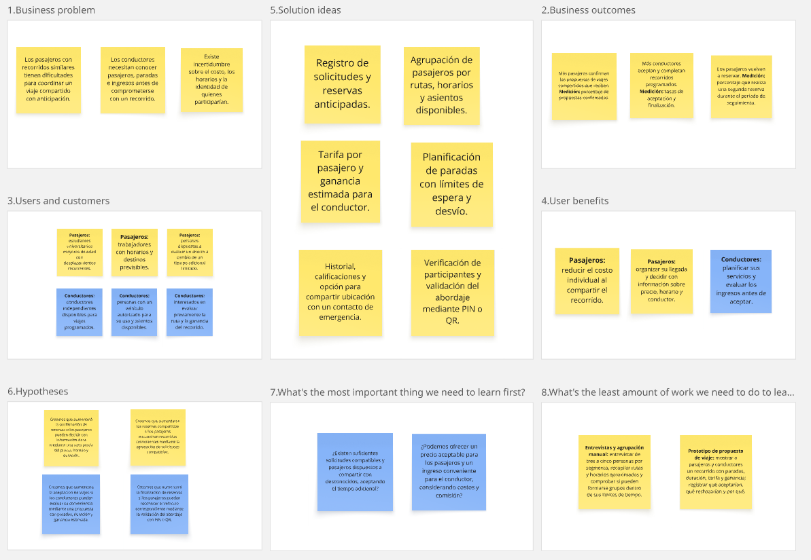

link:
https://miro.com/app/board/uXjVHpnxhsg=/?share_link_id=592356692155

---

## 1.3. Segmentos objetivo

ShareWay está dirigido a dos segmentos complementarios: pasajeros que necesitan organizar desplazamientos frecuentes y conductores interesados en realizar viajes compartidos programados en Lima Metropolitana.

La segmentación inicial considera características geográficas, demográficas y de comportamiento. Los perfiles descritos constituyen una delimitación preliminar para la investigación y deberán ajustarse a partir de las entrevistas.

**Contexto y sustento de la segmentación**

La Autoridad de Transporte Urbano para Lima y Callao informó, en febrero de 2025, que en Lima y Callao se realizan aproximadamente 24 millones de viajes diarios. Este dato permite contextualizar la magnitud de los desplazamientos urbanos, pero no representa la cantidad de personas que utilizarían ShareWay ni una estimación de su mercado potencial.

La misma entidad destaca la importancia del transporte masivo para atender la movilidad urbana. En ese contexto, ShareWay plantea investigar una alternativa para determinados viajes que actualmente se realizan de manera individual, sin asumir que sustituirá al transporte público ni que reducirá automáticamente la congestión.

La demanda específica del producto deberá determinarse investigando la frecuencia de traslado, los horarios, el presupuesto y la disposición a compartir de los pasajeros, junto con la disponibilidad y las expectativas económicas de los conductores.

**Segmento 1: Pasajeros con desplazamientos frecuentes**

Está conformado por personas que necesitan trasladarse dentro de Lima Metropolitana por motivos de estudio, trabajo u otras actividades previstas y que podrían organizar su viaje con anticipación.

Para la validación inicial se propone trabajar con personas mayores de edad, de cualquier género, que utilicen un teléfono inteligente y realicen desplazamientos recurrentes. No se establece inicialmente un nivel de ingresos específico; se investigará el presupuesto que destinan al transporte.

Dentro del segmento se consideran los siguientes perfiles:

- **Estudiantes universitarios:** personas que se desplazan hacia sus centros de estudio en horarios definidos y necesitan administrar su presupuesto de transporte.
- **Trabajadores:** personas que se trasladan hacia oficinas, empresas u otros centros laborales y requieren coordinar sus horarios de llegada.
- **Personas con actividades recurrentes:** usuarios que realizan desplazamientos previsibles hacia destinos habituales.

**Características geográficas**

- Desplazamientos dentro de Lima Metropolitana.
- Orígenes y destinos ubicados en corredores que permitan agrupar solicitudes.
- Como referencia inicial para investigar, se consideran conexiones entre Pueblo Libre, Jesús María, Magdalena del Mar, San Isidro y Miraflores.
- La cobertura definitiva dependerá de la compatibilidad de las solicitudes y de la disponibilidad de conductores.

**Características de comportamiento por validar**

- Planifican al menos una parte de sus desplazamientos.
- Comparan alternativas considerando precio, duración y confianza.
- Utilizan herramientas digitales para consultar rutas o solicitar transporte.
- Podrían aceptar compartir el vehículo si conocen las condiciones del recorrido.
- Necesitan recibir información sobre cambios, confirmaciones y cancelaciones.

**Necesidades principales**

- Conocer la tarifa antes de confirmar.
- Contar con horarios estimados de recojo y llegada.
- Identificar al conductor y al vehículo asignado.
- Comprender cuánto tiempo adicional implica compartir el recorrido.
- Consultar el estado de su reserva.
- Disponer de mecanismos para validar el abordaje y comunicar incidencias.

**Valor propuesto por ShareWay**

Reservar un viaje compartido con anticipación, distribuir el costo del recorrido y conocer las condiciones de participación antes de confirmar.

**Segmento 2: Conductores de viajes programados**

Está conformado por conductores independientes o personas con disponibilidad de un vehículo que estén interesadas en realizar recorridos compartidos previamente organizados.

Para la investigación se buscará entrevistar a conductores mayores de edad, de cualquier género, con experiencia de conducción en Lima Metropolitana y familiaridad con teléfonos inteligentes o aplicaciones de navegación.

La participación operativa estará sujeta al procedimiento de verificación y a los requisitos que se definan para prestar el servicio. La propiedad del vehículo no será el único criterio de selección; también deberá comprobarse que el conductor está autorizado para utilizarlo.

**Características geográficas**

- Disponibilidad para atender recorridos dentro de Lima Metropolitana.
- Familiaridad con las zonas seleccionadas para el alcance inicial.
- Posibilidad de organizar su disponibilidad según los horarios de los viajes.

**Características de comportamiento por validar**

- Evalúan un recorrido según el ingreso esperado, la distancia y el tiempo requerido.
- Utilizan aplicaciones de navegación o transporte.
- Buscan conocer los destinos antes de aceptar.
- Necesitan administrar tiempos de espera y cancelaciones.
- Podrían aceptar varias paradas si las condiciones económicas resultan convenientes.

**Necesidades principales**

- Recibir propuestas con rutas y paradas definidas.
- Conocer la cantidad de pasajeros y los asientos requeridos.
- Visualizar la ganancia estimada y la comisión aplicable.
- Confirmar la identidad de la reserva al recoger a cada pasajero.
- Disponer de reglas sobre cancelaciones, ausencias y esperas.
- Consultar el historial de viajes y calificaciones.

**Valor propuesto por ShareWay**

Acceder a propuestas de viajes previamente organizados, con información suficiente para evaluar su conveniencia y herramientas para gestionar las recogidas y llegadas.

**Priorización inicial**

La validación se concentrará en pasajeros con horarios previsibles y conductores disponibles para atender corredores delimitados. Esta decisión permitirá investigar la formación de grupos antes de ampliar la cobertura.

El administrador de ShareWay se considera un rol interno encargado de verificaciones y supervisión, no un tercer segmento comercial.

---

# CAPÍTULO II: Requirements & Analysis

Este capítulo presenta el análisis de alternativas existentes y el diseño de la investigación con pasajeros y conductores.

La información recopilada permitirá identificar necesidades, revisar los supuestos de Lean UX y sustentar la elaboración de User Personas, User Task Matrix, Empathy Maps y As-Is Scenario Maps.

## 2.1. Competidores

Se seleccionan Uber, Cabify e inDrive como competidores indirectos de ShareWay porque ofrecen alternativas digitales para resolver necesidades de traslado y compiten por la elección de pasajeros y conductores.

La comparación se centra en sus propuestas públicas relacionadas con movilidad, precios, planificación y confianza. No se presupone que todas sus modalidades estén disponibles en todas las zonas o momentos.

**Uber**

Uber permite solicitar desplazamientos mediante su plataforma y ofrece reservas anticipadas en Lima. Su página local también describe opciones para viajes en grupo.

Es un referente para estudiar la solicitud de transporte, la presentación de precios estimados y la planificación. La existencia de reservas anticipadas significa que esta función, por sí sola, no constituye una diferencia suficiente para ShareWay.

**Cabify**

Cabify ofrece servicios de movilidad y publica tarifas para Lima, incluyendo condiciones de reserva en determinadas categorías. Su propuesta de seguridad incluye identificación del conductor, geolocalización, contacto de confianza, herramientas de emergencia y PIN de verificación.

Es un referente para analizar cómo presentar información del servicio y mecanismos de confianza. ShareWay deberá considerar estas funciones como expectativas competitivas, además de desarrollar su propuesta de agrupación.

**inDrive**

inDrive presenta en Lima una propuesta en la que el pasajero puede establecer un precio y elegir al conductor.

Es un referente para investigar la importancia del control sobre el costo y la selección del prestador del servicio. ShareWay deberá evaluar si sus pasajeros prefieren una tarifa calculada para el grupo y si comprenden cómo se distribuye el costo.

### 2.1.1. Análisis Competitivo

**Objetivo del análisis**

Identificar cómo las alternativas existentes atienden las necesidades de precio, planificación y confianza, y determinar qué valor adicional podría ofrecer ShareWay mediante la agrupación de solicitudes compatibles.

**Pregunta orientadora**

¿Cómo puede ShareWay ofrecer una experiencia útil de viajes compartidos programados frente a plataformas que ya permiten solicitar transporte, conocer precios y utilizar mecanismos de seguridad?

**Competitive Analysis Landscape**

Las capacidades de ShareWay corresponden a funcionalidades propuestas. Las debilidades, oportunidades y amenazas expresan una interpretación preliminar del equipo, no resultados de una auditoría de los competidores.

<table>
  <tr>
    <th colspan="6">Competitive Analysis Landscape</th>
  </tr>
  <tr>
    <th colspan="2">¿Por qué llevar a cabo este análisis?</th>
    <td colspan="4">
      Identificar cómo los competidores atienden las necesidades de movilidad,
      planificación, precio y confianza, para definir la propuesta de valor
      de ShareWay en viajes compartidos programados.
    </td>
  </tr>
  <tr>
    <th colspan="2">Aspectos de comparación</th>
    <th>Su startup ShareWay</th>
    <th>Competidor 1 Uber</th>
    <th>Competidor 2 Cabify</th>
    <th>Competidor 3 inDrive</th>
  </tr>
  <tr>
    <th rowspan="2">Perfil</th>
    <td><strong>Overview</strong></td>
    <td>
      Propuesta de plataforma que agrupa solicitudes de pasajeros con rutas
      y horarios compatibles para organizar viajes compartidos programados.
    </td>
    <td>
      Plataforma de movilidad que permite solicitar viajes y realizar
      reservas anticipadas en Lima.
    </td>
    <td>
      Plataforma de movilidad que ofrece traslados y opciones de reserva
      según la categoría del servicio.
    </td>
    <td>
      Plataforma de transporte que permite al pasajero proponer el precio
      del viaje y elegir al conductor.
    </td>
  </tr>
  <tr>
    <td>
      <strong>Ventaja competitiva ¿Qué valor ofrece a los clientes?</strong>
    </td>
    <td>
      Propone integrar la agrupación de pasajeros, la planificación de
      paradas y la distribución del costo en un viaje programado.
    </td>
    <td>
      Facilita la solicitud y reserva de traslados mediante una plataforma
      digital con información del servicio.
    </td>
    <td>
      Ofrece herramientas de confianza como identificación del conductor,
      geolocalización y PIN de verificación.
    </td>
    <td>
      Permite participar en la definición del precio y seleccionar
      al conductor entre las opciones disponibles.
    </td>
  </tr>
  <tr>
    <th rowspan="2">Perfil de Marketing</th>
    <td><strong>Mercado objetivo</strong></td>
    <td>
      Pasajeros con desplazamientos recurrentes y conductores interesados
      en realizar viajes compartidos programados en Lima Metropolitana.
    </td>
    <td>
      Personas que necesitan solicitar o reservar traslados mediante
      una plataforma digital.
    </td>
    <td>
      Personas que buscan una alternativa de movilidad con información
      del servicio y mecanismos de confianza.
    </td>
    <td>
      Personas interesadas en proponer el precio de su traslado
      y elegir al conductor.
    </td>
  </tr>
  <tr>
    <td><strong>Estrategias de marketing</strong></td>
    <td>
      Se propone difusión en comunidades universitarias y laborales,
      enfocada en planificación, recorridos compatibles y costo compartido.
    </td>
    <td>
      En su comunicación pública destaca la facilidad para desplazarse
      y la posibilidad de reservar con anticipación.
    </td>
    <td>
      En su comunicación pública destaca la seguridad, la calidad
      y las herramientas de protección durante el viaje.
    </td>
    <td>
      En su comunicación pública destaca el control del usuario
      sobre el precio y la elección del conductor.
    </td>
  </tr>
  <tr>
    <th rowspan="3">Perfil de Producto</th>
    <td><strong>Productos &amp; Servicios</strong></td>
    <td>
      Solicitudes programadas, agrupación de pasajeros, planificación
      de rutas, reservas individuales, validación del abordaje
      y calificaciones.
    </td>
    <td>
      Solicitud de traslados, reservas anticipadas y opciones de viaje
      según la disponibilidad local.
    </td>
    <td>
      Traslados, reservas según categoría, geolocalización,
      contacto de confianza y herramientas de seguridad.
    </td>
    <td>
      Solicitud de traslados con propuesta de precio
      y selección del conductor.
    </td>
  </tr>
  <tr>
    <td><strong>Precios &amp; Costos</strong></td>
    <td>
      Se propone una tarifa por pasajero y una comisión por viaje
      completado. Los importes deberán definirse y validarse.
    </td>
    <td>
      Precio estimado según el recorrido y la modalidad solicitada.
      El importe puede variar según las condiciones del servicio.
    </td>
    <td>
      Tarifas por categoría, con importes mínimos y posibles cargos
      adicionales según las condiciones del viaje.
    </td>
    <td>
      Precio propuesto por el pasajero y acordado con el conductor
      mediante la plataforma.
    </td>
  </tr>
  <tr>
    <td>
      <strong>Canales de distribución (Web y/o Móvil)</strong>
    </td>
    <td>Plataforma web o móvil por implementar.</td>
    <td>Aplicación móvil y acceso web para solicitar viajes.</td>
    <td>Aplicación móvil y presencia web.</td>
    <td>Aplicación móvil y sitio web informativo.</td>
  </tr>
</table>

**Comparación de la propuesta central**

ShareWay propone agrupar solicitudes independientes de pasajeros que no necesitan conocerse previamente, considerando horarios, ubicaciones, asientos y límites de desvío.

Las fuentes revisadas no permiten confirmar que los tres competidores ofrezcan exactamente este flujo de agrupación anticipada en Lima. Esto representa una oportunidad de investigación, no una afirmación de ausencia definitiva de servicios similares.

Las funciones de reserva, precio anticipado, verificación o PIN no deben presentarse individualmente como exclusivas de ShareWay.

**Análisis FODA comparativo**

El siguiente FODA resume hipótesis estratégicas del equipo. Las fortalezas de ShareWay describen el enfoque de la propuesta, no capacidades operativas ya demostradas.

| Factor | ShareWay | Uber | Cabify | inDrive |
|---|---|---|---|---|
| Fortalezas | Foco en coordinación anticipada y distribución del costo entre solicitudes compatibles. | Cuenta con solicitud digital y reserva anticipada como capacidades disponibles. | Presenta mecanismos concretos de verificación y seguridad. | Permite al usuario intervenir en la elección del precio y conductor. |
| Debilidades o limitaciones frente al caso analizado | Necesita suficientes pasajeros y conductores compatibles; carece de validación operativa. | Reservar un traslado no resuelve por sí solo la agrupación independiente propuesta por ShareWay. | Los mecanismos de seguridad no resuelven por sí solos la coordinación de varios pasajeros independientes. | El proceso de elección puede exigir comparar ofertas antes de cerrar la solicitud. |
| Oportunidades | Investigar corredores recurrentes y desarrollar acuerdos de difusión con comunidades estudiantiles y laborales. | Profundizar soluciones para usuarios con viajes recurrentes y necesidades de planificación. | Reforzar experiencias de planificación y confianza para desplazamientos habituales. | Ampliar herramientas para organizar viajes y simplificar la decisión del usuario. |
| Amenazas | Baja coincidencia de solicitudes, cancelaciones y posible incorporación de funciones similares por otras plataformas. | Usuarios que prefieran alternativas de menor costo o mayor especialización. | Usuarios sensibles al precio que elijan otras opciones. | Usuarios que prefieran confirmar directamente una tarifa sin comparar propuestas. |

**Interpretación del análisis**

La oportunidad de ShareWay consiste en validar si la combinación de agrupación, programación y distribución del costo resulta útil para un grupo específico de usuarios.

La confianza y la claridad de precios son condiciones necesarias para competir, pero deben acompañarse de una coordinación efectiva. Si el ahorro exige esperas o desvíos que los pasajeros no aceptan, la propuesta perdería atractivo.

Antes de concluir que ShareWay ofrece un menor precio, se deberán comparar recorridos equivalentes considerando fecha, horario, duración, cargos y condiciones. No se establece un ahorro porcentual sin mediciones.

Para completar la presentación visual del informe, se incorporarán los logotipos oficiales de los competidores y el logotipo aprobado de ShareWay en las cabeceras correspondientes.

### 2.1.2. Estrategias y tácticas frente a competidores

Las estrategias propuestas buscan desarrollar una diferencia verificable y responder a las expectativas que las plataformas existentes han establecido.

**Especialización en recorridos programados**

La estrategia consiste en concentrar el servicio inicial en necesidades recurrentes de traslado.

Tácticas:

- Seleccionar corredores a partir de las solicitudes y entrevistas.
- Delimitar franjas horarias para facilitar coincidencias.
- Comunicar la anticipación necesaria y el plazo de confirmación.
- Medir cuántas solicitudes pueden agruparse y cuántos viajes llegan a confirmarse.

**Claridad en el costo compartido**

La estrategia consiste en explicar el valor económico del viaje y las condiciones que pueden modificarlo.

Tácticas:

- Presentar la tarifa individual antes de confirmar.
- Mostrar al conductor la ganancia estimada y la comisión.
- Definir qué ocurre con el precio si un participante cancela.
- Comparar alternativas equivalentes antes de comunicar ahorros.
- Evitar promesas de ser la opción más barata sin evidencia.

**Confianza mediante procesos comprensibles**

La estrategia consiste en incorporar mecanismos concretos y explicar su alcance.

Tácticas:

- Definir la revisión de identidad y documentación.
- Mostrar únicamente la información necesaria del conductor y vehículo.
- Validar cada abordaje mediante PIN o QR.
- Permitir calificaciones vinculadas a viajes realizados.
- Explicar qué acciones realiza la función de emergencia.
- Gestionar reportes con un procedimiento definido.

**Control de esperas y desvíos**

La estrategia consiste en evitar que la agrupación produzca recorridos inaceptables para sus participantes.

Tácticas:

- Investigar la tolerancia a tiempos adicionales.
- Definir límites de desvío y espera.
- Mostrar la duración estimada antes de confirmar.
- Establecer reglas sobre incorporación de pasajeros y cambios de ruta.
- Medir puntualidad y diferencias entre tiempos previstos y reales.

---
## 2.2. Entrevistas

Las entrevistas permitirán comprender cómo pasajeros y conductores organizan actualmente sus desplazamientos, qué dificultades experimentan y qué condiciones consideran importantes.

Se realizarán entre tres y cinco entrevistas por segmento, conforme a la guía del trabajo. Esto representa entre seis y diez entrevistas en total.

Los resultados serán utilizados para revisar los supuestos del proyecto y construir los artefactos de Needfinding. No se considerarán una muestra estadísticamente representativa de toda Lima Metropolitana.

### 2.2.1. Diseño de Entrevistas

**Objetivo general**

Comprender las experiencias, necesidades y dificultades de pasajeros y conductores al organizar sus desplazamientos en Lima Metropolitana, identificando los factores que influyen en sus decisiones de transporte y las condiciones que considerarían necesarias para participar en viajes compartidos programados.

**Preguntas para el segmento de pasajeros**

1. ¿Qué edad tienes, en qué distrito resides y a qué te dedicas actualmente?

2. ¿Hacia qué zonas te desplazas habitualmente y por qué motivos?

3. ¿Cuántos días a la semana realizas estos viajes y qué tan estables son tus horarios?

4. Cuéntame cómo fue tu último traslado hacia tu centro de estudio, trabajo u otra actividad habitual. ¿Qué transporte utilizaste y por qué lo elegiste?

5. ¿Cuánto tiempo y dinero destinas aproximadamente a cada traslado?

6. ¿Qué aspectos consideras más importantes al elegir cómo transportarte?

7. ¿Qué aplicaciones o servicios de transporte utilizas y qué te hace preferirlos frente a otras alternativas?

8. Cuéntame una dificultad que hayas tenido recientemente durante un traslado. ¿Cómo la resolviste y cómo te afectó?

9. ¿Cómo organizas tus viajes cuando necesitas llegar a una hora determinada? ¿Con cuánta anticipación puedes planificarlos?

10. ¿Has compartido un taxi o automóvil con otras personas para dividir el costo? ¿Cómo fue la experiencia? Si no lo has hecho, ¿por qué?

11. ¿Qué condiciones necesitarías para compartir un vehículo con personas que no conoces?

12. ¿Cómo decidirías entre un viaje individual y uno compartido que cuesta menos, pero demora más? ¿Cuánto tiempo adicional estarías dispuesto a aceptar?

13. ¿Qué información revisas sobre el conductor y el vehículo antes de iniciar un viaje? ¿Qué te genera confianza o preocupación?

14. ¿Qué necesitarías saber sobre el precio, los horarios y las paradas antes de confirmar un viaje compartido?

15. ¿Qué esperarías que ocurra si el conductor o uno de los pasajeros cancela después de confirmar el viaje?

16. ¿Qué haces actualmente si te sientes inseguro durante un recorrido y qué tipo de ayuda esperarías tener disponible?

17. ShareWay propone agrupar pasajeros con rutas y horarios compatibles para realizar viajes programados con un conductor verificado. ¿En qué situaciones de tu rutina utilizarías una propuesta así y en cuáles no?

18. ¿Qué dudas, dificultades o motivos podrían hacer que decidas no utilizar esta propuesta?

**Preguntas para el segmento de conductores**

1. ¿Qué edad tienes, en qué distrito resides y cuál es tu ocupación principal?

2. ¿Cuánto tiempo llevas realizando servicios de transporte de pasajeros?

3. ¿El vehículo que utilizas es propio, alquilado o trabajas bajo otra modalidad? ¿Cómo influye esto en la organización de tu trabajo?

4. ¿En qué zonas, días y horarios realizas habitualmente tus recorridos?

5. Cuéntame cómo fue tu última jornada de trabajo. ¿Cómo conseguiste los viajes y decidiste cuáles aceptar?

6. ¿Qué aplicaciones o medios utilizas para conseguir pasajeros y qué ventajas o dificultades encuentras en ellos?

7. ¿Qué información necesitas conocer antes de aceptar un recorrido?

8. ¿Cómo determinas si un viaje resulta conveniente considerando combustible, tiempo, comisiones y otros gastos?

9. ¿Qué situaciones te generan más tiempo de espera o recorridos sin pasajeros?

10. Cuéntame una experiencia reciente con un pasajero que canceló, llegó tarde o no se presentó. ¿Cómo la manejaste?

11. ¿Has realizado viajes con varias recogidas o destinos? ¿Cómo organizaste las paradas y qué dificultades encontraste?

12. ¿Has aceptado viajes programados con anticipación? ¿Cómo los coordinaste y qué ventajas o problemas tuviste?

13. ¿Qué condiciones necesitarías para comprometerte a realizar un viaje en una fecha y hora determinadas?

14. ¿Cómo evaluarías un recorrido con varios pasajeros y distintas paradas? ¿Qué ingreso y duración considerarías aceptables?

15. ¿Qué información o mecanismos utilizas para confirmar que estás recogiendo al pasajero correcto?

16. ¿Qué experiencia has tenido con la verificación de identidad y documentación en plataformas de transporte? ¿Qué pasos te resultaron claros o difíciles?

17. ¿Qué reglas considerarías necesarias sobre tiempos de espera, cancelaciones y cambios de ruta en un viaje compartido?

18. ¿Qué tipo de apoyo necesitarías si ocurre una incidencia o emergencia durante el recorrido?

19. ShareWay propone ofrecer recorridos programados con pasajeros agrupados, paradas definidas y una ganancia estimada. ¿Qué te motivaría a aceptar una propuesta así y qué te haría rechazarla?

20. ¿Cómo evaluarías el cobro de una comisión por cada viaje completado mediante la plataforma? ¿Qué condiciones considerarías aceptables?

### 2.2.2. Entrevistas

**Registro de entrevistas para el segmento de pasajeros**
| Campo |   Entrevista 1 |
|---|----|
| **Nombre** | Mariana Alexa Rafael Sosa|
| **Edad** | 21 años|||
| **Distrito** | san isidro |||
| **Duración** | 18.03 min ||
| **Enlace** | [Entrevista](https://upcedupe-my.sharepoint.com/:v:/g/personal/u202312447_upc_edu_pe/IQD1YJsW5NGVQoP3omClSWEeAZyrSRCwT6_rSCZ_bGt6BYk?nav=eyJyZWZlcnJhbEluZm8iOnsicmVmZXJyYWxBcHAiOiJTdHJlYW1XZWJBcHAiLCJyZWZlcnJhbFZpZXciOiJTaGFyZURpYWxvZy1MaW5rIiwicmVmZXJyYWxBcHBQbGF0Zm9ybSI6IldlYiIsInJlZmVycmFsTW9kZSI6InZpZXcifX0%3D&e=DCnPJK) ||

| Campo | 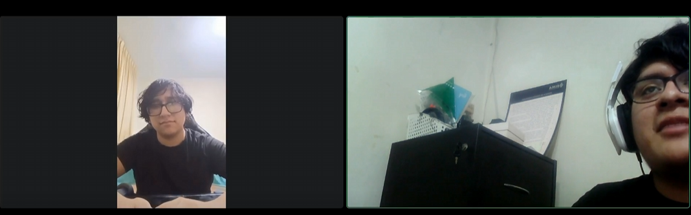  Entrevista 2 | 
|---|----|
| **Nombre** | André Bremen Mendoza Latorraca|
| **Edad** | 21 años|
| **Distrito** | los olivos |
| **Duración** | 16.49 min |
| **Enlace** | [Entrevista](https://upcedupe-my.sharepoint.com/:v:/g/personal/u202312447_upc_edu_pe/IQAdO5YnqN4aRpc8eUr_rrdhAQK6Il6vmXcJvhbIfG5FvRg?nav=eyJyZWZlcnJhbEluZm8iOnsicmVmZXJyYWxBcHAiOiJTdHJlYW1XZWJBcHAiLCJyZWZlcnJhbFZpZXciOiJTaGFyZURpYWxvZy1MaW5rIiwicmVmZXJyYWxBcHBQbGF0Zm9ybSI6IldlYiIsInJlZmVycmFsTW9kZSI6InZpZXcifX0%3D&e=27KhVP) |

| Campo |   Entrevista 3 | 
|---|----|
| **Nombre** |Yañez Santos, Leo Giovany |
| **Edad** | 23 años|
| **Distrito** | Pueblo Libre, Lima |
| **Duración** | 8 min |
| **Enlace** | [Entrevista](https://upcedupe-my.sharepoint.com/:v:/g/personal/u202311912_upc_edu_pe/IQDwOqfrT_Q6TK5A2YJNbLxQAXtefQGILKSGRyxyxdYERhE?nav=eyJyZWZlcnJhbEluZm8iOnsicmVmZXJyYWxBcHAiOiJPbmVEcml2ZUZvckJ1c2luZXNzIiwicmVmZXJyYWxBcHBQbGF0Zm9ybSI6IldlYiIsInJlZmVycmFsTW9kZSI6InZpZXciLCJyZWZlcnJhbFZpZXciOiJNeUZpbGVzTGlua0NvcHkifX0&e=Ifu8rv) |

**Registro de entrevistas para el segmento de Conductores**

| Campo |   Entrevista 1 |  
|---|----|
| **Nombre** | Juan Fernando Bermúdez Alcantara|
| **Edad** | 27 años|
| **Distrito** | Chorrillos |
| **Duración** | 17.33 min |
| **Enlace** | [Entrevista](https://upcedupe-my.sharepoint.com/:v:/g/personal/u202221619_upc_edu_pe/IQBN2IlGe6pwRb86w78L3pBPAR5DqnupF969g0HVkKxNFd0?nav=eyJyZWZlcnJhbEluZm8iOnsicmVmZXJyYWxBcHAiOiJPbmVEcml2ZUZvckJ1c2luZXNzIiwicmVmZXJyYWxBcHBQbGF0Zm9ybSI6IldlYiIsInJlZmVycmFsTW9kZSI6InZpZXciLCJyZWZlcnJhbFZpZXciOiJNeUZpbGVzTGlua0NvcHkifX0&e=ML2FXq) |

| Campo |   Entrevista 2 |
|---|----|
| **Nombre** | Aarón Alexander Avila Palacios |
| **Edad** | 34 años |
| **Distrito** | Chorrillos |
| **Duración** | 11.05 min |
| **Enlace** | [Entrevista](https://upcedupe-my.sharepoint.com/:v:/g/personal/u201823654_upc_edu_pe/IQDaHFGp5jd1Q4PNxKCVoALKAYSTtIZl4dBpzGbSmlNXFOI?nav=eyJyZWZlcnJhbEluZm8iOnsicmVmZXJyYWxBcHAiOiJTdHJlYW1XZWJBcHAiLCJyZWZlcnJhbFZpZXciOiJTaGFyZURpYWxvZy1MaW5rIiwicmVmZXJyYWxBcHBQbGF0Zm9ybSI6IldlYiIsInJlZmVycmFsTW9kZSI6InZpZXcifX0%3D&e=nbWVOm) |

| Campo |   Entrevista 3 |
|---|----|
| **Nombre** | Angel José Pariona |
| **Edad** | 25 años |
| **Distrito** | San Martín de Porres |
| **Duración** | 11:07 min |
| **Enlace** | [Entrevista](https://upcedupe-my.sharepoint.com/:v:/g/personal/u20231b120_upc_edu_pe/IQCZzyO_8COlTp3EYNFYg8tiAdo9CarnO2vmH1tXKGUVsp8?nav=eyJyZWZlcnJhbEluZm8iOnsicmVmZXJyYWxBcHAiOiJTdHJlYW1XZWJBcHAiLCJyZWZlcnJhbFZpZXciOiJTaGFyZURpYWxvZy1MaW5rIiwicmVmZXJyYWxBcHBQbGF0Zm9ybSI6IldlYiIsInJlZmVycmFsTW9kZSI6InZpZXcifX0%3D&e=9KGulE) |

### 2.2.3 Análisis de Entrevistas

---
**Análisis de entrevistas para el segmento de Pasajeros**

1.- Mariana Rafael
<article #id="analisis-ent-01">
La entrevistada (Mariana Alexa Rafael Sosa, 21 años, distrito de Lince, estudiante de Ciencias de la Computación y con un trabajo part-time en Starbucks) presenta un perfil de usuaria intensiva y comparadora de apps de transporte, con desplazamientos frecuentes hacia San Miguel, San Isidro y Surco (Monterrico) —principalmente en horario nocturno, 2 veces por semana—. Su elección de transporte depende directamente de cuánto tiempo tenga disponible: usa el corredor rojo cuando puede planificar con calma (~S/5/día), recurre a "colectivos" informales/ilegales cuando está apurada (~S/10/día), y toma taxi por app cuando el apuro es mayor (S/15-25). Esta jerarquía revela que el factor tiempo pesa más que el ahorro en su decisión diaria.

Es una usuaria de múltiples aplicaciones a la vez (Uber, inDrive, entre otras): antes tuvo suscripción Uber One, pero al cambiar de celular con más almacenamiento empezó a comparar precios entre varias apps simultáneamente antes de pedir un viaje. Tuvo una experiencia negativa con inDrive —conductores que cobran más del precio sugerido cuando sienten disconformidad con la comisión de la app—, lo que la llevó a migrar ese tipo de viajes a otras plataformas.

Un hallazgo relevante para ShareWay es que Mariana ya aplica un "filtro de seguridad" propio e informal al usar colectivos: observa si los demás pasajeros son solo hombres, si alguien "tiene cara" de generar desconfianza, y si el precio cobrado corresponde al normal (menciona que a veces le cobran S/7-8 en vez de S/5 "porque no se molesta en reclamar"). Explícitamente pide que una app de viajes compartidos formalice ese filtro para todos los usuarios, incluida ella misma ("no soy monedita de oro"), y se sentiría cómoda con algún tipo de acompañamiento durante el viaje. También revisa activamente el historial de viajes y el rating del conductor: tolera 4.8-5.0 estrellas con muchos viajes, pero un conductor con muchos viajes y calificación baja (3-4 estrellas) le genera alerta y lo evita.

Sobre cancelaciones tras confirmar el viaje, propone un mecanismo tipo Uber: penalizar o desincentivar la cancelación (p. ej. mejores tarifas para quien no cancela) como forma de dar certidumbre tanto al pasajero como al conductor. En temas de seguridad durante el recorrido, cita explícitamente las funciones de Uber que le generan confianza —alertas automáticas cuando el vehículo permanece detenido mucho tiempo, botón de pánico y contacto con emergencias— y espera que ShareWay ofrezca algo equivalente, mencionando el contexto de casos de secuestro en el país como motivador de esa preocupación.

Sobre la propuesta central de ShareWay, sugiere que la agrupación se organice por institución educativa/laboral (compañeros de la misma universidad o colegio, vecinos con horarios similares) y que el sistema entienda el destino final del pasajero (no solo el punto geográfico) para lograr mejores agrupaciones —por ejemplo, una ruta que pase primero por la Católica y luego por la UPC, cobrando proporcionalmente según el tramo recorrido.

Como condición para adoptar la propuesta, plantea una idea concreta y aplicable: implementar una verificación/descuento estudiantil mediante correo institucional (al estilo Spotify Student, Canva o YouTube Music), posiblemente complementada con carnet o boleta de pago, dado que valora un precio accesible por su condición de estudiante con ingresos limitados. Sus principales motivos para no usar la propuesta serían: precios que no correspondan a lo ofrecido, fallas en los mecanismos de seguridad o en el filtro de pasajeros/conductores, y cualquier incongruencia entre lo prometido por la plataforma y el servicio real entregado.
</article>

2.- André mendoza
<article #id="analisis-ent-02">
El entrevistado (André Mendoza, 20 años, distrito de Los Olivos, estudiante universitario y asistente contable en dos empresas) refleja un perfil de desplazamiento moderado pero sensible al tema de seguridad y confianza. Se traslada principalmente a la universidad y a casas de familiares, entre 4 y 5 días por semana, con horarios poco estables por el tráfico. Su medio principal es el transporte público (Metropolitano, buses), y solo ocasionalmente usa apps de transporte privado —prefiere inDrive sobre Uber, tras haber tenido problemas previos con Uber y sus conductores—, gastando aproximadamente S/30-40 cada 2-3 semanas en esas ocasiones.

Un punto central de la entrevista es una experiencia traumática con el transporte público: un bus en el que viajaba sufrió una falla (posiblemente de llanta) que generó humo, obligando a los pasajeros a bajarse por miedo en plena vía pública. Desde entonces evita esa ruta de transporte, lo que evidencia cuánto pesa la percepción de seguridad física en su elección de medio de transporte, más allá del costo o el tiempo.

Respecto a compartir viajes, André tiene experiencia positiva dividiendo costos de taxi con amigos y familiares ("mientras más somos, mejor para dividir el costo"), pero traslada esa apertura a desconocidos con matices: aceptaría compartir vehículo con personas que no conoce siempre que no retrase su llegada al destino, y valora conocer previamente algún indicio sobre el conductor y el vehículo. Es exigente con la reputación del conductor: revisa activamente el rating de estrellas y el número de viajes realizados, señalando que un conductor con pocas reseñas (100-200 viajes) o baja calificación le genera desconfianza.

Sobre el trade-off de precio vs. tiempo, se muestra receptivo: toleraría hasta ~20 minutos adicionales si el viaje compartido resulta planificado y más económico. Sin embargo, considera que una cancelación después de confirmado el viaje (del conductor o de otro pasajero) sería una desventaja neta, porque descuadra sus horarios y genera tedio, pese al ahorro potencial —esto lo identifica como su principal reparo frente a la propuesta.

Ve valor concreto en ShareWay para dos escenarios: viajes largos o costosos donde compartir compensa el gasto, y viajes grupales con amigos o familiares que se dirigen a destinos distintos pero parten juntos, lo cual considera una funcionalidad "productiva" no contemplada inicialmente. En cuanto a seguridad personal durante el recorrido, su mecanismo actual es compartir ubicación con familiares y mantener activada la llamada de emergencia en el celular — coincide con lo que ShareWay ya contempla (contacto de emergencia).

Como principales barreras para adoptar la propuesta menciona: El riesgo de que una cancelación corte el viaje grupal y genere esperas, y El desconocimiento del conductor o de los demás pasajeros, incluyendo el temor a que alguno tenga "malas intenciones". Pese a estas reservas, cierra la entrevista calificando la propuesta como "muy buena".
</article>

3.- Yañez Santos, Leo Giovany

La entrevista realizada a Leo, estudiante universitario de 23 años, permitió identificar que sus principales preocupaciones al movilizarse son el costo, el tiempo de viaje y la seguridad.

El entrevistado realiza traslados frecuentes y suele contar con horarios relativamente estables, por lo que considera útil poder planificar sus viajes con anticipación. Aunque utiliza transporte público por su bajo costo, también recurre a aplicaciones de taxi cuando necesita mayor rapidez.

Respecto a los viajes compartidos, Leo considera que podrían ser una buena alternativa para reducir gastos, siempre que los pasajeros y conductores estén verificados. También valora conocer previamente el precio, la duración estimada, las paradas y la información del conductor.

Además, estaría dispuesto a aceptar entre 10 y 15 minutos adicionales de viaje si el ahorro económico es significativo. Sin embargo, no utilizaría esta modalidad cuando necesite llegar con urgencia.

Estos hallazgos respaldan funcionalidades de ShareWay como los viajes programados, agrupación de pasajeros con rutas compatibles, verificación de usuarios, calificaciones, información anticipada del recorrido y herramientas de seguridad.

**Análisis de entrevistas para el segmento de Conductores**
1. Juan Bermúdez
<article #id="analisis-conductor-01">
Juan cree que la rentabilidad y el control sobre el servicio son fundamentales.
Por ejemplo, plantea que un conductor pueda crear una ruta entre dos universidades, indicando los horarios de ida y vuelta. Los estudiantes podrían encontrar y utilizar directamente esa ruta sin tener que organizarse previamente entre ellos.

ShareWay podría ser atractivo para él si le permite planificar rutas previamente, conocer cuántos pasajeros tendrá, estimar sus ingresos y controlar sus horarios y tarifas, en lugar de depender completamente de solicitudes individuales como ocurre con las aplicaciones tradicionales. Esto responde directamente a su preocupación por el pago por kilómetro, los tiempos muertos, la congestión y el tiempo necesario para conseguir pasajeros después de terminar un viaje.
</article>

2. Aarón Avila
<article #id="analisis-conductor-02">
El entrevistado (Aarón Alexander Avila Palacios, 34 años, distrito de Chorrillos, conductor independiente de transporte particular) representa un perfil con experiencia sostenida en servicios de movilidad urbana. Lleva aproximadamente seis años realizando traslados de pasajeros y trabaja principalmente en Chorrillos, Barranco, Miraflores, San Isidro, Surco y zonas cercanas. Su jornada se concentra en franjas de alta demanda, especialmente entre 6:30 y 10:00 de la mañana y entre 5:00 y 9:00 de la noche.

Su principal criterio de decisión es la rentabilidad real del recorrido. Antes de aceptar un viaje evalúa punto de recojo, destino, distancia, tiempo estimado, tarifa, forma de pago, paradas adicionales, tráfico, comisión de la plataforma y posibilidad de conseguir otro pasajero cerca del destino. Este hallazgo refuerza la necesidad de que ShareWay muestre información completa antes de que el conductor acepte una propuesta.

También identifica como problemas frecuentes las cancelaciones de último minuto, los pasajeros que no están listos al llegar, los recorridos hacia zonas de baja demanda y los viajes cortos que requieren desplazamientos largos hasta el punto de recojo. Por ello, considera necesarias reglas claras sobre tiempo máximo de espera, penalidades por cancelación tardía y límites para cambios de ruta, especialmente cuando se trata de un viaje compartido.

Sobre los recorridos con varios pasajeros, el entrevistado los considera viables si las paradas siguen una lógica de ruta y si el ingreso final compensa el tiempo adicional. La propuesta de ShareWay le resultaría atractiva si ofrece pasajeros confirmados, rutas organizadas, ganancia visible y reglas que protejan su tiempo. La rechazaría si incluye demasiadas paradas, pago insuficiente o falta de confirmación de los pasajeros.

En seguridad y verificación, valida positivamente mecanismos como PIN o código QR para confirmar al pasajero correcto, sobre todo en puntos donde esperan varias personas. Asimismo, considera útil contar con soporte rápido, registro de datos del viaje y opciones para reportar emergencias, conflictos u objetos perdidos. Respecto a la comisión, estaría dispuesto a aceptarla si la plataforma reduce tiempos muertos, consigue pasajeros confirmados y mantiene la comisión en un nivel transparente y razonable.
</article>

3. Angel José Pariona
<article #id="analisis-conductor-03">
El entrevistado Angel José Pariona, trabaja como conductor de transporte de pasajeros utilizando un vehículo alquilado. Esta modalidad de trabajo le exige organizar sus jornadas con la presión diaria de conseguir pasajeros para cubrir la cuota de alquiler del automóvil. Inició en el servicio hace poco tiempo y sus recorridos se concentran habitualmente de lunes a sábado en la zona norte.

Antes de aceptar un viaje, su criterio de decisión más importante es la tarifa, seguida de cerca por el destino, el contexto general de la ruta y la calificación del pasajero. Para determinar la conveniencia real de un recorrido, calcula el costo del combustible por kilómetro, la cuota diaria del auto y el tiempo estimado del viaje, buscando siempre que le deje un margen de ganancia por hora que supere sus gastos operativos.

Entre las dificultades frecuentes que le generan tiempos muertos se encuentran el tráfico en vías principales como la Panamericana Norte, los trayectos hacia zonas residenciales alejadas y las demoras de los usuarios en los puntos de recojo. Menciona haber tenido que cancelar servicios tras esperar más de siete minutos sin respuesta del cliente. Por ello, para un modelo de viaje programado o compartido, exige reglas claras: un tiempo máximo de espera de 5 minutos y penalidades económicas si el pasajero cancela de forma tardía.

Respecto a la propuesta de ShareWay, le resultaría muy atractiva si la plataforma ofrece rutas con paradas intermedias secuenciales y optimizadas, le ayuda a evadir el tráfico y garantiza una tarifa rentable por kilómetro. Valora positivamente la tranquilidad de asegurar un ingreso fijo por adelantado, comparándolo con la ventaja de los viajes programados hacia el aeropuerto. Rechazaría el servicio si el orden de las paradas genera desorden o conflictos directos entre los pasajeros.

En temas de seguridad, considera vital que la plataforma exija revisión de antecedentes, validación de DNI y reconocimiento facial, sumado a su propia práctica de preguntar el nombre del pasajero antes de abrir las puertas. Ante incidentes, espera que la aplicación brinde un soporte de cobertura rápida frente a daños materiales, además de asistencia legal y telefónica inmediata. Finalmente, estaría dispuesto a pagar una comisión siempre y cuando la plataforma le garantice un flujo constante de viajes, seguridad y responsabilidad por parte de los pasajeros.
</article>

**Análisis consolidado por segmento**

Considerando que el avance actual cuenta con dos entrevistas registradas por segmento, los porcentajes se interpretan como hallazgos preliminares y no como resultados estadísticamente representativos de toda Lima Metropolitana.

**Segmento pasajeros**

- El 100% de los entrevistados manifiesta preocupación por la seguridad al trasladarse y espera información clara sobre conductor, vehículo, reputación o mecanismos de emergencia.
- El 100% compara alternativas de transporte considerando precio, tiempo y confianza, aunque el peso de cada factor cambia según la urgencia del viaje.
- El 100% muestra apertura a compartir un traslado si el beneficio económico o de organización compensa el tiempo adicional y si existen condiciones visibles antes de confirmar.
- El 100% identifica las cancelaciones o retrasos como un riesgo importante para adoptar un viaje compartido programado.
- El 50% propone explícitamente agrupar viajes por comunidades conocidas, como universidades, centros de trabajo o grupos con rutas compatibles.

Estos hallazgos sustentan al User Persona de pasajeros como una usuaria que necesita ahorrar y planificar, pero que no aceptará la propuesta si percibe incertidumbre en seguridad, puntualidad o precio.

**Segmento conductores**

- El 100% de los entrevistados evalúa la conveniencia del servicio a partir de la rentabilidad, el tiempo invertido y el control sobre la ruta.
- El 100% considera valioso conocer anticipadamente pasajeros, paradas, duración estimada e ingresos antes de aceptar un viaje.
- El 100% identifica cancelaciones, tiempos de espera y cambios de ruta como riesgos que deben regularse desde la plataforma.
- El 100% considera útil que la plataforma permita planificar recorridos o rutas con mayor anticipación para reducir tiempos muertos.
- El 50% menciona de forma explícita la utilidad de mecanismos de validación como PIN o QR para confirmar al pasajero correcto.

Estos hallazgos sustentan al User Persona de conductor como un usuario que busca ingresos previsibles, reglas claras y herramientas que reduzcan incertidumbre operativa.

## 2.3. NeedFinding

El proceso de Needfinding permitió transformar los hallazgos de entrevistas y el análisis competitivo en artefactos que representan necesidades, tareas, emociones y escenarios actuales de los segmentos objetivo. Para este avance se consideran dos segmentos principales: pasajeros con desplazamientos frecuentes y conductores interesados en viajes programados.

Los artefactos presentados no reemplazan las entrevistas, sino que sintetizan sus patrones más relevantes para orientar la especificación de requisitos. En conjunto, los User Personas, User Task Matrix, Empathy Maps y As-Is Scenario Mapping permiten identificar qué problemas deben resolverse antes de proponer funcionalidades.

### 2.3.1. User Personas

Los User Personas se construyeron a partir de características recurrentes observadas en las entrevistas y en el análisis de alternativas existentes. Para pasajeros, se priorizaron preocupaciones sobre ahorro, tiempo, confianza y planificación. Para conductores, se priorizaron rentabilidad, control operativo, reducción de tiempos muertos y claridad en reglas de servicio.

Segmento pasajeros

    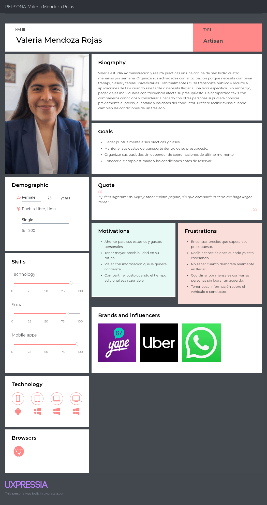

Segmento conductores

    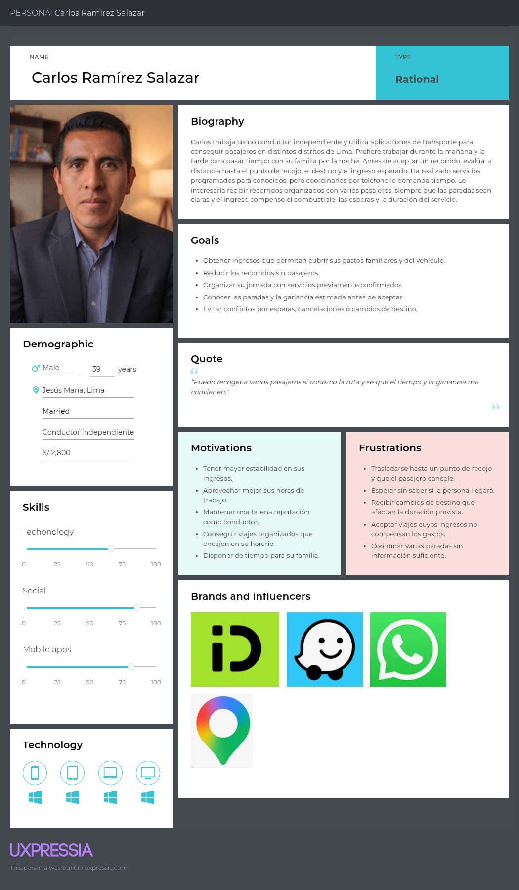

### 2.3.2. User Task Matrix

El User Task Matrix identifica tareas que los segmentos realizan independientemente de que ShareWay exista. Estas tareas permiten diferenciar necesidades reales de funcionalidades propuestas. Para facilitar la lectura del informe, se presentan por segmento y luego se analizan las tareas de mayor frecuencia e importancia.

#### 1. Segmento pasajeros

| Tareas (Tasks) | Frecuencia | Importancia |
| :--- | :---: | :---: |
| Planificar y programar los desplazamientos semanales según horarios de estudio o trabajo | Alta | Alta |
| Buscar, comparar y evaluar alternativas de transporte y costos | Alta | Alta |
| Intentar coordinar rutas o traslados compartidos con conocidos o de forma informal | Media | Media |
| Acordar puntos de recojo, llegada y condiciones del viaje | Media | Alta |
| Gestionar imprevistos, retrasos o cancelaciones imprevistas | Media | Alta |
| Verificar la identidad de los conductores y las condiciones de seguridad del vehículo | Alta | Alta |

* **Análisis de User Task Matrix:** Las tareas más críticas para Valeria se centran en la planificación anticipada, la evaluación de precios y la verificación rigurosa de la seguridad. Esto refleja su necesidad constante de optimizar su presupuesto y viajar con tranquilidad en Lima Metropolitana, buscando opciones estructuradas que eviten la incertidumbre del transporte informal.

#### 2. Segmento conductor

| Tareas (Tasks) | Frecuencia | Importancia |
| :--- | :---: | :---: |
| Evaluar la rentabilidad diaria y los costos operativos (combustible, mantenimiento) | Alta | Alta |
| Revisar y aceptar propuestas de recorridos o rutas en la ciudad | Alta | Alta |
| Organizar y coordinar las paradas, secuencia de recojo y destinos de los pasajeros | Alta | Alta |
| Gestionar cancelaciones, tiempos de espera y ausencias de los pasajeros | Media | Alta |
| Validar la identidad de los pasajeros al momento del abordaje | Alta | Alta |
| Consultar el historial de viajes, calificaciones y ganancias estimadas | Media | Media |

* **Análisis de User Task Matrix:** Para Carlos, las actividades de mayor prioridad giran en torno a la viabilidad financiera (rendimiento frente a costos operativos) y al control operativo de las rutas y paradas. Su enfoque demuestra que requiere herramientas claras que le garanticen la seguridad y el cumplimiento de los tiempos para que cada viaje compartido resulte rentable y organizado.

### 2.3.3. Empathy Maps

Los Empathy Maps resumen lo que cada User Persona dice, piensa, siente, observa y necesita resolver. Su objetivo es conectar los hallazgos de entrevista con motivaciones, frustraciones y criterios de decisión que influyen en la adopción de ShareWay.

#### 1. Segmento pasajeros

    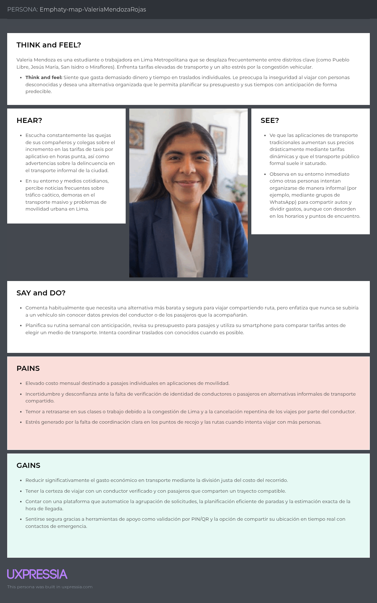

#### 2. Segmento conductor

    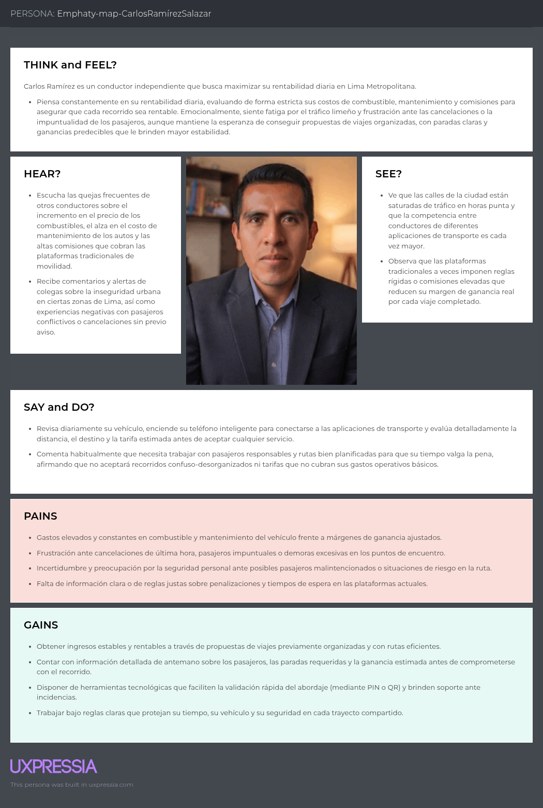

### 2.3.4. As-Is Scenario Mapping

El As-Is Scenario Mapping representa la experiencia actual antes de ShareWay. En pasajeros, se observan decisiones fragmentadas entre costo, seguridad y tiempo. En conductores, se observa dependencia de solicitudes individuales, incertidumbre sobre rentabilidad y exposición a cancelaciones o esperas.

#### 1. Segmento pasajeros

    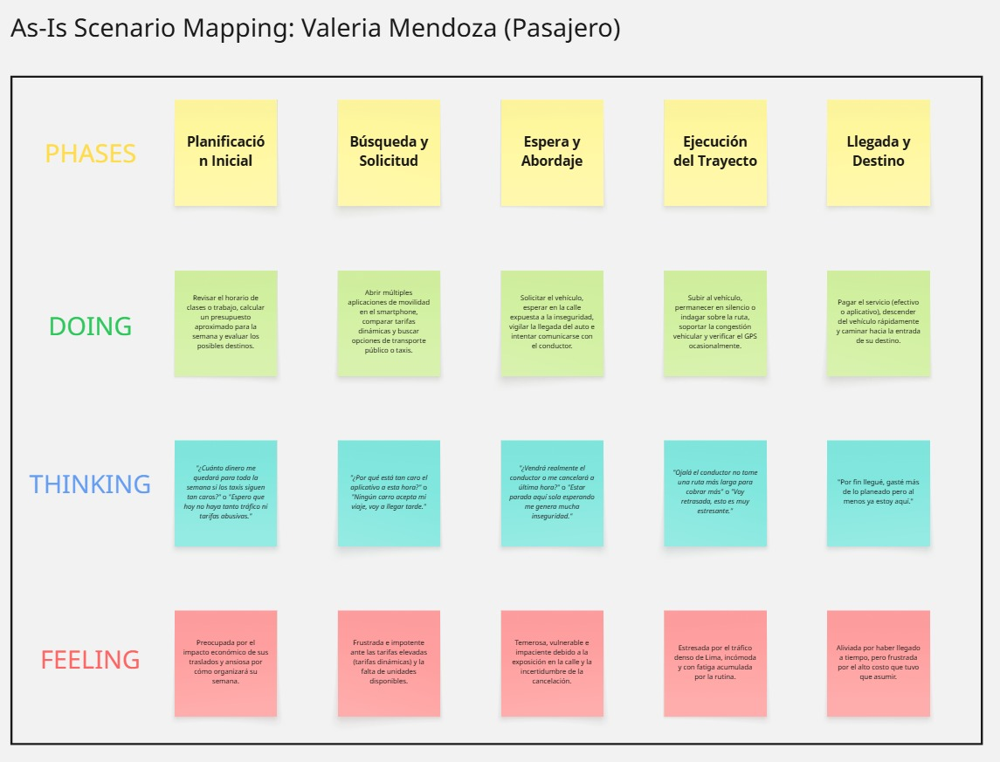

#### 2. Segmento conductor

    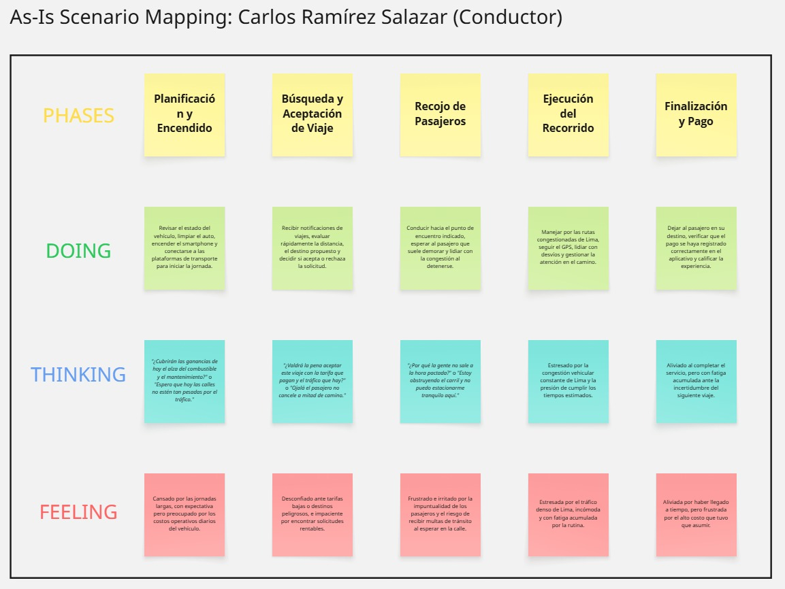

# CAPÍTULO III: Requirements Specification

## 3.1. To-Be Scenario Mapping

El To-Be Scenario Mapping representa el escenario objetivo que ShareWay propone para los segmentos de pasajeros y conductores. A diferencia del As-Is Scenario Mapping, que muestra la experiencia actual con incertidumbre, coordinación informal y decisiones poco estructuradas, el escenario To-Be describe cómo debería desarrollarse la interacción cuando la plataforma organiza las solicitudes, presenta información anticipada y facilita la confirmación del viaje compartido.

Para elaborar los mapas se consideraron las necesidades identificadas en los segmentos objetivo, los supuestos de Lean UX y los hallazgos iniciales del análisis de entrevistas. El resultado permite visualizar las fases esperadas de uso, las acciones de cada usuario, sus pensamientos durante la experiencia y las emociones que deberían acompañar el proceso.

El proceso seguido inició con la preparación de los User Personas y revisión de los As-Is Scenario Mapping. Luego se realizó una lluvia de ideas sobre acciones esperadas en una experiencia ideal, se agruparon las ideas en fases, se nombraron las columnas principales y se comparó cada fase con el escenario actual para identificar cambios que ShareWay debería ofrecer. Las filas consideradas fueron Phases, Doing, Thinking y Feeling, conforme al formato solicitado para Scenario Mapping.

**To-Be Scenario Mapping para el segmento de pasajeros**

En el caso del segmento de pasajeros, el escenario objetivo inicia cuando la usuaria conoce ShareWay como una alternativa para organizar viajes compartidos programados. Luego registra su solicitud indicando origen, destino, fecha, hora y preferencias básicas. A partir de esa información, la plataforma presenta una propuesta con ruta sugerida, tarifa, conductor, pasajeros agrupados y condiciones del viaje.

La usuaria puede confirmar la reserva con mayor seguridad porque conoce anticipadamente el costo, el tiempo estimado, la ruta y los datos relevantes del servicio. Durante el abordaje, valida que se encuentra ante el vehículo correcto mediante PIN o código QR. Finalmente, consulta el estado del recorrido, recibe actualizaciones y evalúa la experiencia al terminar el viaje.

    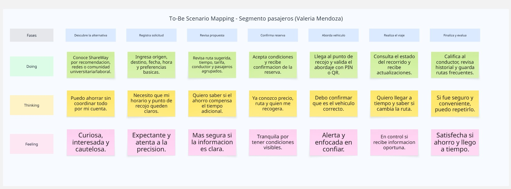

Este escenario busca reducir la incertidumbre del pasajero al compartir un vehículo con otras personas. La experiencia propuesta se centra en brindar información clara antes de confirmar, controlar los puntos críticos del abordaje y generar confianza mediante datos visibles del conductor, del vehículo y del recorrido.

**To-Be Scenario Mapping para el segmento de conductores**

En el caso del segmento de conductores, el escenario objetivo inicia cuando el conductor se registra en ShareWay para recibir propuestas de viajes programados. Luego configura su disponibilidad, completa sus datos personales, registra el vehículo y presenta la documentación necesaria para el proceso de verificación.

Una vez habilitado, el conductor recibe propuestas de rutas con pasajeros agrupados, paradas, duración estimada y ganancia esperada. Con esta información puede evaluar la conveniencia del servicio antes de aceptarlo. Durante el viaje, valida a cada pasajero mediante PIN o código QR, sigue la ruta sugerida y gestiona el avance del recorrido. Al finalizar, revisa sus ganancias, calificaciones e historial.

    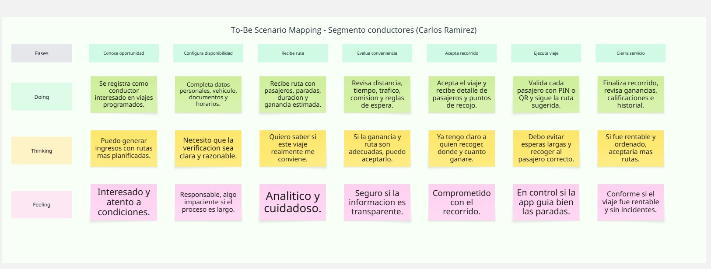

Este escenario busca que el conductor tome decisiones con información suficiente sobre tiempo, distancia, pasajeros, reglas de espera y rentabilidad. La experiencia propuesta reduce la dependencia de coordinaciones manuales y permite que el servicio se ejecute con condiciones previamente definidas.

## 3.2. User Stories

A partir del análisis de entrevistas, los User Persona (Valeria Mendoza Rojas para el segmento de pasajeros y Carlos Ramírez Salazar para el segmento de conductores), el User Task Matrix, los Empathy Maps y los escenarios As-Is / To-Be, se identificaron los requisitos funcionales de ShareWay. Estos requisitos se organizaron como User Stories agrupadas en Epics, de modo que cada historia pueda trazarse hacia la necesidad de negocio que busca resolver.

Cada User Story sigue el formato **"Como [rol], quiero [acción], para [beneficio]"** y se complementa con Criterios de Aceptación que permiten validar objetivamente cuándo la historia se considera terminada (Definition of Done a nivel de historia).

**Épicas identificadas**

Cada Epic se redacta como una historia de usuario de grano grueso, en el mismo formato **"Como [rol], quiero [objetivo amplio], para [beneficio]"**, y agrupa a varias User Stories relacionadas mediante su ID.

| ID Epic | Nombre (label) | Historia Épica |
| :---: | :--- | :--- |
| EP-01 | búsqueda y reserva de viajes | **Como** pasajero, **quiero** poder buscar, solicitar y reservar viajes compartidos disponibles según mi ruta y horario, **para** trasladarme de forma planificada sin depender de la improvisación del transporte informal. |
| EP-02 | agrupación y coordinación del viaje | **Como** pasajero, **quiero** conocer cómo se conforma el grupo de viaje y el detalle del recorrido antes y durante el trayecto, **para** anticipar tiempos y coordinar mi traslado con confianza. |
| EP-03 | confianza e identidad | **Como** pasajero o conductor, **quiero** verificar la identidad de la otra parte antes y durante el viaje, **para** sentir seguridad al compartir un vehículo con una persona desconocida. |
| EP-04 | tarifas y pagos | **Como** pasajero o conductor, **quiero** conocer y gestionar la tarifa y el cobro de cada viaje compartido, **para** tomar decisiones informadas sobre el costo y el ingreso del servicio. |
| EP-05 | gestión operativa del conductor | **Como** conductor, **quiero** gestionar mi disponibilidad, aceptar propuestas de viaje y ejecutar el recorrido de forma ordenada, **para** operar en ShareWay de manera eficiente y rentable. |
| EP-06 | seguridad y emergencias | **Como** pasajero o conductor, **quiero** contar con mecanismos de protección ante situaciones de riesgo durante el viaje, **para** sentirme seguro al utilizar ShareWay. |
| EP-07 | historial y reputación | **Como** pasajero o conductor, **quiero** calificar la experiencia del viaje y consultar mi historial dentro de la plataforma, **para** construir confianza y llevar control de mi actividad. |
| EP-08 | registro y habilitación de conductores | **Como** conductor, **quiero** registrarme y presentar mis documentos y los datos de mi vehículo, **para** habilitarme como conductor verificado dentro de ShareWay. |

**Historias de Usuario**

| Epic / User Story ID | Título | Descripción | Criterios de Aceptación | Relacionado con (Epic ID) |
| :---: | :--- | :--- | :--- | :---: |
| US-01 | Encontrar puntos populares | **Como** pasajero, **quiero** visualizar las rutas más utilizadas desde un punto concurrido, **para** identificar rápidamente destinos con viajes compartidos disponibles. | Escenario 1: Dado que el pasajero abre la pantalla de búsqueda, Cuando el sistema detecta su ubicación, Entonces muestra las rutas con mayor demanda cercanas, indicando origen, destino frecuente y cantidad aproximada de viajes disponibles. Escenario 2: Dado que no existen rutas populares cercanas a la ubicación del pasajero, Cuando este ingresa a la sección de rutas populares, Entonces el sistema muestra el mensaje "No se encontraron rutas populares cerca de tu ubicación." | EP-01 |
| US-02 | Buscar rutas | **Como** pasajero, **quiero** consultar los viajes disponibles para una ruta y horario determinados, **para** elegir el viaje que más se ajuste a mis necesidades. | Escenario 1: Dado que el pasajero ingresa origen, destino, fecha y rango horario, Cuando ejecuta la búsqueda, Entonces el sistema muestra el listado de viajes disponibles con tarifa estimada, hora de salida y asientos disponibles. Escenario 2: Dado que no existen viajes que cumplan los criterios seleccionados, Cuando el pasajero ejecuta la búsqueda, Entonces el sistema muestra el mensaje "No hay viajes disponibles para los criterios seleccionados." | EP-01 |
| US-03 | Estimar precio | **Como** pasajero, **quiero** conocer el precio que pagaré antes de incluirme a un viaje, **para** decidir si la opción se ajusta a mi presupuesto. | Escenario 1: Dado que el pasajero selecciona un viaje disponible, Cuando el sistema calcula el precio según distancia, pasajeros agrupados y tarifa base vigente, Entonces muestra el precio estimado antes de confirmar la reserva. Escenario 2: Dado que el precio final varía por un cambio de ruta después de confirmada la reserva, Cuando el sistema detecta la variación, Entonces notifica al pasajero antes de continuar con el viaje. | EP-04 |
| US-04 | Asegurar asiento | **Como** pasajero, **quiero** reservar mi asiento en un viaje compartido, **para** asegurar un lugar en el vehículo. | Escenario 1: Dado que el pasajero confirma su reserva, Cuando el sistema procesa la solicitud, Entonces bloquea el asiento para otros pasajeros mientras se completa el pago y actualiza la disponibilidad en tiempo real. Escenario 2: Dado que el viaje se llena mientras el pasajero está confirmando su reserva, Cuando intenta completar la confirmación, Entonces el sistema muestra el mensaje "El viaje ya no tiene asientos disponibles." | EP-01 |
| US-05 | Encontrar compañeros de viaje | **Como** pasajero, **quiero** conocer cuántos pasajeros ya han reservado un lugar en el vehículo, **para** saber qué tanto tardará en iniciar el recorrido. | Escenario 1: Dado que el pasajero consulta el detalle de un viaje, Cuando abre la sección de pasajeros confirmados, Entonces visualiza la cantidad actual, el mínimo requerido y una barra de progreso hacia ese mínimo. Escenario 2: Dado que otro pasajero se une o cancela su reserva en el mismo viaje, Cuando ocurre ese cambio, Entonces el contador y la barra de progreso se actualizan automáticamente. | EP-02 |
| US-06 | Información del viaje | **Como** pasajero, **quiero** consultar la hora estimada de salida, ruta elegida y paradas del viaje, **para** saber cómo se desarrollará mi recorrido. | Escenario 1: Dado que el pasajero abre el detalle de su viaje, Cuando consulta la información del recorrido, Entonces el sistema muestra la hora estimada de salida, la ruta en mapa y la lista ordenada de paradas. Escenario 2: Dado que se agregan o retiran paradas antes del inicio del viaje, Cuando ocurre ese cambio, Entonces el sistema recalcula y actualiza el tiempo estimado visible para el pasajero. | EP-02 |
| US-07 | Información del chofer | **Como** pasajero, **quiero** conocer información relevante del chofer antes del viaje, **para** tener mayor confianza al utilizar el servicio. | Escenario 1: Dado que el pasajero tiene un viaje confirmado, Cuando consulta la información del conductor, Entonces el sistema muestra nombre, foto, calificación promedio, cantidad de viajes realizados y el estado de verificación de documentos. Escenario 2: Dado que el conductor asignado no tiene calificaciones previas, Cuando el pasajero consulta su información, Entonces el sistema muestra la etiqueta "Conductor nuevo en la plataforma." | EP-03 |
| US-08 | Ayuda para abordar | **Como** pasajero, **quiero** recibir información del vehículo, como modelo, color y placa, **para** estar preparado antes de abordar. | Escenario 1: Dado que faltan 10 minutos para la hora de recojo, Cuando se acerca ese momento, Entonces el sistema envía al pasajero una notificación con marca, modelo, color y placa del vehículo asignado. Escenario 2: Dado que el pasajero necesita revisar nuevamente esos datos, Cuando abre el detalle del viaje, Entonces puede consultar la información del vehículo en cualquier momento. | EP-03 |
| US-09 | Valorar servicio | **Como** pasajero, **quiero** calificar el viaje al final del recorrido, **para** comunicar mi experiencia con el servicio. | Escenario 1: Dado que el viaje finaliza, Cuando el sistema solicita la calificación al pasajero, Entonces este puede asignar de 1 a 5 estrellas y un comentario opcional, reflejándose en el promedio del conductor dentro de las 24 horas siguientes. Escenario 2: Dado que el pasajero no califica el viaje, Cuando transcurren 48 horas desde su finalización, Entonces el sistema descarta automáticamente la solicitud de calificación. | EP-07 |
| US-10 | Bloquear usuarios | **Como** pasajero, **quiero** bloquear a otros usuarios con los que tenga malas experiencias, **para** evitar compartir mi viaje con personas molestas. | Escenario 1: Dado que el pasajero tuvo una mala experiencia con un conductor o pasajero, Cuando lo bloquea desde el historial de viajes, Entonces el sistema evita que ese usuario vuelva a ser agrupado en sus próximos viajes. Escenario 2: Dado que el pasajero quiere revisar a quién ha bloqueado, Cuando abre la sección correspondiente en su perfil, Entonces puede ver y administrar su lista de usuarios bloqueados. | EP-06 |
| US-11 | Validar abordaje con PIN o QR | **Como** pasajero, **quiero** validar mi ingreso al vehículo mediante un PIN o código QR, **para** confirmar que estoy abordando el viaje correcto de forma segura. | Escenario 1: Dado que el pasajero llega al punto de recojo, Cuando muestra al conductor el PIN o QR único generado para el viaje, Entonces el sistema valida el código y marca al pasajero como "abordado". Escenario 2: Dado que el código ingresado es incorrecto en tres intentos consecutivos, Cuando ocurre el tercer intento fallido, Entonces el sistema notifica automáticamente al soporte de la plataforma. | EP-03 |
| US-12 | Cancelar viaje reservado | **Como** pasajero, **quiero** cancelar un viaje que ya reservé, **para** liberar mi asiento cuando cambian mis planes. | Escenario 1: Dado que el pasajero cambia de planes antes de la hora de salida, Cuando cancela el viaje desde el detalle de su reserva, Entonces el sistema libera el asiento de inmediato para otros pasajeros. Escenario 2: Dado que la cancelación ocurre con menos de 30 minutos de anticipación, Cuando el pasajero confirma la cancelación, Entonces el sistema aplica la penalidad correspondiente según la política vigente. | EP-01 |
| US-13 | Compartir ubicación en tiempo real | **Como** pasajero, **quiero** compartir la ubicación de mi viaje con un contacto de emergencia, **para** que pueda seguir mi recorrido ante una situación de riesgo. | Escenario 1: Dado que el pasajero selecciona un contacto de emergencia antes de iniciar el viaje, Cuando el viaje comienza, Entonces el sistema envía a ese contacto un enlace para visualizar la ubicación del vehículo en tiempo real. Escenario 2: Dado que el viaje finaliza, Cuando el sistema registra el cierre del recorrido, Entonces desactiva automáticamente el acceso al enlace de ubicación compartida. | EP-06 |
| US-14 | Recibir notificaciones del viaje | **Como** pasajero, **quiero** recibir notificaciones sobre el estado de mi viaje, **para** estar informado de cambios relevantes en tiempo real. | Escenario 1: Dado que ocurre un evento relevante del viaje (confirmación, proximidad de llegada o inicio del recorrido), Cuando el sistema detecta el evento, Entonces envía al pasajero una notificación correspondiente, incluyendo el tiempo estimado de espera si hay retraso. Escenario 2: Dado que el pasajero no desea recibir notificaciones no críticas, Cuando las desactiva desde la configuración de su cuenta, Entonces el sistema deja de enviárselas. | EP-02 |
| US-15 | Programar viajes recurrentes | **Como** pasajero, **quiero** programar un viaje que se repita en días y horarios fijos, **para** no tener que registrar mi solicitud cada vez que necesito trasladarme. | Escenario 1: Dado que el pasajero define días de la semana, hora y ruta para un viaje recurrente, Cuando guarda la programación, Entonces el sistema genera automáticamente las solicitudes de viaje correspondientes. Escenario 2: Dado que el pasajero ya no necesita el viaje recurrente, Cuando lo pausa o cancela desde su perfil, Entonces el sistema deja de generar nuevas solicitudes a partir de ese momento. | EP-01 |
| US-16 | Registrar cuenta como conductor | **Como** conductor, **quiero** registrarme en la plataforma con mis datos personales, **para** poder ofrecer viajes compartidos a través de ShareWay. | Escenario 1: Dado que una persona desea ofrecer viajes como conductor, Cuando completa el registro con nombre completo, DNI, número de licencia y datos de contacto, Entonces el sistema valida el formato de la licencia y crea la cuenta en estado "pendiente de verificación". Escenario 2: Dado que el conductor aún no ha completado documentos ni datos del vehículo, Cuando intenta acceder a las funciones operativas, Entonces el sistema mantiene su cuenta en estado "pendiente de verificación". | EP-08 |
| US-17 | Subir documentos para verificación | **Como** conductor, **quiero** subir mi brevete, SOAT y tarjeta de propiedad, **para** que la plataforma verifique que cumplo los requisitos para operar. | Escenario 1: Dado que el conductor necesita verificar su cuenta, Cuando sube su brevete, SOAT y tarjeta de propiedad en formato imagen o PDF, Entonces el sistema registra cada documento con estado "en revisión". Escenario 2: Dado que un documento es rechazado durante la revisión, Cuando el conductor consulta su estado, Entonces el sistema muestra el motivo del rechazo y la opción de volver a subirlo. | EP-08 |
| US-18 | Registrar datos del vehículo | **Como** conductor, **quiero** registrar la información de mi vehículo, **para** que los pasajeros puedan identificarlo correctamente durante el viaje. | Escenario 1: Dado que el conductor registra su vehículo, Cuando completa marca, modelo, color, placa y número de asientos disponibles, Entonces el sistema guarda la información y habilita al conductor para operar. Escenario 2: Dado que el vehículo no tiene toda la información obligatoria completa, Cuando el conductor intenta iniciar un viaje, Entonces el sistema no lo permite hasta que los datos estén completos. | EP-08 |
| US-19 | Configurar disponibilidad y horarios | **Como** conductor, **quiero** configurar mis horarios y zonas de disponibilidad, **para** recibir propuestas de viaje que se ajusten a mi rutina. | Escenario 1: Dado que el conductor define días, franjas horarias y zonas donde desea operar, Cuando guarda su configuración, Entonces el sistema solo le envía propuestas de viaje dentro de esa disponibilidad. Escenario 2: Dado que el conductor modifica su disponibilidad, Cuando guarda los cambios, Entonces los viajes ya confirmados no se ven afectados. | EP-05 |
| US-20 | Recibir propuestas de viaje | **Como** conductor, **quiero** recibir propuestas de viajes con ruta, pasajeros agrupados y ganancia estimada, **para** decidir si me conviene aceptarlas. | Escenario 1: Dado que existe un viaje compatible con la disponibilidad del conductor, Cuando el sistema le envía la propuesta, Entonces esta muestra ruta, número de pasajeros, paradas y ganancia estimada antes de decidir. Escenario 2: Dado que el conductor no responde a la propuesta dentro del tiempo determinado, Cuando ese plazo vence, Entonces el sistema la marca como expirada automáticamente. | EP-05 |
| US-21 | Aceptar o rechazar una propuesta de viaje | **Como** conductor, **quiero** aceptar o rechazar una propuesta de viaje, **para** gestionar mi disponibilidad y decidir qué recorridos realizar. | Escenario 1: Dado que el conductor revisa una propuesta de viaje, Cuando decide aceptarla, Entonces el sistema cambia el viaje a estado "confirmado" y notifica a los pasajeros agrupados. Escenario 2: Dado que el conductor decide rechazar la propuesta, Cuando confirma el rechazo, Entonces el sistema la reasigna automáticamente a otro conductor disponible. | EP-05 |
| US-22 | Ver ruta optimizada con paradas | **Como** conductor, **quiero** visualizar la ruta optimizada con el orden de las paradas de recojo, **para** completar el recorrido de la forma más eficiente posible. | Escenario 1: Dado que el conductor inicia un viaje con varias paradas, Cuando el sistema calcula el recorrido, Entonces muestra la ruta optimizada en un mapa con navegación paso a paso, minimizando el tiempo total. Escenario 2: Dado que un pasajero cancela su reserva durante el recorrido, Cuando el sistema registra la cancelación, Entonces recalcula automáticamente la ruta eliminando esa parada. | EP-05 |
| US-23 | Validar pasajero al abordar | **Como** conductor, **quiero** validar el PIN o código QR de cada pasajero al momento de abordar, **para** confirmar que corresponde al viaje asignado. | Escenario 1: Dado que un pasajero llega al punto de recojo, Cuando el conductor escanea o ingresa su código PIN/QR, Entonces el sistema valida el código y registra la hora de abordaje. Escenario 2: Dado que el código ingresado no corresponde al viaje, Cuando el conductor intenta validarlo, Entonces el sistema muestra el mensaje "El código ingresado no pertenece a este viaje." | EP-03 |
| US-24 | Iniciar el viaje | **Como** conductor, **quiero** iniciar el viaje una vez abordados los pasajeros confirmados, **para** dar comienzo formal al recorrido registrado en la plataforma. | Escenario 1: Dado que el mínimo de pasajeros requerido ya abordó, Cuando el conductor presiona el botón de inicio de viaje, Entonces el sistema activa el seguimiento en tiempo real y registra la hora exacta de inicio. Escenario 2: Dado que aún no aborda el mínimo de pasajeros requerido, Cuando el conductor intenta iniciar el viaje, Entonces el botón permanece deshabilitado. | EP-05 |
| US-25 | Finalizar el viaje y confirmar cobro | **Como** conductor, **quiero** finalizar el viaje y confirmar el cobro correspondiente, **para** cerrar el recorrido y recibir mi pago de forma correcta. | Escenario 1: Dado que el conductor completa el recorrido, Cuando finaliza el viaje, Entonces el sistema calcula el monto total a cobrar y muestra el desglose de ganancias por pasajero antes de confirmar el cierre. Escenario 2: Dado que el conductor confirma el cierre del viaje, Cuando el sistema procesa la confirmación, Entonces el viaje pasa automáticamente al historial del conductor. | EP-04 |
| US-26 | Consultar historial de viajes y ganancias | **Como** conductor, **quiero** consultar mi historial de viajes y ganancias, **para** llevar un control de mi actividad en la plataforma. | Escenario 1: Dado que el conductor quiere revisar su actividad, Cuando abre su historial de viajes, Entonces el sistema muestra fecha, ruta, pasajeros transportados y ganancia obtenida por cada viaje, junto con el resumen semanal y mensual. Escenario 2: Dado que el conductor necesita revisar un periodo específico, Cuando filtra el historial por rango de fechas, Entonces el sistema muestra únicamente los viajes correspondientes a ese rango. | EP-07 |
| US-27 | Calificar a los pasajeros | **Como** conductor, **quiero** calificar a los pasajeros al finalizar el viaje, **para** reportar mi experiencia y contribuir a la confianza dentro de la plataforma. | Escenario 1: Dado que el viaje finaliza, Cuando el conductor califica de 1 a 5 estrellas a cada pasajero transportado, Entonces el sistema actualiza el promedio de calificaciones de cada pasajero. Escenario 2: Dado que un pasajero queda con calificación por debajo del mínimo establecido, Cuando el sistema actualiza su promedio, Entonces le envía una advertencia de la plataforma. | EP-07 |
| US-28 | Gestionar cancelación de un pasajero | **Como** conductor, **quiero** que el sistema me informe cuando un pasajero cancela su reserva, **para** reorganizar mi ruta y disponibilidad de asientos. | Escenario 1: Dado que un pasajero cancela su reserva, Cuando el sistema registra la cancelación, Entonces notifica de inmediato al conductor y recalcula automáticamente la ruta y el tiempo estimado. Escenario 2: Dado que el viaje aún no ha iniciado, Cuando se libera el asiento del pasajero que canceló, Entonces el sistema lo pone a disposición de otros pasajeros en espera. | EP-05 |
| US-29 | Activar botón de emergencia | **Como** conductor, **quiero** activar un botón de emergencia durante el viaje, **para** solicitar ayuda inmediata en caso de una situación de riesgo. | Escenario 1: Dado que el conductor enfrenta una situación de riesgo durante el viaje, Cuando activa el botón de emergencia, Entonces el sistema notifica de inmediato a la plataforma y a un contacto de emergencia registrado. Escenario 2: Dado que la emergencia fue activada, Cuando aún no ha sido marcada como resuelta, Entonces el sistema continúa compartiendo la ubicación en tiempo real. | EP-06 |
| US-30 | Ver y editar perfil y vehículo | **Como** conductor, **quiero** ver y editar mi perfil y los datos de mi vehículo, **para** mantener actualizada mi información dentro de la plataforma. | Escenario 1: Dado que el conductor quiere actualizar su información, Cuando edita sus datos de contacto o foto de perfil, Entonces el sistema guarda los cambios y registra la fecha de la actualización. Escenario 2: Dado que el conductor modifica los datos de su vehículo, Cuando guarda esos cambios, Entonces el sistema exige una nueva revisión de verificación antes de habilitarlo nuevamente. | EP-08 |

## 3.3. Impact Map

El Impact Map conecta los objetivos de negocio de ShareWay con los actores que pueden influir en su logro, los cambios de comportamiento esperados, los entregables del producto y las User Stories relacionadas. Para este avance se consideraron los User Personas de pasajeros y conductores, porque ambos son necesarios para validar el modelo de viajes compartidos programados.

Los Business Goals se formularon con criterio SMART para mantenerlos medibles y acotados. En esta etapa representan metas iniciales de validación del modelo digital:

| Business Goal | Personas / Actors | Impactos esperados | Deliverables | User Stories relacionadas |
|---|---|---|---|---|
| Lograr que al menos 60 pasajeros registren solicitudes de viajes compartidos programados durante los primeros 3 meses de piloto en corredores seleccionados de Lima Metropolitana. | Valeria Mendoza Rojas, pasajera con desplazamientos frecuentes. | Que registre rutas, compare condiciones, confirme reservas y repita viajes si percibe ahorro y confianza. | Búsqueda de rutas, estimación de precio, reserva de asiento, información del viaje y notificaciones. | US-01, US-02, US-03, US-04, US-06, US-14, US-15 |
| Conseguir que al menos 20 conductores verificados acepten propuestas de recorridos programados durante los primeros 3 meses de piloto. | Carlos Ramírez Salazar, conductor de viajes programados. | Que configure disponibilidad, evalúe propuestas por rentabilidad, acepte recorridos y ejecute paradas de forma ordenada. | Registro de conductor, carga de documentos, disponibilidad, propuestas de viaje y ruta optimizada. | US-16, US-17, US-18, US-19, US-20, US-21, US-22 |
| Alcanzar que el 70% de viajes piloto finalizados cuenten con validación de abordaje y calificación registrada durante el periodo de prueba. | Pasajeros y conductores. | Que ambos validen correctamente el abordaje, finalicen el recorrido y registren la experiencia para fortalecer confianza. | PIN o QR de abordaje, finalización de viaje, calificaciones, historial y reputación. | US-09, US-11, US-23, US-25, US-26, US-27 |

Las capturas siguientes muestran el Impact Map elaborado para cada segmento, manteniendo la relación entre objetivos de negocio, personas, impactos, entregables y User Stories.

### Pasajeros

    

### Conductores

    

## 3.4. Product Backlog

<article>Medimos el esfuerzo, complejidad e incertidumbre usando story points.
Utilizamos una secuencia de fibonacci redondeada (1, 2, 3, 5, 8, 13, 20, 50...), donde '2' simboliza el doble de esfuerzo que '1' y '1' simboliza esfuerzo minimo.</article>

El Product Backlog prioriza primero las historias que habilitan la operación mínima del servicio: registro y verificación del conductor, búsqueda y reserva del pasajero, aceptación de propuestas, validación del abordaje y cierre del viaje. Luego se incorporan funcionalidades de reputación, notificaciones, seguridad y recurrencia. Esta priorización permite que el producto valide tempranamente si existe compatibilidad entre solicitudes de pasajeros y disponibilidad de conductores.

| # Orden | User Story Id | Titulo | Descripción | Story Points |
| :--- | :---: | :---: | :---: | :---: |
| 01 | US-16 | Registrar cuenta como conductor | **Como** conductor, **quiero** registrarme en la plataforma con mis datos personales, **para** poder ofrecer viajes compartidos a través de ShareWay. | 3 |
| 02 | US-17 | Subir documentos para verificación | **Como** conductor, **quiero** subir mi brevete, SOAT y tarjeta de propiedad, **para** que la plataforma verifique que cumplo los requisitos para operar.| 8 | 
| 03 | US-18 | Registrar datos del vehículo | **Como** conductor, **quiero** registrar la información de mi vehículo, **para** que los pasajeros puedan identificarlo correctamente durante el viaje. | 3 | 
| 04 | US-02 | Buscar rutas | **Como** pasajero, **quiero** consultar los viajes disponibles para una ruta y horario determinados, **para** elegir el viaje que más se ajuste a mis necesidades. | 3 | 
| 05 | US-04 | Asegurar asiento | **Como** pasajero, **quiero** reservar mi asiento en un viaje compartido, **para** asegurar un lugar en el vehículo. | 5 |
| 06 | US-03 | Estimar precio | **Como** pasajero, **quiero** conocer el precio que pagaré antes de incluirme a un viaje, **para** decidir si la opción se ajusta a mi presupuesto. | 3 |
| 07 | US-20 | Recibir propuestas de viaje | **Como** conductor, **quiero** recibir propuestas de viajes con ruta, pasajeros agrupados y ganancia estimada, **para** decidir si me conviene aceptarlas. | 8 | 
| 08 | US-21 | Aceptar o rechazar una propuesta de viaje | **Como** conductor, **quiero** aceptar o rechazar una propuesta de viaje, **para** gestionar mi disponibilidad y decidir qué recorridos realizar. | 3 | 
| 09 | US-19 | Configurar disponibilidad y horarios | **Como** conductor, **quiero** configurar mis horarios y zonas de disponibilidad, **para** recibir propuestas de viaje que se ajusten a mi rutina. | 5 | 
| 10 | US-22 | Ver ruta optimizada con paradas | **Como** conductor, **quiero** visualizar la ruta optimizada con el orden de las paradas de recojo, **para** completar el recorrido de la forma más eficiente posible. | 8 | 
| 11 | US-11 | Validar abordaje con PIN o QR | **Como** pasajero, **quiero** validar mi ingreso al vehículo mediante un PIN o código QR, **para** confirmar que estoy abordando el viaje correcto de forma segura. | 5 | 
| 12 | US-23 | Validar pasajero al abordar | **Como** conductor, **quiero** validar el PIN o código QR de cada pasajero al momento de abordar, **para** confirmar que corresponde al viaje asignado. | 3 | 
| 13 | US-24 | Iniciar el viaje | **Como** conductor, **quiero** iniciar el viaje una vez abordados los pasajeros confirmados, **para** dar comienzo formal al recorrido registrado en la plataforma. | 3 | 
| 14 | US-25 | Finalizar el viaje y confirmar cobro | **Como** conductor, **quiero** finalizar el viaje y confirmar el cobro correspondiente, **para** cerrar el recorrido y recibir mi pago de forma correcta. | 8 |
| 15 | US-05 | Encontrar compañeros de viaje | **Como** pasajero, **quiero** conocer cuántos pasajeros ya han reservado un lugar en el vehículo, **para** saber qué tanto tardará en iniciar el recorrido.| 2 |
| 16 | US-06 | Información del viaje | **Como** pasajero, **quiero** consultar la hora estimada de salida, ruta elegida y paradas del viaje, **para** saber cómo se desarrollará mi recorrido. | 3 | 
| 17 | US-07 | Información del chofer | **Como** pasajero, **quiero** conocer información relevante del chofer antes del viaje, **para** tener mayor confianza al utilizar el servicio. | 2 | 
| 18 | US-08 | Ayuda para abordar | **Como** pasajero, **quiero** recibir información del vehículo, como modelo, color y placa, **para** estar preparado antes de abordar. | 2 | 
| 19 | US-12 | Cancelar viaje reservado | **Como** pasajero, **quiero** cancelar un viaje que ya reservé, **para** liberar mi asiento cuando cambian mis planes. | 3 | 
| 20 | US-28 | Gestionar cancelación de un pasajero | **Como** conductor, **quiero** que el sistema me informe cuando un pasajero cancela su reserva, **para** reorganizar mi ruta y disponibilidad de asientos. | 3 | 
| 21 | US-09 | Valorar servicio | **Como** pasajero, **quiero** calificar el viaje al final del recorrido, **para** comunicar mi experiencia con el servicio. | 3 |
| 22 | US-27 | Calificar a los pasajeros | **Como** conductor, **quiero** calificar a los pasajeros al finalizar el viaje, **para** reportar mi experiencia y contribuir a la confianza dentro de la plataforma. | 3 |
| 23 | US-26 | Consultar historial de viajes y ganancias | **Como** conductor, **quiero** consultar mi historial de viajes y ganancias, **para** llevar un control de mi actividad en la plataforma. | 5 |
| 24 | US-14 | Recibir notificaciones del viaje | **Como** pasajero, **quiero** recibir notificaciones sobre el estado de mi viaje, **para** estar informado de cambios relevantes en tiempo real. | 5 | 
| 25 | US-13 | Compartir ubicación en tiempo real | **Como** pasajero, **quiero** compartir la ubicación de mi viaje con un contacto de emergencia, **para** que pueda seguir mi recorrido ante una situación de riesgo. | 8 | 
| 26 | US-29 | Activar botón de emergencia | **Como** conductor, **quiero** activar un botón de emergencia durante el viaje, **para** solicitar ayuda inmediata en caso de una situación de riesgo. | 5  | 
| 27 | US-10 | Bloquear usuarios | **Como** pasajero, **quiero** bloquear a otros usuarios con los que tenga malas experiencias, **para** evitar compartir mi viaje con personas molestas. | 5 | 
| 28 | US-01 | Encontrar puntos populares | **Como** pasajero, **quiero** visualizar las rutas más utilizadas desde un punto concurrido, **para** identificar rápidamente destinos con viajes compartidos disponibles. | 2 |
| 29 | US-15 | Programar viajes recurrentes | **Como** pasajero, **quiero** programar un viaje que se repita en días y horarios fijos, **para** no tener que registrar mi solicitud cada vez que necesito trasladarme. | 8 | 
| 30 | US-30 | Ver y editar perfil y vehículo | **Como** conductor, **quiero** ver y editar mi perfil y los datos de mi vehículo, **para** mantener actualizada mi información dentro de la plataforma. | 3 | 
---

# CAPÍTULO IV: Product Architecture Design

## 4.1. Design Concepts, ViewPoints & ER Diagrams

### 4.1.1. Principles Statements

Los principios de arquitectura de ShareWay establecen los criterios que se tendrán en cuenta al momento de diseñar y organizar la solución. Estos principios buscan que la plataforma pueda responder a las necesidades del negocio, manteniendo una estructura clara, segura y fácil de evolucionar.

1. **Separación de responsabilidades**

   Cada parte de la arquitectura debe tener una responsabilidad claramente definida. En ShareWay, las funcionalidades se organizan en diferentes bounded contexts para evitar que todas las responsabilidades se concentren en un mismo componente. Esto permite que aspectos como la gestión de usuarios, reservas, operaciones del conductor, seguridad y pagos puedan evolucionar de manera independiente.

2. **El dominio guía la arquitectura**

   Las decisiones de arquitectura deben partir de las necesidades y procesos principales de ShareWay. Por ello, el dominio se divide en seis bounded contexts: **Identity & Driver Verification, Ride Booking & Matching, Driver Operations & Routing, Trip Execution & Notifications, Safety, Trust & Reputation y Pricing & Payments**. Esta división permite representar de manera más clara las responsabilidades del negocio dentro de la solución.

3. **Bajo acoplamiento y alta cohesión**

   Los componentes deben mantenerse lo más independientes posible, evitando dependencias innecesarias entre ellos. En ShareWay, cada bounded context debe concentrarse en sus propias responsabilidades y comunicarse con los demás mediante interfaces o contratos definidos. De esta manera, un cambio en una parte de la plataforma no debería afectar directamente a toda la solución.

4. **Seguridad desde el diseño**

   La seguridad debe considerarse desde las primeras decisiones de arquitectura y no como una característica agregada posteriormente. En ShareWay, esto es especialmente importante debido al manejo de información de usuarios, conductores, vehículos, reservas, pagos y situaciones de emergencia. Por ello, las operaciones relacionadas con identidad, acceso, verificación y datos sensibles deben contemplar mecanismos de protección adecuados.

5. **Integridad de las operaciones críticas**

   Las operaciones importantes para el funcionamiento de ShareWay deben mantener un estado consistente. Esto aplica principalmente a las reservas de asientos, cambios de estado de los viajes, validación del abordaje y procesos relacionados con pagos. La arquitectura debe considerar posibles errores o solicitudes simultáneas para evitar inconsistencias en estas operaciones.

6. **Diseño orientado al cambio**

   La arquitectura debe permitir que ShareWay pueda incorporar cambios en sus reglas de negocio sin requerir modificaciones importantes en toda la plataforma. Por ejemplo, aspectos como la asignación de viajes, cálculo de tarifas, verificación de conductores o integración con servicios externos pueden cambiar con el tiempo. Por ello, estas responsabilidades deben mantenerse suficientemente separadas.

7. **Comunicación adecuada entre componentes**

   La comunicación entre las diferentes partes de ShareWay debe definirse de acuerdo con las necesidades de cada operación. Las acciones que requieren una respuesta inmediata pueden utilizar una comunicación directa, mientras que procesos como notificaciones o actualizaciones que no necesitan una respuesta inmediata pueden manejarse de forma desacoplada.

8. **Trazabilidad de operaciones importantes**

   Las operaciones relevantes deben poder ser identificadas y rastreadas dentro de la plataforma. En ShareWay, esto resulta importante para procesos como reservas, cancelaciones, pagos, validación de abordaje, cambios en los viajes y situaciones relacionadas con seguridad. Esto facilita el seguimiento de los procesos y el análisis de posibles problemas.

### 4.1.2. Approaches Statements Architectural Styles & Patterns

Para el diseño de la arquitectura de ShareWay se consideran diferentes enfoques, estilos y patrones que permiten organizar la solución de acuerdo con las características del dominio y los principales requerimientos de la plataforma.

**Architectural Approaches**

1. **Domain-Driven Design (DDD)**

   Se utilizará como enfoque principal para organizar la arquitectura a partir del dominio de ShareWay. El sistema se divide en seis bounded contexts, cada uno asociado a una responsabilidad específica del negocio:

   * **Identity & Driver Verification:** gestión de usuarios, perfiles, contactos de emergencia y verificación de conductores y vehículos.
   * **Ride Booking & Matching:** búsqueda de viajes, solicitudes, reservas, cancelaciones y agrupación de pasajeros.
   * **Driver Operations & Routing:** disponibilidad del conductor, propuestas de viajes y planificación de rutas.
   * **Trip Execution & Notifications:** ejecución del viaje, validación del abordaje y notificaciones relacionadas con el viaje.
   * **Safety, Trust & Reputation:** ubicación, botón de emergencia, bloqueos, calificaciones y reputación.
   * **Pricing & Payments:** cálculo de tarifas, cobros, penalizaciones y liquidaciones para conductores.

   Esta organización permite separar las principales responsabilidades del negocio y facilita la evolución de cada área.

2. **Attribute-Driven Design (ADD)**

   Se considera este enfoque para tomar decisiones arquitectónicas teniendo en cuenta los atributos de calidad que son importantes para ShareWay. Entre ellos se encuentran la seguridad, integridad de las operaciones, disponibilidad, rendimiento y capacidad de evolución. Estos atributos servirán como referencia para justificar las decisiones tomadas durante el diseño de la arquitectura.

3. **Enfoque Cloud Native**

   Se considera un enfoque orientado a la nube para que la arquitectura pueda adaptarse a las necesidades de crecimiento de ShareWay. Esto permitirá plantear una solución que pueda evolucionar y aprovechar mecanismos de escalabilidad, disponibilidad y operación distribuida, sin depender todavía de una tecnología específica.

#### Architectural Styles

1. **Microservices**

   Se considera el estilo principal para estructurar ShareWay, debido a que sus principales responsabilidades pueden separarse de acuerdo con los bounded contexts definidos. Cada servicio podrá concentrarse en una parte específica del negocio, reduciendo el acoplamiento y permitiendo que las diferentes áreas evolucionen de forma independiente.

2. **Service-Oriented Architecture**

   La comunicación entre los diferentes servicios se organizará mediante interfaces y contratos definidos. Este estilo permitirá que los bounded contexts interactúen sin depender directamente de la implementación interna de los demás, manteniendo una separación clara entre responsabilidades.

**Architectural Patterns**

1. **API Gateway**

   Se considera un punto de entrada para las solicitudes externas hacia los servicios de ShareWay. Su función será centralizar aspectos comunes de acceso y dirigir cada solicitud hacia el servicio correspondiente, evitando exponer directamente la estructura interna de la arquitectura.

2. **Database per Service**

   Cada servicio debe mantener el control de los datos relacionados con su propia responsabilidad. De esta manera, los bounded contexts no dependerán directamente de las estructuras internas de datos de otros servicios, reduciendo el acoplamiento entre ellos.

3. **Event-Driven Communication**

   Se considera para aquellas situaciones en las que una acción puede generar cambios o notificaciones en otras partes de la plataforma sin requerir una respuesta inmediata. En ShareWay puede aplicarse, por ejemplo, a cambios en el estado de una reserva, actualizaciones del viaje o generación de notificaciones.

4. **Circuit Breaker**

   Se considera para las comunicaciones con servicios externos de los que depende ShareWay. Si uno de estos servicios presenta problemas, este patrón permite evitar que la falla se propague directamente al resto de la plataforma y facilita el manejo de errores.

5. **Saga**

   Se considera para coordinar procesos que involucran varias operaciones distribuidas. En ShareWay puede ser útil en procesos como una reserva que involucra la confirmación del viaje y el procesamiento del pago, permitiendo definir acciones de compensación cuando una parte del proceso no se completa correctamente.

En conjunto, estos enfoques, estilos y patrones proporcionan una base para organizar la arquitectura de ShareWay manteniendo una separación clara entre las responsabilidades del dominio, reduciendo el acoplamiento y facilitando la evolución de la plataforma.

### 4.1.3. Context Diagram

El diagrama de contexto (nivel 1 del modelo C4) presenta a ShareWay como una única caja negra y muestra las personas que interactúan con la plataforma y los sistemas externos de los que depende. Su objetivo es delimitar el alcance de la solución antes de descomponerla en contenedores y componentes. El diagrama se elaboró con Structurizr DSL y se exportó con Structurizr Lite; las fuentes y el procedimiento de regeneración se encuentran en la carpeta `diagrams/` del repositorio.

    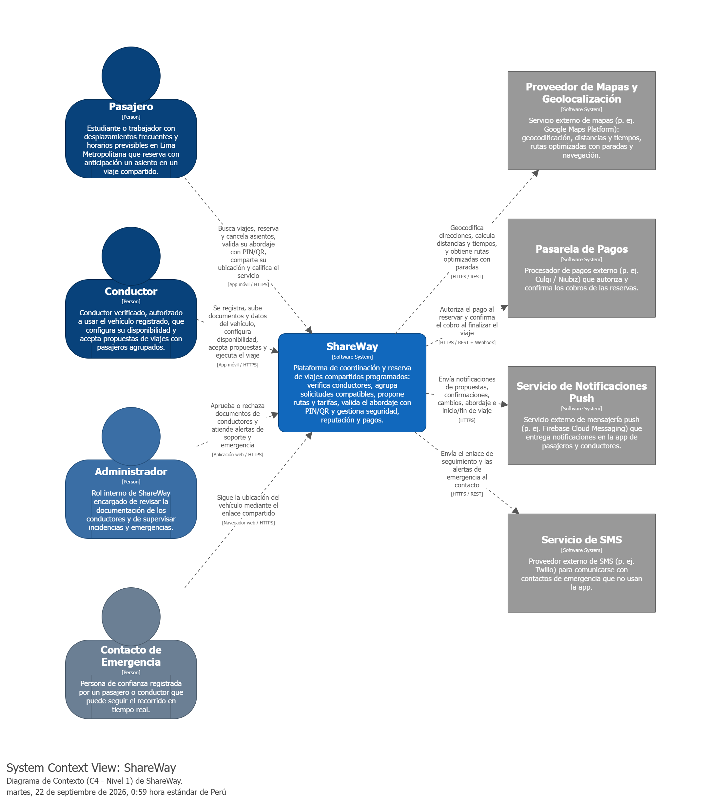

**Actores**

| Actor | Tipo | Interacción con ShareWay | Trazabilidad |
|---|---|---|---|
| Pasajero | Usuario (segmento 1) | Busca viajes, reserva y cancela asientos, consulta la información del conductor y del vehículo, valida su abordaje con PIN/QR, comparte su ubicación y califica el servicio. | EP-01, EP-02, EP-03, EP-06, EP-07 |
| Conductor | Usuario (segmento 2) | Se registra, sube su brevete, SOAT y tarjeta de propiedad, registra su vehículo, configura su disponibilidad, acepta o rechaza propuestas y ejecuta el viaje. | EP-04, EP-05, EP-08 |
| Administrador | Rol interno | Revisa y aprueba o rechaza la documentación de los conductores, y atiende las alertas de soporte (p. ej. tres intentos fallidos de PIN/QR) y de emergencia. | US-11, US-17, US-29 |
| Contacto de Emergencia | Persona externa | Recibe un enlace para seguir en tiempo real la ubicación del vehículo; el acceso se desactiva al finalizar el viaje. | US-13, US-29 |

**Sistemas externos**

| Sistema externo | Uso dentro de ShareWay | Trazabilidad |
|---|---|---|
| Proveedor de Mapas y Geolocalización | Geocodificación de origen y destino, cálculo de distancias y tiempos, rutas optimizadas con paradas y navegación paso a paso. | US-01, US-02, US-06, US-22 |
| Pasarela de Pagos | Autorización del pago al reservar el asiento y confirmación del cobro al finalizar el viaje. | US-04, US-25 |
| Servicio de Notificaciones Push | Entrega de notificaciones sobre propuestas, confirmaciones, cambios de ruta, proximidad del vehículo e inicio o fin del viaje. | US-08, US-14, US-20, US-21, US-28 |
| Servicio de SMS | Envío del enlace de seguimiento y de las alertas de emergencia al contacto de emergencia, que no necesariamente usa la aplicación. | US-13, US-29 |

Como se indica en el alcance inicial (sección 1.2.2), la disponibilidad de las integraciones de mapas, ubicación y pagos deberá evaluarse antes de incorporarlas; los proveedores mencionados en el diagrama son referenciales.

### 4.1.4. Approach Driven ViewPoints Diagrams

El diseño de ShareWay sigue un enfoque Domain-Driven Design (DDD). El dominio se divide en seis bounded contexts, cada uno con un lenguaje y un modelo propios, que agrupan las épicas identificadas en el capítulo III:

| Bounded Context | Responsabilidad | Épicas |
|---|---|---|
| Identity & Driver Verification | Registro de usuarios, perfil, contactos de emergencia y verificación de conductores y vehículos. | EP-03, EP-08 |
| Ride Booking & Matching | Búsqueda de viajes, solicitudes, viajes recurrentes, agrupación de pasajeros y reservas. | EP-01, EP-02 |
| Driver Operations & Routing | Disponibilidad del conductor, propuestas de viaje y rutas optimizadas con paradas. | EP-05 |
| Trip Execution & Notifications | Validación del abordaje, inicio y fin del viaje, y notificaciones a los participantes. | EP-02, EP-05 |
| Safety, Trust & Reputation | Ubicación compartida, botón de emergencia, bloqueos, calificaciones y reputación. | EP-06, EP-07 |
| Pricing & Payments | Estimación y recálculo de tarifas, cobros, penalidades y liquidación al conductor. | EP-04 |

A partir de este enfoque se eligieron tres viewpoints UML que describen el comportamiento y la estructura del dominio: un diagrama de actividad para el flujo central del negocio, un diagrama de estados para el ciclo de vida de la reserva y un diagrama de clases para el modelo de dominio. Los diagramas se elaboraron con PlantUML y sus fuentes se encuentran en `diagrams/uml/`.

#### Diagrama de actividad: búsqueda, matching y reserva

Describe el flujo desde que el pasajero busca un viaje hasta que un conductor acepta la propuesta y la reserva queda confirmada. Los carriles muestran qué bounded context o actor ejecuta cada acción.

    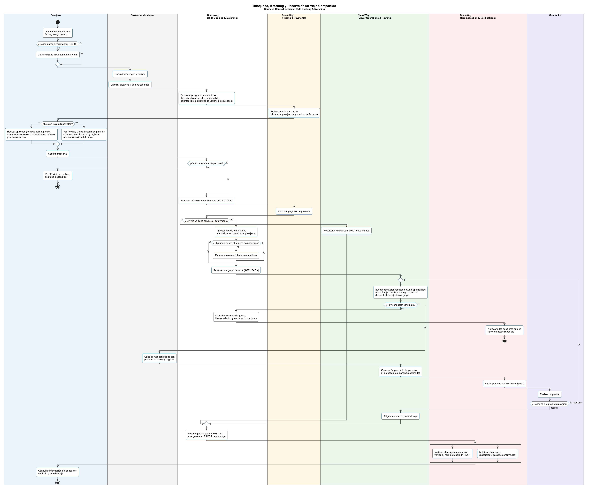

- El pasajero ingresa origen, destino, fecha y rango horario, y puede programar un viaje recurrente (US-02, US-15).
- ShareWay busca viajes compatibles según horario, ubicación, desvío permitido y asientos libres, y excluye a los usuarios bloqueados (US-10). Cada opción muestra el precio estimado y el avance hacia el mínimo de pasajeros (US-03, US-05).
- Al confirmar, el asiento se bloquea mientras se autoriza el pago; si el viaje se llenó, se informa que ya no tiene asientos disponibles (US-04).
- Si el viaje ya tiene conductor, solo se recalcula la ruta con la nueva parada. Si no, la solicitud espera a que el grupo alcance el mínimo de pasajeros y luego se busca un conductor cuya disponibilidad, zona y capacidad se ajusten al grupo (US-19).
- El conductor recibe una propuesta con ruta, paradas, número de pasajeros y ganancia estimada. Si la rechaza o la propuesta expira, se reasigna a otro conductor (US-20, US-21).
- Cuando el conductor acepta, la reserva pasa a confirmada, se genera el PIN/QR de abordaje y se notifica a ambas partes (US-21).

#### Diagrama de estados: ciclo de vida de la reserva

Muestra los estados por los que pasa la reserva de un pasajero, desde su creación hasta que finaliza o se cancela. Los estados coinciden con el enumerado `EstadoReserva` del modelo de dominio.

    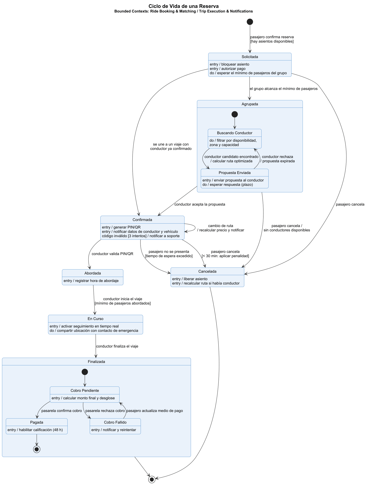

| Estado | Descripción | Trazabilidad |
|---|---|---|
| Solicitada | El asiento está bloqueado y el pago autorizado; la reserva espera a que el grupo alcance el mínimo de pasajeros. | US-04, US-05 |
| Agrupada | El grupo está completo y se busca conductor. Incluye los subestados *Buscando Conductor* y *Propuesta Enviada*; si la propuesta se rechaza o expira, se vuelve a buscar. | US-20, US-21 |
| Confirmada | Un conductor aceptó el viaje; se generan el PIN/QR y se notifican los datos del conductor y del vehículo. Un cambio de ruta recalcula el precio y se notifica al pasajero. | US-03, US-07, US-08, US-21 |
| Abordada | El conductor validó el PIN/QR y se registró la hora de abordaje. | US-11, US-23 |
| En Curso | El conductor inició el viaje tras abordar el mínimo de pasajeros; se activa el seguimiento en tiempo real y la ubicación compartida. | US-13, US-24 |
| Finalizada | El conductor cerró el viaje; se calcula el monto final y se confirma el cobro. Una vez pagada, se habilita la calificación durante 48 horas. | US-09, US-25 |
| Cancelada | El pasajero canceló, no se presentó o no hubo conductor disponible. Se libera el asiento y, si la cancelación ocurre con menos de 30 minutos de anticipación, se aplica una penalidad. | US-12, US-28 |

#### Diagrama de clases: modelo de dominio

Representa las entidades, value objects y enumerados de cada bounded context, agrupados en paquetes. Los *aggregate roots* están marcados con el estereotipo `<<Aggregate Root>>`.

    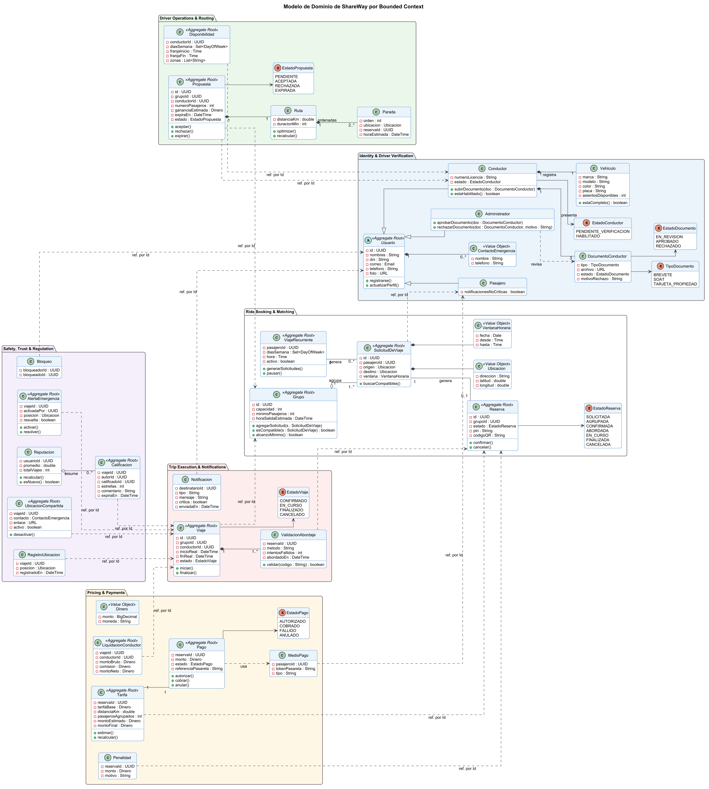

Dentro de un mismo bounded context, las clases se relacionan mediante asociaciones y composiciones directas. Entre bounded contexts distintos, las clases solo guardan el identificador de la otra entidad (flechas punteadas con la etiqueta "ref. por Id"). De esta manera cada contexto mantiene su propio modelo y puede evolucionar de forma independiente.

| Bounded Context | Clases principales |
|---|---|
| Identity & Driver Verification | `Usuario` (abstracta) con sus especializaciones `Pasajero`, `Conductor` y `Administrador`; `Vehiculo`; `DocumentoConductor` (brevete, SOAT y tarjeta de propiedad, con estado de revisión y motivo de rechazo); `ContactoEmergencia`. |
| Ride Booking & Matching | `SolicitudDeViaje`, `Grupo` (capacidad y mínimo de pasajeros), `Reserva` (estado y PIN/QR), `ViajeRecurrente`; value objects `Ubicacion` y `VentanaHoraria`. |
| Driver Operations & Routing | `Disponibilidad` (días, franja horaria y zonas), `Propuesta` (ganancia estimada y plazo de expiración), `Ruta` y `Parada`. |
| Trip Execution & Notifications | `Viaje`, `ValidacionAbordaje` (intentos fallidos y hora de abordaje) y `Notificacion` (críticas y no críticas). |
| Safety, Trust & Reputation | `UbicacionCompartida`, `RegistroUbicacion`, `AlertaEmergencia`, `Calificacion` (1 a 5 estrellas), `Bloqueo` y `Reputacion`. |
| Pricing & Payments | `Tarifa`, `Pago`, `Penalidad`, `LiquidacionConductor` (monto bruto, comisión y monto neto), `MedioPago` y el value object `Dinero`. |

### 4.1.5. Relational/Non Relational Database Diagram

### 4.1.6. Design Patterns

### 4.1.7. Tactics

---

## 4.2. Architectural Drivers

Los architectural drivers de ShareWay representan los requisitos con mayor influencia sobre la estructura del sistema. Su identificación considera la propuesta de viajes compartidos programados, las historias de usuario del capítulo III y las restricciones del trabajo académico. Se distinguen drivers funcionales, escenarios de atributos de calidad y restricciones. Asimismo, se registran preocupaciones arquitectónicas que deberán resolverse durante las iteraciones de Attribute-Driven Design (ADD).

### 4.2.1. Design Purpose

El propósito del diseño arquitectónico de ShareWay es establecer una estructura que permita coordinar viajes compartidos programados con conductores verificados, manteniendo consistencia entre las reservas individuales, la disponibilidad de asientos, la asignación de conductores y el estado del recorrido.

El diseño debe delimitar responsabilidades y modelos de dominio mediante Domain-Driven Design (DDD), y orientar la construcción de una solución basada en microservicios. Las decisiones se desarrollarán mediante ADD, considerando las funcionalidades de mayor impacto, los atributos de calidad y las restricciones del proyecto.

Se busca que la arquitectura permita:

- Agrupar solicitudes compatibles y proponer recorridos acordes con la disponibilidad de los conductores.
- Evitar reservas que excedan la capacidad del vehículo y mantener coherencia ante cancelaciones y operaciones de cobro.
- Restringir las operaciones a usuarios autorizados y validar que cada abordaje corresponda al pasajero y al viaje asignados.
- Comunicar cambios relevantes del recorrido y gestionar fallas de servicios externos sin perder información confirmada.
- Facilitar cambios en las reglas de tarifas, agrupación y verificación, limitando su impacto sobre otras responsabilidades.

**Objetivos de negocio que orientan el diseño**

Los siguientes objetivos sintetizan la propuesta y las historias existentes de ShareWay. Sus identificadores permiten relacionar las necesidades del negocio con los escenarios y las decisiones posteriores. No añaden metas comerciales de crecimiento ni presupuestos que el equipo no haya definido.

| ID | Objetivo de negocio | Drivers relacionados |
|---|---|---|
| DN-01 | Ofrecer viajes programados con cupos y asignaciones confiables. | DF-01, DF-02, DF-06. |
| DN-02 | Generar confianza mediante conductores verificados, abordajes válidos y protección de la ubicación. | DF-04, DF-05, DF-07. |
| DN-03 | Mantener la coordinación del viaje y comunicar cambios o emergencias. | DF-05, DF-06, DF-07. |
| DN-04 | Mantener claridad y consistencia en las tarifas y los cobros. | DF-03. |
| DN-05 | Permitir que el equipo ajuste las reglas de negocio con impacto limitado sobre otras funcionalidades. | DF-03 y evolución de la solución. |

El resultado del diseño será una arquitectura documentada mediante elementos, responsabilidades, interfaces y vistas, con trazabilidad hacia los drivers que justifican cada decisión.

### 4.2.2. Primary Functionality (Primary User Stories)

Se seleccionaron las siguientes historias por su relevancia para el negocio, complejidad técnica e influencia sobre la descomposición y coordinación del sistema. Esta selección arquitectónica complementa la priorización del Product Backlog.

| Driver | Historias relacionadas | Funcionalidad principal | Justificación arquitectónica |
|---|---|---|---|
| DF-01 | US-02 Buscar rutas; US-19 Configurar disponibilidad y horarios; US-20 Recibir propuestas de viaje; US-21 Aceptar o rechazar una propuesta de viaje | Buscar viajes compatibles y coordinar propuestas y asignaciones. | Requiere relacionar ruta, horario, capacidad y disponibilidad, y resolver la aceptación, expiración o reasignación de una propuesta sin generar asignaciones incompatibles. |
| DF-02 | US-04 Asegurar asiento; US-12 Cancelar viaje reservado; US-28 Gestionar cancelación de un pasajero | Reservar y liberar asientos. | Exige control de concurrencia y coordinación entre la reserva, los cupos y las modificaciones del recorrido. |
| DF-03 | US-03 Estimar precio; US-25 Finalizar el viaje y confirmar cobro | Calcular tarifas y registrar el cierre económico del viaje. | Requiere conservar la relación entre la tarifa comunicada, sus cambios, cada reserva y el cobro, evitando duplicaciones o importes inconsistentes. |
| DF-04 | US-16 Registrar cuenta como conductor; US-17 Subir documentos para verificación; US-18 Registrar datos del vehículo; US-30 Ver y editar perfil y vehículo | Registrar y verificar conductores y vehículos. | Requiere gestionar documentos y estados de habilitación, restringir operaciones y solicitar una nueva revisión cuando corresponda. |
| DF-05 | US-11 Validar abordaje con PIN o QR; US-23 Validar pasajero al abordar; US-24 Iniciar el viaje | Validar pasajeros e iniciar el recorrido. | Requiere asociar códigos con reservas y viajes, registrar abordajes y controlar las condiciones de inicio. |
| DF-06 | US-06 Información del viaje; US-22 Ver ruta optimizada con paradas; US-28 Gestionar cancelación de un pasajero | Planificar y actualizar rutas y paradas. | Implica integración con información geográfica y propagación coherente de cambios a pasajeros y conductores. |
| DF-07 | US-13 Compartir ubicación en tiempo real; US-14 Recibir notificaciones del viaje; US-29 Activar botón de emergencia | Compartir ubicación y comunicar eventos y emergencias. | Exige controlar el acceso a la ubicación, gestionar actualizaciones y distinguir alertas críticas de notificaciones ordinarias. |

### 4.2.3. Quality Attribute Scenarios

Cada escenario se especifica mediante fuente de estímulo, estímulo, entorno, artefacto, respuesta y medida de respuesta, siguiendo el material de clase. Los valores numéricos siguientes son **metas iniciales propuestas de diseño**; deberán validarse con el equipo, las necesidades de los stakeholders y la capacidad del entorno de pruebas. No representan resultados de pruebas ejecutadas ni acuerdos ya obtenidos mediante QAW.

**Preparación de escenarios y priorización**

Se adopta del ejercicio resuelto la secuencia de identificar necesidades, consolidar escenarios, priorizarlos y refinarlos en seis partes. Las necesidades de la tabla son paráfrasis derivadas de las US, no citas de entrevistas ni resultados de un taller realizado.

| Necesidad inicial derivada de las US | Perspectiva a validar | Escenario refinado |
|---|---|---|
| Consultar opciones compatibles sin esperas prolongadas. | Pasajero; US-02. | QAS-01. |
| Conservar un cupo exclusivo cuando otros pasajeros reservan al mismo tiempo. | Pasajero; US-04. | QAS-02. |
| Impedir que un código incorrecto autorice el abordaje. | Pasajero y conductor; US-11 y US-23. | QAS-03. |
| Consultar el estado confirmado del viaje aunque falle el envío de avisos. | Pasajero y operación; US-14. | QAS-04. |
| Cambiar el cálculo de la tarifa sin modificar otras funciones. | Producto y desarrollo; US-03. | QAS-05. |
| Desactivar el seguimiento compartido cuando finaliza el viaje. | Pasajero y contacto de emergencia; US-13. | QAS-06. |
| Recuperar el servicio de reservas conservando las operaciones confirmadas. | Pasajero y operación; US-04 y US-12. | QAS-07. |
| Registrar y comunicar una emergencia con rapidez. | Conductor y operación; US-29. | QAS-08. |

**Consolidación:** US-11 y US-23 se reúnen en QAS-03 porque describen las dos perspectivas de la misma validación. US-04 y US-12 se relacionan con QAS-07 porque ambas dependen del estado persistido de las reservas. QAS-02 y QAS-07 se mantienen separados: prueban concurrencia y recuperación ante fallas, respectivamente. QAS-04 y QAS-08 también se separan porque las alertas de emergencia requieren un tratamiento distinto de los avisos ordinarios.

**Orden de atención propuesto:** se ponderan el impacto sobre la seguridad de los usuarios, la integridad de las operaciones centrales y la continuidad del servicio. El orden siguiente es una propuesta de análisis; debe confirmarse con el equipo y representantes de los stakeholders. No se atribuyen votos ni consensos que todavía no existen.

| Orden | Escenario | Objetivo relacionado | Justificación |
|---|---|---|---|
| 1 | QAS-02 Integridad de cupos. | DN-01. | Una sobreventa invalida el compromiso central de la reserva y afecta al viaje completo. |
| 2 | QAS-03 Seguridad del abordaje. | DN-02. | Una validación indebida compromete la confianza y el acceso al viaje correcto. |
| 3 | QAS-07 Recuperación de reservas. | DN-01, DN-03. | La pérdida del servicio o de reservas confirmadas impide coordinar el traslado. |
| 4 | QAS-08 Atención técnica de alertas de emergencia. | DN-03. | Una alerta perdida o demorada afecta una función crítica de protección. |
| 5 | QAS-06 Revocación de ubicación compartida. | DN-02. | El acceso posterior al viaje expone información que ya no debe compartirse. |
| 6 | QAS-01 Rendimiento de búsqueda. | DN-01. | Los tiempos de consulta influyen en la elección del viaje y en la carga soportada. |
| 7 | QAS-04 Fallas de notificaciones ordinarias. | DN-03. | Deben preservarse las operaciones confirmadas aunque un canal de comunicación falle. |
| 8 | QAS-05 Modificabilidad de tarifas. | DN-04, DN-05. | Reduce el impacto y el esfuerzo de evolución de las reglas comerciales. |

Se proponen los primeros cinco como foco inicial de discusión, conservando los ocho escenarios para el diseño completo. Si se realiza el QAW, se deberá adjuntar la participación real, la votación y la justificación de los desempates. Los roles pertinentes son pasajero, conductor, responsable de operaciones, responsable de seguridad y líder de desarrollo. Si los estudiantes representan estos roles, se registrará como una simulación académica.

**Escenarios refinados**

#### QAS-01 Rendimiento en la búsqueda de viajes

| Elemento | Especificación |
|---|---|
| Fuente de estímulo | Pasajero. |
| Estímulo | Solicita viajes por origen, destino, fecha y rango horario. |
| Entorno | Prueba con 100 sesiones activas, 20 búsquedas por segundo durante 10 minutos y 10 000 viajes programados en el conjunto de datos. |
| Artefacto | Servicio de búsqueda de viajes. |
| Respuesta | Devuelve viajes compatibles o indica que no existen resultados. |
| Medida de respuesta | Al menos el 95 % de las solicitudes responde en un máximo de 2 segundos, medidos desde la recepción en la API hasta la emisión de la respuesta; tasa de errores técnicos inferior al 1 %. |

**Trazabilidad:** DF-01; US-02.

#### QAS-02 Confiabilidad e integridad de los cupos ante reservas simultáneas

| Elemento | Especificación |
|---|---|
| Fuente de estímulo | Varios pasajeros. |
| Estímulo | Solicitan simultáneamente reservar el último asiento de un viaje. |
| Entorno | Prueba de 20 solicitudes simultáneas sobre un viaje con un asiento libre, repetida 100 veces. |
| Artefacto | Gestión de reservas y disponibilidad de asientos. |
| Respuesta | Concede el bloqueo del asiento a una sola solicitud e informa a las restantes que el cupo ya no está disponible. |
| Medida de respuesta | Exactamente un bloqueo exitoso por ejecución, cero sobreventas y cero valores negativos de disponibilidad. |

**Trazabilidad:** DF-02; US-04. Este escenario evalúa la integridad y consistencia de la información bajo concurrencia.

#### QAS-03 Seguridad en la validación del abordaje

| Elemento | Especificación |
|---|---|
| Fuente de estímulo | Conductor autenticado que presenta un código para validación. |
| Estímulo | Envía un PIN/QR inválido o perteneciente a otro viaje. |
| Entorno | Viaje en etapa de abordaje, con conectividad disponible. |
| Artefacto | Validación de abordaje y registro de intentos. |
| Respuesta | Rechaza el código sin modificar el estado del pasajero, registra el intento y genera una notificación a soporte al tercer intento incorrecto consecutivo para la validación del mismo pasajero y viaje. |
| Medida de respuesta | Se rechaza el 100 % de los códigos inválidos del conjunto de prueba; cero abordajes indebidos; la notificación queda registrada para envío en un máximo de 5 segundos desde el tercer intento. |

**Trazabilidad:** DF-05; US-11 y US-23. El alcance del contador de intentos se propone para validación del equipo.

#### QAS-04 Disponibilidad ante fallas de notificaciones

| Elemento | Especificación |
|---|---|
| Fuente de estímulo | Proveedor externo de notificaciones. |
| Estímulo | Deja de responder cuando debe notificarse un cambio de estado del viaje. |
| Entorno | Interrupción simulada de 5 minutos; la aplicación y su persistencia permanecen operativas. |
| Artefacto | Gestión del viaje y envío de notificaciones. |
| Respuesta | Conserva el cambio confirmado, permite consultarlo en la aplicación y mantiene el aviso pendiente de entrega. |
| Medida de respuesta | Cero cambios confirmados perdidos; las operaciones de consulta y actualización del viaje no fallan por la interrupción del proveedor; con un máximo de 100 avisos pendientes, se obtiene la aceptación de todos por el proveedor dentro de los 60 segundos posteriores a su recuperación. |

**Trazabilidad:** DF-07; US-14. La aceptación por el proveedor no equivale a la lectura o recepción efectiva en el dispositivo del usuario.

#### QAS-05 Modificabilidad de las reglas de tarifas

| Elemento | Especificación |
|---|---|
| Fuente de estímulo | Responsable del producto. |
| Estímulo | Solicita cambiar la fórmula de distribución del precio por pasajero, conservando las entradas y salidas de la operación. |
| Entorno | Desarrollo y pruebas de una nueva versión. |
| Artefacto | Lógica de cálculo de tarifas. |
| Respuesta | El equipo modifica la regla y sus pruebas, preservando el comportamiento de reservas, verificación y abordaje. |
| Medida de respuesta | Cambio implementado y probado en un máximo de 2 jornadas de 8 horas de un desarrollador, sin cambios en los contratos públicos ni en el código de reservas, verificación o abordaje; aprobación del 100 % de las pruebas de regresión definidas para esos procesos. |

**Trazabilidad:** DF-03; US-03.

#### QAS-06 Seguridad del acceso a la ubicación compartida

| Elemento | Especificación |
|---|---|
| Fuente de estímulo | Contacto de emergencia que posee un enlace de seguimiento. |
| Estímulo | Intenta consultar la ubicación después del cierre del viaje. |
| Entorno | Viaje finalizado con el cierre registrado por el sistema. |
| Artefacto | Servicio de seguimiento y autorización del enlace. |
| Respuesta | Revoca el acceso y rechaza nuevas consultas de ubicación mediante el enlace. |
| Medida de respuesta | Revocación efectiva en un máximo de 5 segundos desde el cierre; el 100 % de las solicitudes realizadas después de ese plazo se rechaza sin devolver datos de ubicación. |

**Trazabilidad:** DF-07; US-13. La revocación afecta nuevas consultas y no elimina información que el contacto ya haya recibido.

#### QAS-07 Disponibilidad y recuperación del servicio de reservas

| Elemento | Especificación |
|---|---|
| Fuente de estímulo | Falla de la instancia de ejecución del servicio de reservas. |
| Estímulo | La instancia se detiene durante el procesamiento de solicitudes. |
| Entorno | Prueba con 20 solicitudes por segundo; la persistencia y los demás servicios permanecen disponibles. |
| Artefacto | Servicio de reservas y estado persistido de bloqueos y reservas. |
| Respuesta | Recupera la capacidad de atender solicitudes, conserva las reservas confirmadas y permite consultar el resultado de operaciones interrumpidas antes de reintentarlas. |
| Medida de respuesta | Recuperación en un máximo de 60 segundos desde la falla, verificada mediante solicitudes válidas exitosas durante los siguientes 30 segundos; cero reservas confirmadas perdidas y cero duplicados al reintentar 100 operaciones interrumpidas con el mismo identificador de operación. |

**Trazabilidad:** DN-01, DN-03; DF-02; US-04 y US-12. La recuperación frente a una pérdida de la base de datos requiere otro escenario y no se considera cubierta por esta prueba.

#### QAS-08 Rendimiento en el registro y envío de alertas de emergencia

| Elemento | Especificación |
|---|---|
| Fuente de estímulo | Conductor de un viaje activo. |
| Estímulo | Activa el botón de emergencia. |
| Entorno | Prueba con 100 viajes activos y 10 alertas simultáneas; conectividad disponible y proveedor de notificaciones operativo. |
| Artefacto | Gestión de emergencias y comunicación con la plataforma y el contacto registrado. |
| Respuesta | Persiste la alerta asociada al viaje y a la última ubicación conocida con su hora, confirma el registro al conductor y envía los avisos a los destinatarios configurados. |
| Medida de respuesta | El 100 % de las alertas de la prueba se registra y confirma en un máximo de 2 segundos desde su recepción por la API; aceptación de los avisos por los canales de entrega en un máximo de 5 segundos desde esa recepción; cero alertas perdidas. |

**Trazabilidad:** DN-03; DF-07; US-29. Estas medidas cubren el procesamiento técnico, no el tiempo de asistencia humana. Ante pérdida de conectividad o falla del proveedor, la interfaz deberá indicar que el envío no se completó; la política de recuperación se resolverá en AC-08.

### 4.2.4. Constraints

Las restricciones son condiciones obligatorias que delimitan las decisiones de arquitectura. CON-01 a CON-04 condicionan directamente la solución; CON-05 y CON-06 son restricciones del proceso y de la documentación. Todas provienen del enunciado del trabajo. Las elecciones tecnológicas todavía abiertas se mantendrán como decisiones pendientes.

| ID | Restricción | Origen | Implicación |
|---|---|---|---|
| CON-01 | Desarrollar una solución con arquitectura orientada a microservicios y enfoque DDD. | Logro y objetivo del trabajo. | Delimitar modelos de dominio y responsabilidades, y justificar la descomposición de la solución. |
| CON-02 | Aplicar ADD v3 al diseño arquitectónico. | Capítulo IV del enunciado. | Documentar iteraciones, drivers, decisiones, responsabilidades, interfaces y revisión de objetivos. |
| CON-03 | Exponer los servicios mediante RESTful APIs y documentarlos con OpenAPI a través de Swagger. | Secciones de componentes y tecnologías. | Definir operaciones, contratos, respuestas y documentación verificable de los servicios. |
| CON-04 | Desplegar los microservicios en AWS, Microsoft Azure o Google Cloud. | Sección de tecnologías. | Diseñar una solución desplegable en uno de los proveedores permitidos; el proveedor concreto queda por seleccionar. |
| CON-05 | Utilizar GitHub con GitFlow, Conventional Commits y Semantic Versioning. | Source Code Management y tecnologías. | Mantener trazabilidad de cambios y convenciones compartidas para ramas, commits y versiones. |
| CON-06 | Elaborar C4 con Structurizr, UML con LucidChart y el diseño de datos con LucidChart o Vertabelo. | Sección de tecnologías. | Producir la documentación arquitectónica con las herramientas establecidas. |

No se establece como restricción un lenguaje, framework, motor de base de datos o presupuesto específico, ya que no se ha identificado una imposición concreta de estos elementos en la información revisada. Las políticas sobre cupos, verificación y cancelaciones se tratarán como reglas funcionales del dominio.

### 4.2.5. Architectural Concerns

Las architectural concerns reúnen asuntos de diseño que requieren análisis y coordinación entre las partes de la solución. Se registran como cuestiones por resolver mediante ADD, sin asumir que ya se ha elegido una solución técnica.

| ID | Preocupación | Decisión o análisis requerido | Trazabilidad |
|---|---|---|---|
| AC-01 | Delimitación de bounded contexts y propiedad de los datos. | Definir quién controla solicitudes, propuestas, viajes, reservas, tarifas, cobros y verificación; acordar contratos de integración y evitar que varias partes modifiquen el mismo estado sin coordinación. | DF-01 a DF-07. |
| AC-02 | Consistencia entre reservas, bloqueos de asientos y cobros. | Aclarar el pago durante la reserva de US-04 frente al cobro al finalizar de US-25, distinguiendo pago, autorización y liquidación según el flujo acordado. Definir duración del bloqueo, expiración, rechazo del pago, liberación del cupo y reintentos sin duplicados. | DF-02, DF-03; QAS-02. |
| AC-03 | Ciclo de vida y asignación del viaje. | Precisar estados y transiciones para propuesta, aceptación, confirmación, abordaje, inicio y finalización. Resolver aceptaciones simultáneas y cambios de disponibilidad sin afectar viajes confirmados. En US-24, aclarar si el inicio exige todos los pasajeros confirmados o solo el mínimo, y cómo se atienden los recojos pendientes. | DF-01, DF-05. |
| AC-04 | Habilitación efectiva del conductor. | Aclarar la relación entre US-16, US-17 y US-18: registrar el vehículo no debería habilitar por sí solo a un conductor con documentos pendientes. Definir las condiciones conjuntas de aprobación y reverificación de US-30. | DF-04. |
| AC-05 | Cancelaciones y actualización del recorrido. | Resolver la diferencia entre US-12, que contempla cancelación antes de la salida, y US-22, que contempla cancelación durante el recorrido. Definir reglas, penalidades, efectos sobre paradas y tarifas y comunicación de los cambios. | DF-02, DF-03, DF-06. |
| AC-06 | Dependencias externas y conectividad móvil. | Definir el comportamiento ante fallas de mapas, pagos o notificaciones y ante pérdida de conexión del usuario. Distinguir operaciones pendientes de operaciones confirmadas y controlar duplicados tras la reconexión. | DF-03, DF-06, DF-07; QAS-04. |
| AC-07 | Protección de documentos, identidad y ubicación. | Definir permisos de acceso, vigencia de enlaces y códigos, conservación de documentos y exposición mínima de información personal en respuestas y registros. | DF-04, DF-05, DF-07; QAS-03, QAS-06. |
| AC-08 | Tratamiento de alertas de emergencia. | Separar alertas críticas de avisos ordinarios, registrar su estado de entrega y atención y mostrar al usuario si el envío no pudo completarse. La recepción técnica del aviso no debe presentarse como garantía de asistencia presencial. | DF-07; US-29; QAS-08. |
| AC-09 | Verificación del cumplimiento de los drivers. | Definir pruebas y registros que permitan medir los escenarios, seguir operaciones entre servicios y detectar fallas sin exponer información sensible. | QAS-01 a QAS-08. |

**Compromisos entre atributos de calidad**

| Escenarios en tensión | Riesgo o costo de diseño | Criterio para evaluar alternativas en ADD |
|---|---|---|
| QAS-02 y rendimiento de las reservas. | Serializar el acceso al último cupo puede aumentar el tiempo de espera. | Preservar la ausencia de sobreventas y medir la latencia bajo contención antes de elegir el control de concurrencia. |
| QAS-03 / QAS-06 y QAS-01. | Las verificaciones de autorización y vigencia añaden procesamiento. | Comprobar la seguridad y la latencia en conjunto; cualquier caché de autorizaciones debe respetar el límite de revocación del enlace. |
| QAS-07 y recursos de operación. | La recuperación rápida puede requerir redundancia, supervisión y mayor consumo de recursos. | Comparar recuperación por reinicio y por réplica frente a la meta de 60 segundos, midiendo costos sin asumir un presupuesto no definido. |
| QAS-04 / QAS-08 y simplicidad operativa. | La entrega diferida y los reintentos requieren mantener estados, tratar duplicados y supervisar pendientes. | Asegurar persistencia y trazabilidad de avisos y separar la prioridad de emergencias de la de notificaciones ordinarias. |
| QAS-05 y simplicidad de implementación. | Aislar reglas y versionar contratos exige más interfaces y pruebas iniciales. | Justificar el aislamiento por cambios concretos de tarifas y evitar abstracciones que no respondan a una necesidad. |

---

## 4.3. ADD Iterations

### 4.3.1. Iteration 1: Global System Structure

#### 4.3.1.1. Architectural Design Backlog 1

#### 4.3.1.2. Establish Iteration Goal by Selecting Drivers

#### 4.3.1.3. Choose One or More Elements of the System to Refine

#### 4.3.1.4. Choose One or More Design Concepts That Satisfy the Selected Drivers

#### 4.3.1.5. Instantiate Architectural Elements, Allocate Responsibilities, and Define Interfaces

#### 4.3.1.6. Sketch Views (C4 & UML) and Record Design Decisions

#### 4.3.1.7. Analysis of Current Design and Review Iteration Goal (Kanban Board)

---

### 4.3.2. Iteration 2: Sincronización Edge-to-Cloud y Pipeline de Telemetría

#### 4.3.2.1. Architectural Design Backlog 2

#### 4.3.2.2. Establish Iteration Goal by Selecting Drivers

#### 4.3.2.3. Choose One or More Elements of the System to Refine

#### 4.3.2.4. Choose One or More Design Concepts That Satisfy the Selected Drivers

#### 4.3.2.5. Instantiate Architectural Elements, Allocate Responsibilities, and Define Interfaces

#### 4.3.2.6. Sketch Views (C4 & UML) and Record Design Decisions

#### 4.3.2.7. Analysis of Current Design and Review Iteration Goal (Kanban Board)

---

### 4.3.3. Iteration 3: Orquestación del Ciclo de Riego Autónomo e Integración con el Edge

#### 4.3.3.1. Architectural Design Backlog 3

#### 4.3.3.2. Establish Iteration Goal by Selecting Drivers

#### 4.3.3.3. Choose One or More Elements of the System to Refine

#### 4.3.3.4. Choose One or More Design Concepts That Satisfy the Selected Drivers

#### 4.3.3.5. Instantiate Architectural Elements, Allocate Responsibilities, and Define Interfaces

#### 4.3.3.6. Sketch Views (C4 & UML) and Record Design Decisions

#### 4.3.3.7. Analysis of Current Design and Review Iteration Goal (Kanban Board)

---

### 4.3.4. Iteration 4: Seguridad e Identidad

#### 4.3.4.1. Architectural Design Backlog 4

#### 4.3.4.2. Establish Iteration Goal by Selecting Drivers

#### 4.3.4.3. Choose One or More Elements of the System to Refine

#### 4.3.4.4. Choose One or More Design Concepts That Satisfy the Selected Drivers

#### 4.3.4.5. Instantiate Architectural Elements, Allocate Responsibilities, and Define Interfaces

#### 4.3.4.6. Sketch Views (C4 & UML) and Record Design Decisions

#### 4.3.4.7. Analysis of Current Design and Review Iteration Goal (Kanban Board)

---

### 4.3.5. Iteration 5: Refinamiento del Crop Analysis Service y Diagnóstico de Cultivos

#### 4.3.5.1. Architectural Design Backlog 5

#### 4.3.5.2. Establish Iteration Goal by Selecting Drivers

#### 4.3.5.3. Choose One or More Elements of the System to Refine

#### 4.3.5.4. Choose One or More Design Concepts That Satisfy the Selected Drivers

#### 4.3.5.5. Instantiate Architectural Elements, Allocate Responsibilities, and Define Interfaces

#### 4.3.5.6. Sketch Views (C4 & UML) and Record Design Decisions

#### 4.3.5.7. Analysis of Current Design and Review Iteration Goal (Kanban Board)

---

# CAPÍTULO V: Product Implementation, Validation & Deployment

## 5.1. Testing Suites & General Patterns

### 5.1.1. Backend Application Core Testing Suite

### 5.1.2. Pattern Based Backend Application(s)

### 5.1.3. Pattern Based Custom Software Library

### 5.1.4. Framework Pattern Driven Refactoring Report

---

## 5.2. Software Configuration Management

### 5.2.1. Software Development Environment Configuration

### 5.2.2. Source Code Management

### 5.2.3. Source Code Style Guide & Conventions

### 5.2.4. Software Deployment Configuration

---

## 5.3. MicroServices Implementation

### 5.3.1. Sprint 1

#### 5.3.1.1. Sprint Backlog 1

#### 5.3.1.2. Development Evidence for Sprint Review

#### 5.3.1.3. Testing Suite Evidence for Sprint Review

#### 5.3.1.4. Execution Evidence for Sprint Review

#### 5.3.1.5. Microservices Documentation Evidence for Sprint Review

#### 5.3.1.6. Software Deployment Evidence for Sprint Review

#### 5.3.1.7. Team Collaboration Insights during Sprint

#### 5.3.1.8. Kanban Board

---

### 5.3.2. Sprint 2

#### 5.3.2.1. Sprint Backlog 2

#### 5.3.2.2. Development Evidence for Sprint Review

#### 5.3.2.3. Testing Suite Evidence for Sprint Review

#### 5.3.2.4. Execution Evidence for Sprint Review

#### 5.3.2.5. Microservices Documentation Evidence for Sprint Review

#### 5.3.2.6. Software Deployment Evidence for Sprint Review

#### 5.3.2.7. Team Collaboration Insights During Sprint

#### 5.3.2.8. Kanban Board

---

### 5.3.3. Sprint 3

#### 5.3.3.1. Sprint Backlog 3

#### 5.3.3.2. Development Evidence for Sprint Review

#### 5.3.3.3. Testing Suite Evidence for Sprint Review

#### 5.3.3.4. Execution Evidence for Sprint Review

#### 5.3.3.5. Microservices Documentation Evidence for Sprint Review

#### 5.3.3.6. Software Deployment Evidence for Sprint Review

#### 5.3.3.7. Team Collaboration Insights During Sprint

#### 5.3.3.8. Kanban Board

---

### 5.3.4. Sprint 4

#### 5.3.4.1. Sprint Backlog 4

#### 5.3.4.2. Development Evidence for Sprint Review

#### 5.3.4.3. Testing Suite Evidence for Sprint Review

#### 5.3.4.4. Execution Evidence for Sprint Review

#### 5.3.4.5. Microservices Documentation Evidence for Sprint Review

#### 5.3.4.6. Software Deployment Evidence for Sprint Review

#### 5.3.4.7. Team Collaboration Insights During Sprint

#### 5.3.4.8. Kanban Board

---

## 5.4. MicroServices Deployment

### 5.4.1. Cloud Architecture Diagrams

### 5.4.2. Cloud Architecture Deployment

---

# Conclusiones

- El Avance 1 permitió delimitar ShareWay como una plataforma de viajes compartidos programados orientada a pasajeros con desplazamientos frecuentes y conductores que buscan recorridos rentables y previamente organizados.
- Las entrevistas muestran que la propuesta debe equilibrar ahorro, seguridad y puntualidad para pasajeros, mientras que para conductores debe ofrecer rentabilidad clara, reglas de espera, control de ruta y reducción de tiempos muertos.
- Los artefactos de Needfinding evidencian que el problema no se limita a pedir un traslado, sino a coordinar condiciones entre varios participantes: horarios, paradas, confirmaciones, identidad, tarifa y cancelaciones.
- El To-Be Scenario Mapping y el Impact Map ayudan a conectar la experiencia deseada con funcionalidades concretas del Product Backlog, manteniendo trazabilidad entre necesidades, objetivos de negocio y User Stories.
- El Product Backlog inicial prioriza las capacidades necesarias para validar el flujo base: registrar actores, buscar viajes, confirmar reservas, aceptar propuestas, validar abordaje, ejecutar el recorrido y cerrar el servicio.

---

# Recomendaciones

- Mantener la validación del modelo en corredores y horarios delimitados antes de ampliar cobertura, ya que la propuesta depende de coincidencias reales entre pasajeros y conductores.
- Profundizar las reglas de cancelación, tiempos de espera y cambios de ruta, porque aparecen como riesgos importantes tanto para pasajeros como para conductores.
- Validar mediante prototipos si los usuarios comprenden la tarifa compartida, la ganancia del conductor, la secuencia de paradas y el uso de PIN o QR para abordar.
- Mantener la trazabilidad entre Impact Map, User Stories y Product Backlog para que cada funcionalidad implementada responda a un objetivo de negocio y a una necesidad identificada.

---

# Bibliografía

Autoridad de Transporte Urbano para Lima y Callao. (2025, 5 de febrero). *La ATU apuesta por la macromovilidad para atender a más usuarios de transporte y mejorar la fluidez del tráfico*. Plataforma del Estado Peruano. https://www.gob.pe/atu

Cabify. (s. f.). *La ciudad es tuya. Viaja con nosotros*. Recuperado el 10 de septiembre de 2026, de https://cabify.com/es

Google. (s. f.). *Google Maps Platform*. Recuperado el 10 de septiembre de 2026, de https://mapsplatform.google.com/

Gothelf, J., & Seiden, J. (2021). *Lean UX: Designing great products with agile teams* (3.a ed.). O'Reilly Media.

Miro. (s. f.). *Online collaborative whiteboard platform*. Recuperado el 10 de septiembre de 2026, de https://miro.com/

SUOL INNOVATIONS LTD. (2026). *inDrive. Viajes alternativos* [Aplicación móvil]. Google Play. https://play.google.com/store/apps/details?hl=es_PE&id=sinet.startup.inDriver

Uber Technologies, Inc. (2026). *Uber - Viajes en taxi y más* [Aplicación móvil]. Google Play. https://play.google.com/store/apps/details?hl=es&id=com.ubercab

UXPressia. (s. f.). *Customer journey mapping, personas, and impact mapping platform*. Recuperado el 10 de septiembre de 2026, de https://uxpressia.com/

---

# Anexos

## Anexo A. Evidencias de entrevistas

### A.1. Entrevista – Mariana Alexa Rafael Sosa
[https://upcedupe-my.sharepoint.com/:v:/g/personal/u202312447_upc_edu_pe/IQD1YJsW5NGVQoP3omClSWEeAZyrSRCwT6_rSCZ_bGt6BYk?nav=eyJyZWZlcnJhbEluZm8iOnsicmVmZXJyYWxBcHAiOiJTdHJlYW1XZWJBcHAiLCJyZWZlcnJhbFZpZXciOiJTaGFyZURpYWxvZy1MaW5rIiwicmVmZXJyYWxBcHBQbGF0Zm9ybSI6IldlYiIsInJlZmVycmFsTW9kZSI6IldlYiIsInJlZmVycmFsTW9kZSI6IldlYiIsInJlZmVycmFsTW9kZSI6IldlYiIsInJlZmVycmFsTW9kZSI6IldlYiIsInJlZmVycmFsTW9kZSI6IldlYiIsInJlZmVycmFsTW9kZSI6IldlYiIsInJlZmVycmFsTW9kZSI6IldlYiIsInJlZmVycmFsTW9kZSI6IldlYiIsInJlZmVycmFsTW9kZSI6IldlYiIsInJlZmVycmFsTW9kZSI6IldlYiIsInJlZmVycmFsTW9kZSI6IldlYiIsInJlZmVycmFsTW9kZSI6IldlYiIsInJlZmVycmFsTW9kZSI6IldlYiIsInJlZmVycmFsTW9kZSI6IldlYiIsInJlZmVycmFsTW9kZSI6IldlYiIsInJlZmVycmFsTW9kZSI6IldlYiIsInJlZmVycmFsTW9kZSI6IldlYiIsInJlZmVycmFsTW9kZSI6IldlYiIsInJlZmVycmFsTW9kZSI6IldlYiIsInJlZmVycmFsTW9kZSI6IldlYiIsInJlZmVycmFsTW9kZSI6IldlYiIsInJlZmVycmFsTW9kZSI6IldlYiIsInJlZmVycmFsTW9kZSI6IldlYiIsInJlZmVycmFsTW9kZSI6IldlYiIsInJlZmVycmFsTW9kZSI6IldlYiIsInJlZmVycmFsTW9kZSI6IldlYiIsInJlZmVycmFsTW9kZSI6IldlYiIsInJlZmVycmFsTW9kZSI6IldlYiIsInJlZmVycmFsTW9kZSI6IldlYiIsInJlZmVycmFsTW9kZSI6IldlYiIsInJlZmVycmFsTW9kZSI6IldlYiIsInJlZmVycmFsTW9kZSI6IldlYiIsInJlZmVycmFsTW9kZSI6IldlYiIsInJlZmVycmFsTW9kZSI6IldlYiIsInJlZmVycmFsTW9kZSI6IldlYiIsInJlZmVycmFsTW9kZSI6IldlYi-IsIiwicmVmZXJyYWxBcHBQbGF0Zm9ybSI6IldlYiJ9&e=DCnPJK](https://upcedupe-my.sharepoint.com/:v:/g/personal/u202312447_upc_edu_pe/IQD1YJsW5NGVQoP3omClSWEeAZyrSRCwT6_rSCZ_bGt6BYk?nav=eyJyZWZlcnJhbEluZm8iOnsicmVmZXJyYWxBcHAiOiJTdHJlYW1XZWJBcHAiLCJyZWZlcnJhbFZpZXciOiJTaGFyZURpYWxvZy1MaW5rIiwicmVmZXJyYWxBcHBQbGF0Zm9ybSI6IldlYiIsInJlZmVycmFsTW9kZSI6IldlYiIsInJlZmVycmFsTW9kZSI6IldlYiIsInJlZmVycmFsTW9kZSI6IldlYiIsInJlZmVycmFsTW9kZSI6IldlYiIsInJlZmVycmFsTW9kZSI6IldlYiIsInJlZmVycmFsTW9kZSI6IldlYiIsInJlZmVycmFsTW9kZSI6IldlYiIsInJlZmVycmFsTW9kZSI6IldlYiIsInJlZmVycmFsTW9kZSI6IldlYiIsInJlZmVycmFsTW9kZSI6IldlYiIsInJlZmVycmFsTW9kZSI6IldlYiIsInJlZmVycmFsTW9kZSI6IldlYiIsInJlZmVycmFsTW9kZSI6IldlYiIsInJlZmVycmFsTW9kZSI6IldlYiIsInJlZmVycmFsTW9kZSI6IldlYiIsInJlZmVycmFsTW9kZSI6IldlYiIsInJlZmVycmFsTW9kZSI6IldlYiIsInJlZmVycmFsTW9kZSI6IldlYiIsInJlZmVycmFsTW9kZSI6IldlYiIsInJlZmVycmFsTW9kZSI6IldlYiIsInJlZmVycmFsTW9kZSI6IldlYiIsInJlZmVycmFsTW9kZSI6IldlYiIsInJlZmVycmFsTW9kZSI6IldlYiIsInJlZmVycmFsTW9kZSI6IldlYiIsInJlZmVycmFsTW9kZSI6IldlYiIsInJlZmVycmFsTW9kZSI6IldlYiIsInJlZmVycmFsTW9kZSI6IldlYiIsInJlZmVycmFsTW9kZSI6IldlYiIsInJlZmVycmFsTW9kZSI6IldlYiIsInJlZmVycmFsTW9kZSI6IldlYiIsInJlZmVycmFsTW9kZSI6IldlYiIsInJlZmVycmFsTW9kZSI6IldlYiIsInJlZmVycmFsTW9kZSI6IldlYiIsInJlZmVycmFsTW9kZSI6IldlYiIsInJlZmVycmFsTW9kZSI6IldlYiIsInJlZmVycmFsTW9kZSI6IldlYi-IsIiwicmVmZXJyYWxBcHBQbGF0Zm9ybSI6IldlYiJ9&e=DCnPJK)

### A.2. Entrevista – André Bremen Mendoza Latorraca
[https://upcedupe-my.sharepoint.com/:v:/g/personal/u202312447_upc_edu_pe/IQAdO5YnqN4aRpc8eUr_rrdhAQK6Il6vmXcJvhbIfG5FvRg?nav=eyJyZWZlcnJhbEluZm8iOnsicmVmZXJyYWxBcHAiOiJTdHJlYW1XZWJBcHAiLCJyZWZlcnJhbFZpZXciOiJTaGFyZURpYWxvZy1MaW5rIiwicmVmZXJyYWxBcHBQbGF0Zm9ybSI6IldlYiIsInJlZmVycmFsTW9kZSI6InZpZXcifX0%3D&e=27KhVP](https://upcedupe-my.sharepoint.com/:v:/g/personal/u202312447_upc_edu_pe/IQAdO5YnqN4aRpc8eUr_rrdhAQK6Il6vmXcJvhbIfG5FvRg?nav=eyJyZWZlcnJhbEluZm8iOnsicmVmZXJyYWxBcHAiOiJTdHJlYW1XZWJBcHAiLCJyZWZlcnJhbFZpZXciOiJTaGFyZURpYWxvZy1MaW5rIiwicmVmZXJyYWxBcHBQbGF0Zm9ybSI6IldlYiIsInJlZmVycmFsTW9kZSI6InZpZXcifX0%3D&e=27KhVP)

### A.3. Entrevista – Leo Giovany Yañez Santos
[https://upcedupe-my.sharepoint.com/:v:/g/personal/u202311912_upc_edu_pe/IQDwOqfrT_Q6TK5A2YJNbLxQAXtefQGILKSGRyxyxdYERhE?nav=eyJyZWZlcnJhbEluZm8iOnsicmVmZXJyYWxBcHAiOiJPbmVEcml2ZUZvckJ1c2luZXNzIiwicmVmZXJyYWxBcHBQbGF0Zm9ybSI6IldlYiIsInJlZmVycmFsTW9kZSI6Ik15RmlsZXNMaW5rQ29weSJ9&e=Ifu8rv](https://upcedupe-my.sharepoint.com/:v:/g/personal/u202311912_upc_edu_pe/IQDwOqfrT_Q6TK5A2YJNbLxQAXtefQGILKSGRyxyxdYERhE?nav=eyJyZWZlcnJhbEluZm8iOnsicmVmZXJyYWxBcHAiOiJPbmVEcml2ZUZvckJ1c2luZXNzIiwicmVmZXJyYWxBcHBQbGF0Zm9ybSI6IldlYiIsInJlZmVycmFsTW9kZSI6Ik15RmlsZXNMaW5rQ29weSJ9&e=Ifu8rv)

### A.4. Entrevista – Juan Fernando Bermúdez Alcantara
[https://upcedupe-my.sharepoint.com/:v:/g/personal/u202221619_upc_edu_pe/IQBN2IlGe6pwRb86w78L3pBPAR5DqnupF969g0HVkKxNFd0?nav=eyJyZWZlcnJhbEluZm8iOnsicmVmZXJyYWxBcHAiOiJPbmVEcml2ZUZvckJ1c2luZXNzIiwicmVmZXJyYWxBcHBQbGF0Zm9ybSI6IldlYiIsInJlZmVycmFsTW9kZSI6InZpZXciLCJyZWZlcnJhbFZpZXciOiJNeUZpbGVzTGlua0NvcHkifX0&e=ML2FXq](https://upcedupe-my.sharepoint.com/:v:/g/personal/u202221619_upc_edu_pe/IQBN2IlGe6pwRb86w78L3pBPAR5DqnupF969g0HVkKxNFd0?nav=eyJyZWZlcnJhbEluZm8iOnsicmVmZXJyYWxBcHAiOiJPbmVEcml2ZUZvckJ1c2luZXNzIiwicmVmZXJyYWxBcHBQbGF0Zm9ybSI6IldlYiIsInJlZmVycmFsTW9kZSI6InZpZXciLCJyZWZlcnJhbFZpZXciOiJNeUZpbGVzTGlua0NvcHkifX0&e=ML2FXq)

### A.5. Entrevista – Aarón Alexander Avila Palacios
[https://upcedupe-my.sharepoint.com/:v:/g/personal/u201823654_upc_edu_pe/IQDaHFGp5jd1Q4PNxKCVoALKAYSTtIZl4dBpzGbSmlNXFOI?nav=eyJyZWZlcnJhbEluZm8iOnsicmVmZXJyYWxBcHAiOiJTdHJlYW1XZWJBcHAiLCJyZWZlcnJhbFZpZXciOiJTaGFyZURpYWxvZy1MaW5rIiwicmVmZXJyYWxBcHBQbGF0Zm9ybSI6IldlYiIsInJlZmVycmFsTW9kZSI6IldlYiJ9&e=nbWVOm](https://upcedupe-my.sharepoint.com/:v:/g/personal/u201823654_upc_edu_pe/IQDaHFGp5jd1Q4PNxKCVoALKAYSTtIZl4dBpzGbSmlNXFOI?nav=eyJyZWZlcnJhbEluZm8iOnsicmVmZXJyYWxBcHAiOiJTdHJlYW1XZWJBcHAiLCJyZWZlcnJhbFZpZXciOiJTaGFyZURpYWxvZy1MaW5rIiwicmVmZXJyYWxBcHBQbGF0Zm9ybSI6IldlYiIsInJlZmVycmFsTW9kZSI6IldlYiJ9&e=nbWVOm)

### A.6. Entrevista – Angel José Pariona
[https://upcedupe-my.sharepoint.com/:v:/g/personal/u20231b120_upc_edu_pe/IQCZzyO_8COlTp3EYNFYg8tiAdo9CarnO2vmH1tXKGUVsp8?nav=eyJyZWZlcnJhbEluZm8iOnsicmVmZXJyYWxBcHAiOiJTdHJlYW1XZWJBcHAiLCJyZWZlcnJhbFZpZXciOiJTaGFyZURpYWxvZy1MaW5rIiwicmVmZXJyYWxBcHBQbGF0Zm9ybSI6IldlYiIsInJlZmVycmFsTW9kZSI6InZpZXcifX0%3D&e=9KGulE](https://upcedupe-my.sharepoint.com/:v:/g/personal/u20231b120_upc_edu_pe/IQCZzyO_8COlTp3EYNFYg8tiAdo9CarnO2vmH1tXKGUVsp8?nav=eyJyZWZlcnJhbEluZm8iOnsicmVmZXJyYWxBcHAiOiJTdHJlYW1XZWJBcHAiLCJyZWZlcnJhbFZpZXciOiJTaGFyZURpYWxvZy1MaW5rIiwicmVmZXJyYWxBcHBQbGF0Zm9ybSI6IldlYiIsInJlZmVycmFsTW9kZSI6InZpZXcifX0%3D&e=9KGulE)

## Anexo B. Herramientas y artefactos

### B.1. Lean UX Canvas – Miro
[https://miro.com/app/board/uXjVHpnxhsg=/?share_link_id=592356692155](https://miro.com/app/board/uXjVHpnxhsg=/?share_link_id=592356692155)

### B.2. UXPressia
[https://uxpressia.com/](https://uxpressia.com/)

### B.3. As-Is Scenario Mapping – Miro
[https://miro.com/welcomeonboard/ck9vRlFLbFpZdzh5bTNwQmVHNmNMMjBjd1JwOGN3bnk3WlU1UlI1NkRxV29qd1R3Y1k0UUxVZlVVV0NWN2YyNUF1QkZvY3c1RHVYR0p6WFN1WFprdWtJcjNSN05VTStFMkV1TDZIUWxhZmtWNE5uWVBkMmFKVjJCdDhiaWdMTnVBd044SHFHaVlWYWk0d3NxeHNmeG9BPT0hdjE=?share_link_id=267230343208](https://miro.com/welcomeonboard/ck9vRlFLbFpZdzh5bTNwQmVHNmNMMjBjd1JwOGN3bnk3WlU1UlI1NkRxV29qd1R3Y1k0UUxVZlVVV0NWN2YyNUF1QkZvY3c1RHVYR0p6WFN1WFprdWtJcjNSN05VTStFMkV1TDZIUWxhZmtWNE5uWVBkMmFKVjJCdDhiaWdMTnVBd044SHFHaVlWYWk0d3NxeHNmeG9BPT0hdjE=?share_link_id=267230343208)

### B.4. To-Be Scenario Mapping – Miro
[https://miro.com/welcomeonboard/ZkJqMldXdWY3RWZKc3dQdktWUTYwRG5MeVZzR3p5bUtPMnN3b0VCZFlMbXBrajJ6dG95SlVML0dJcytXdkdWamRLVG1hLzgwK3FiMUVIRU13cE50VFlrQWpqVXY4c3hMVUZ0bm5GWU55V1dlWlN1ZFRpU0U0V0tWaE1qWEZvK210R2lncW1vRmFBVnlLcVJzTmdFdlNRPT0hdjE=?share_link_id=744612124612](https://miro.com/welcomeonboard/ZkJqMldXdWY3RWZKc3dQdktWUTYwRG5MeVZzR3p5bUtPMnN3b0VCZFlMbXBrajJ6dG95SlVML0dJcytXdkdWamRLVG1hLzgwK3FiMUVIRU13cE50VFlrQWpqVXY4c3hMVUZ0bm5GWU55V1dlWlN1ZFRpU0U0V0tWaE1qWEZvK210R2lncW1vRmFBVnlLcVJzTmdFdlNRPT0hdjE=?share_link_id=744612124612)

## Anexo C. Repositorio del proyecto

### C.1. GitHub
[https://github.com/FundaTechPeru/Report](https://github.com/FundaTechPeru/Report)

